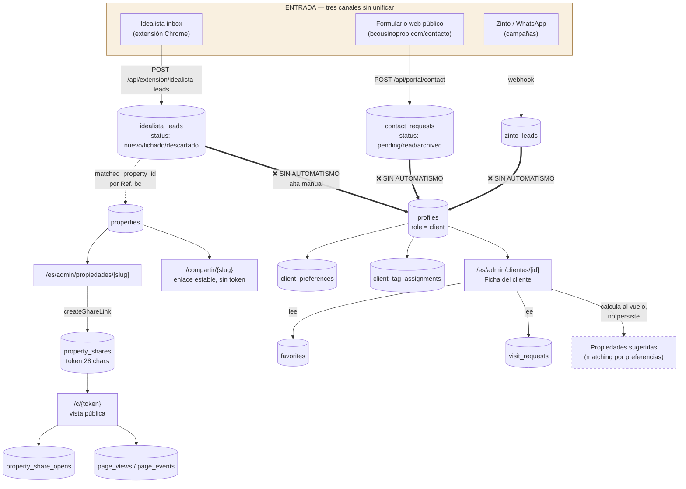
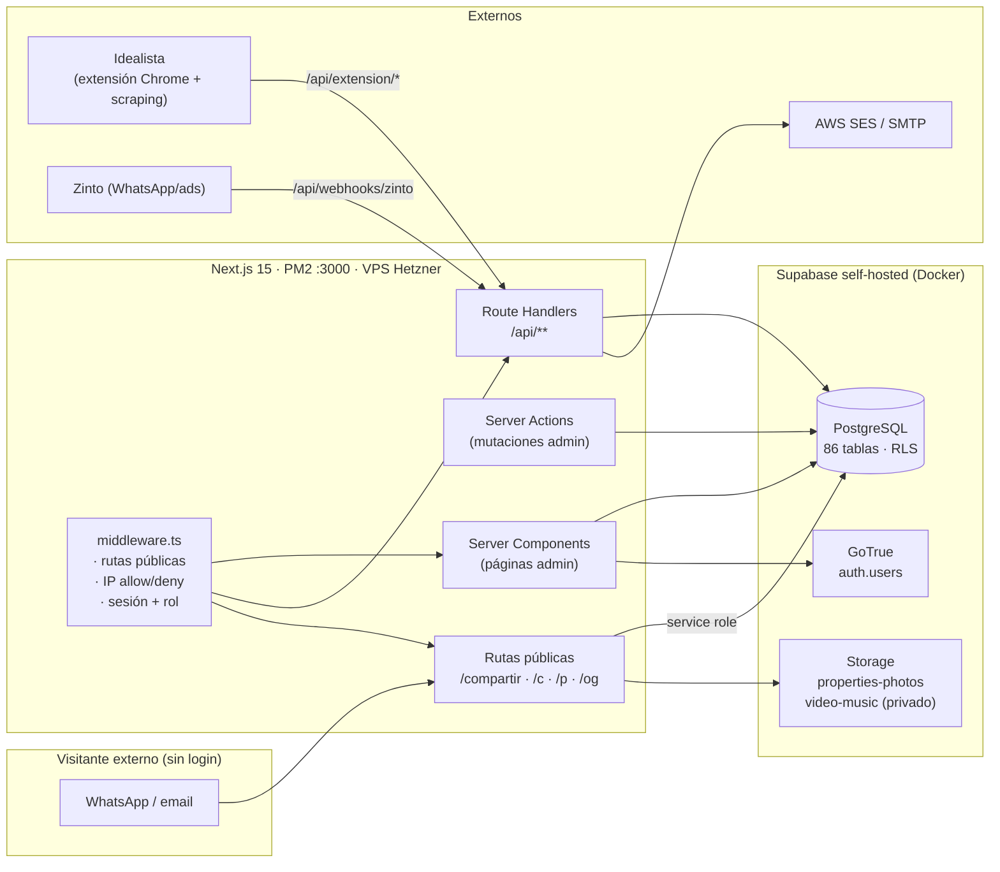
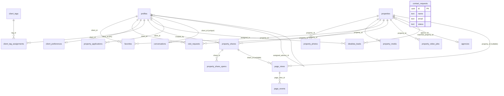
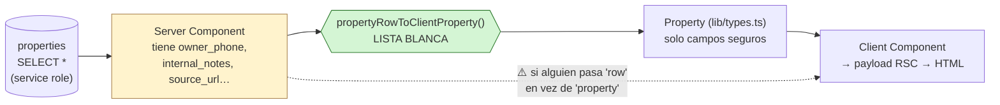

# CRM Architecture Discovery — v0.1

**Sprint 0 · Análisis previo al módulo "Client Viewing Collections & Itinerary"**

| | |
|---|---|
| Fecha | 2026-08-15 |
| Repositorio | `smartbc` (rama `main`, commit `d46121c`) |
| Alcance | Solo análisis. **No se ha escrito código de producto, ni migraciones, ni APIs.** |
| Fuente de verdad | El código del repositorio. Todo lo que no se ha podido verificar se marca `UNKNOWN — HUMAN INPUT REQUIRED`. |
| Método | Lectura de las 135 migraciones de `supabase/migrations/`, el árbol `app/`, `lib/db/**`, `components/**` y `middleware.ts`. No se ha ejecutado nada contra la base de datos viva. |

---

## 1. Executive summary

### Lo que hay

El CRM es un **Next.js 15 (App Router) + PostgreSQL self-hosted** en un VPS Hetzner, con GoTrue para auth y Supabase Storage para ficheros. Tiene **86 tablas** y cubre bastante más que el flujo "lead → cliente → propiedad": incluye captación de inmuebles (Chile), scraping de particulares, sindicación a portales, documentación de operaciones, chat interno, analítica de páginas y generación automática de vídeos.

Para el módulo que se quiere construir, lo relevante se reduce a un núcleo pequeño y bastante sano:

- **`properties`** — catálogo, con fotos ordenadas (`property_photos`), media (`property_media`), y un **adaptador de proyección segura ya escrito** ([lib/db/adapters.ts:310](lib/db/adapters.ts#L310)) que convierte la fila cruda en el objeto que ve el cliente final.
- **`profiles`** — tabla única para staff y clientes, discriminados por `role`.
- **SmartLinks** — `property_shares` + `property_share_opens` + la ruta pública `/c/[token]`, con tracking de aperturas y una vista pública ya diseñada y responsive.
- **`favorites`** y **`visit_requests`** — las dos únicas relaciones cliente↔propiedad que existen.

### Los cinco hallazgos que condicionan el diseño de Sprint 1

1. **No existe ninguna entidad de "selección de propiedades hecha por el agente".** `favorites` es del cliente (la RLS impide que el staff inserte por sesión), y `visit_requests` es una visita individual, sin agrupación ni orden. La pregunta *"¿qué 6 pisos le hemos seleccionado a Paul?"* hoy **no tiene respuesta en la base de datos**. Ver §9.

2. **El SmartLink no sabe a qué cliente se envió.** `property_shares` tiene `label TEXT` ("Para María Pérez") y `created_by`, pero **no tiene `client_id`**. La trazabilidad enlace→cliente es texto libre. Ver §10.

3. **Un SmartLink es de UNA propiedad.** El modelo `property_shares.property_id` es un FK simple. No hay concepto de "enlace que agrupa N propiedades". El nuevo módulo necesita eso, y es la decisión de arquitectura más importante del Sprint 1: ¿nueva entidad hermana o generalización de `property_shares`? Ver §15 y §19.

4. **Existe un patrón de "proyección segura" ya probado y hay que reutilizarlo, no reinventarlo.** `properties` contiene `owner_name`, `owner_phone`, `owner_email`, `internal_notes`, `source_url` (delata el portal de origen). La query pública hace `select("*")` con service role y esos campos **llegan al servidor**; lo que impide la fuga es que `propertyRowToClientProperty` sea una lista blanca. Es una defensa por convención, no estructural. Ver §14 y §16.

5. **Hay dos tablas fantasma que parecen encajar y no encajan**: `calendar_events` (con `client_id` + `property_id` + `event_type='visit'`) y `internal_notes` **no se referencian desde ninguna línea de código de la aplicación**. El calendario real opera sobre `visit_requests`. No las adoptes creyendo que están en uso. Ver §5.4.

### Recomendación de una línea

Construir el módulo como **entidades nuevas** (`viewing_collection` + `collection_item`) que **reutilizan** el mecanismo de token público y la vista pública de SmartLinks, y que **enlazan** a los SmartLinks existentes por propiedad en lugar de sustituirlos. No tocar `property_shares` en el Sprint 1. Detalle en §19.

---

## 2. Current CRM overview

### 2.1 Stack

| Capa | Tecnología | Notas |
|---|---|---|
| Framework | Next.js 15.1 (App Router), React 19 | Server Components por defecto; Server Actions para mutaciones de admin |
| Lenguaje | TypeScript 5.8 | `strict` según `tsconfig.json` |
| Estilos | Tailwind 3.4 + `clsx`/`tailwind-merge` | Sistema de color propio: `ink`, `cream`, `gold` |
| Iconos | `lucide-react` | |
| DB | PostgreSQL en contenedor `supabase-db` (VPS) | **No es Supabase Cloud** — ver `CLAUDE.md` |
| Auth | GoTrue self-hosted vía `@supabase/ssr` | Cookies; sesión resuelta en `middleware.ts` |
| Storage | Supabase Storage self-hosted | Buckets: `properties-photos`, `agencies-logos`, `avatars`, `video-music` (privado) |
| PDF | `@react-pdf/renderer` | Dossier de propiedad ([lib/pdf/property-pdf.tsx](lib/pdf/property-pdf.tsx)) |
| Imagen/vídeo | `sharp` + `ffmpeg` (binario del VPS) | Vídeos Ken Burns automáticos |
| Mapas | `leaflet` + `react-leaflet` | |
| Validación | `zod` 4 | Usada sobre todo en `lib/api/v1/**` |
| Deploy | PM2 (`smartbc-portal`) + `git pull` por cron | Sin Vercel |

### 2.2 Árboles de rutas

Hay **cuatro** superficies distintas, y conviene tenerlas claras porque el nuevo módulo va a vivir a caballo entre dos:

```
app/
├── [country]/(admin)/admin/**   ← Panel admin REAL (es/cl). Aquí vive el CRM.
├── (admin)/admin/**             ← Árbol admin LEGACY (sin país). Aún contiene
│                                   `propiedades/actions.ts`, que es el fichero
│                                   de server actions que usa TODO el panel.
├── admin/[...slug]              ← Catch-all: redirige /admin/x → /{country}/admin/x
├── (cliente)/**                 ← Portal del cliente logueado (/inicio, /favoritos…)
├── compartir/[slug]             ← SmartLink público estable (por propiedad)
├── c/[token]                    ← SmartLink público con token (por envío)
├── p/[slug]/[idx]               ← Proxy de fotos (URLs neutras)
├── og/**                        ← Imágenes Open Graph
└── web/**                       ← Sitio de marketing (bcousinoprop.com, por rewrite)
```

⚠️ El desdoblamiento `(admin)` legacy vs `[country]/(admin)` es deuda técnica activa: las **páginas** están migradas a `[country]`, pero las **server actions** (incluidas `createShareLink` / `deleteShareLink`) siguen en `app/(admin)/admin/propiedades/actions.ts`. Cualquier acción nueva debe decidir conscientemente dónde vive.

### 2.3 Control de acceso

Tres capas superpuestas:

1. **`middleware.ts`** — rutas públicas (`/compartir`, `/c`, `/og`, `/p`, `/login`, `/auth`), redirección de clientes fuera de `/admin` y de staff fuera de las rutas de cliente. Filtro de IP (whitelist/blacklist) solo en rutas públicas.
2. **`lib/permissions.ts`** — matriz `recurso × acción` (15 recursos × 5 acciones), con roles predefinidos, overrides por usuario, roles personalizados y roles por país. Los recursos relevantes: `clientes`, `solicitudes`, `properties`, `calendario`.
3. **RLS en PostgreSQL** — presente en casi todas las tablas, pero con matices importantes (§16).

Además existe `getViewRestriction(role, resource)` → `all | team | own_only | assigned_only | none`, que hoy solo se aplica de verdad a `clientes`, `solicitudes` y `captaciones` ([lib/permissions.ts:597](lib/permissions.ts#L597)).

**Un detalle que importa mucho:** buena parte de las queries del panel usan `createAdminClient()` (service role, **ignora RLS**) y reaplican el scope a mano en TypeScript. Está documentado y es deliberado (ver el comentario en [lib/db/queries/clients.ts:81](lib/db/queries/clients.ts#L81)), pero significa que **la RLS no es la última línea de defensa en la práctica**: lo es el código de la query.

---

## 3. Current user journey

### 3.1 El flujo real, reconstruido desde el código

El diagrama del brief (`Idealista → Solicitud → Cliente → Ficha → Propiedades → Smartlinks`) **no se corresponde con el código**. Lo que existe son **tres canales de entrada desconectados entre sí** y un salto manual hacia el cliente.



### 3.2 Los cortes del flujo (evidencia)

| Corte | Evidencia |
|---|---|
| **Lead → Cliente no está automatizado** | `idealista_leads.status` admite `'fichado'`, pero grep de `"fichado"` en todo el repo solo devuelve el enum, el filtro de UI y el botón que cambia el estado. **No hay código que cree un `profile` a partir de un lead.** El alta de cliente es un formulario aparte (`create-client-dialog.tsx` → `/api/admin/clientes/create-no-email`). |
| **`contact_requests` no enlaza con nada** | Sin `client_id`, sin `property_id`, sin `country`. Es una bandeja de entrada aislada ([supabase/migrations/0055_contact_requests.sql](supabase/migrations/0055_contact_requests.sql)). |
| **El SmartLink no vuelve al cliente** | `property_shares` no tiene `client_id`. Se abre, se registra la apertura, pero nadie sabe quién abrió. |
| **Las sugerencias no se persisten** | `getSuggestedProperties()` recalcula en cada render de la ficha; el agente no puede "guardar" una selección. |

### 3.3 Acciones del agente, hoy

Recorrido completo del agente sobre un cliente, tal como está implementado:

| # | Acción | Dónde | Persistencia | Endpoint / action |
|---|---|---|---|---|
| 1 | Ver bandeja de leads | `/es/admin/solicitudes` | — | `getIdealistaLeads()`, `getContactRequests()`, `getVisitRequests()` |
| 2 | Clasificar lead (`particular`/`agencia`/`relocation`) | idem | `idealista_leads.lead_type` | `setIdealistaLeadType()` |
| 3 | Asignar lead a un agente | idem | `idealista_leads.assigned_to` | server action |
| 4 | Marcar contactado | idem | `idealista_leads.contact_status` | server action |
| 5 | **Crear el cliente a mano** | `/es/admin/clientes` | `auth.users` + `profiles` | `POST /api/admin/clientes/create-no-email` |
| 6 | Configurar preferencias | ficha del cliente | `client_preferences` | server action |
| 7 | Ver sugerencias | ficha del cliente | **nada** | `GET /api/admin/clientes/[clientId]/suggested-properties` |
| 8 | Abrir la propiedad | `/es/admin/propiedades/[slug]` | — | |
| 9 | **Crear SmartLink** | pestaña del detalle | `property_shares` | `createShareLink(slug, label)` |
| 10 | Copiar y enviar por WhatsApp | manual | — | fuera del sistema |
| 11 | Ver aperturas | pestaña del detalle | `property_share_opens` | `getSharesForProperty()` |
| 12 | Agendar visita | `/es/admin/calendario` | `visit_requests` | `POST /api/admin/calendario/events` |
| 13 | Confirmar / cancelar / completar visita | `/es/admin/solicitudes` | `visit_requests.status` | `updateVisitStatus()` |

**Los pasos 7→9 son exactamente donde encaja el módulo nuevo**, y hoy están unidos por el portapapeles del agente.

---

## 4. Current system architecture



### 4.1 Dos clientes de base de datos, y cuándo se usa cada uno

Distinción crítica para el diseño posterior:

| Cliente | Fichero | RLS | Uso |
|---|---|---|---|
| **Sesión** | `lib/db/server.ts` → `createClient()` | Sí, con `auth.uid()` | Páginas y actions del panel |
| **Service role** | `lib/db/admin.ts` → `createAdminClient()` | **No, la ignora** | Rutas públicas (visitante sin sesión), ingesta, y *fallbacks* de queries del panel |

Las rutas públicas **tienen que** usar service role (el visitante no está autenticado), lo que significa que **la seguridad de todo lo público es puramente código de aplicación**. Esto es la razón por la que §14 y §16 son las secciones más importantes de este documento.

---

## 5. Relevant data models

### 5.1 Diagrama del núcleo relevante



`contact_requests` aparece suelto **a propósito**: no tiene ninguna FK.

### 5.2 Enums relevantes

```sql
user_role         : 'client' | 'admin' | 'advisor'   -- + roles añadidos después:
                    owner, viewer, agent_junior, agent_senior, agent_admin, captadora
property_operation: 'rent' | 'sale'
property_stay     : 'short' | 'long'
property_status   : 'available' | 'reserved' | 'sold' | 'archived'
property_source   : 'manual' | 'scrape' | 'api'
visit_status      : 'pending' | 'confirmed' | 'completed' | 'cancelled'
```

⚠️ Ojo con `visit_status`: la BD tiene 4 estados, pero `lib/types.ts` declara `VisitRequestStatus` con **5** (`pending | confirmed | rescheduled | rejected | completed`) y el adaptador mapea `cancelled → rejected`, dejando `rescheduled` sin origen en BD ([lib/db/adapters.ts:206](lib/db/adapters.ts#L206)). Un itinerario necesitará estados de confirmación por parada; **no heredes esta inconsistencia**.

### 5.3 Inventario de entidades por relevancia

| Entidad | Tabla | Relevancia para el módulo | Estado |
|---|---|---|---|
| Cliente / Usuario | `profiles` | 🟢 Alta — sujeto del itinerario | Activa |
| Propiedad | `properties` | 🟢 Alta — objeto del itinerario | Activa |
| Foto | `property_photos` | 🟢 Alta — catálogo visual | Activa |
| Media (vídeo/plano) | `property_media` | 🟢 Alta | Activa |
| SmartLink | `property_shares` | 🟢 Alta — integración obligatoria | Activa |
| Apertura de SmartLink | `property_share_opens` | 🟢 Alta — patrón de tracking | Activa |
| Analítica | `page_views`, `page_events` | 🟢 Alta — ya soporta `share_id` | Activa |
| Favorito | `favorites` | 🟡 Media — relación cliente↔prop existente | Activa (solo cliente) |
| Visita | `visit_requests` | 🟢 Alta — lo más cercano a "parada" | Activa |
| Preferencias | `client_preferences` | 🟡 Media — alimenta el matching | Activa |
| Etiquetas | `client_tags` + `client_tag_assignments` | 🟡 Media | Activa |
| Lead Idealista | `idealista_leads` | 🟡 Media — origen del cliente | Activa |
| Solicitud web | `contact_requests` | 🔵 Baja — aislada | Activa |
| Lead Zinto | `zinto_leads` | 🔵 Baja | Activa |
| Agencia | `agencies` | 🔵 Baja | Activa |
| Documentación | `property_applications` (+5 tablas) | 🔵 Baja — fase posterior a la visita | Activa |
| Mensajería cliente | `conversations`, `messages` | 🔵 Baja — canal alternativo de feedback | Activa |
| **Evento de calendario** | `calendar_events` | ⚫ **Trampa** | **Muerta** |
| **Nota interna de cliente** | `internal_notes` | ⚫ **Trampa** | **Muerta** |

### 5.4 Las dos tablas fantasma (leer antes de diseñar)

**`calendar_events`** ([supabase/migrations/0030_complete_features.sql:11](supabase/migrations/0030_complete_features.sql#L11)) tiene exactamente el shape que uno querría para una parada de itinerario:

```sql
created_by, assigned_to, title, description,
event_type CHECK IN ('meeting','call','task','visit','other'),
start_at, end_at, all_day,
property_id, client_id, google_event_id
```

**Y sin embargo:** `grep -rn "calendar_events" app lib components` → **cero resultados**. El calendario de `/es/admin/calendario` lee y escribe **`visit_requests`** ([app/api/admin/calendario/events/route.ts:34](app/api/admin/calendario/events/route.ts#L34) y `:92`). La tabla se creó y nunca se cableó.

**`internal_notes`** (tabla, definida en [supabase/migrations/0001_init.sql:203](supabase/migrations/0001_init.sql#L203)) tampoco se usa: la ficha del cliente muestra `client_preferences.notes` como si fueran notas internas ([lib/db/adapters.ts:201](lib/db/adapters.ts#L201)). El único `internal_notes` vivo es la **columna** de `properties`, que es otra cosa.

> **Implicación de producto:** hay una decisión pendiente que no es técnica — ¿el itinerario debe aparecer en el calendario del agente? Si sí, hay que resolver antes el solapamiento `visit_requests` / `calendar_events`, porque el nuevo módulo no puede ser la tercera tabla de agenda. Ver pregunta Q-BL-3.

---

## 6. Lead / request architecture

### 6.1 Canal 1 — Idealista (el principal)

**Cómo llegan:** una **extensión de Chrome** (`chrome-extension/`) lee el inbox de `idealista/tools` y hace POST a `/api/extension/idealista-leads`. No es una API oficial de Idealista.

**Entidad:** `idealista_leads` ([supabase/migrations/0080_idealista_leads.sql](supabase/migrations/0080_idealista_leads.sql), extendida por 0081–0087).

| Campo | Tipo | Nota |
|---|---|---|
| `conversation_id` | text UNIQUE | Clave de deduplicación (de la URL del inbox) |
| `name`, `phone`, `phone_country`, `is_international`, `avatar_url` | | Datos del contacto |
| `message`, `profile` (jsonb) | | Texto y bullets del perfil de Idealista |
| `property_title`, `property_price`, `property_type`, `property_image_url` | | Primera propiedad consultada (texto crudo) |
| `properties` | jsonb `[]` | **Todas** las propiedades consultadas en el hilo |
| `idealista_code`, `property_ref` | | "Cod. XXXXX", "Ref. bc386" |
| `matched_property_id` | uuid FK → properties | **El único enlace lead↔propiedad tipado** |
| `suggested_type`, `suggestion_keywords` | | Sugerencia automática de clasificación |
| `lead_type` | `particular\|agencia\|relocation` | Clasificación del agente |
| `status` | `nuevo\|fichado\|descartado` | Estado del lead |
| `assigned_to`, `assigned_at` | uuid FK → profiles | Agente responsable |
| `contact_status` | `ninguno\|contactado_whatsapp\|contactado_llamada\|contactado_email\|sin_respuesta` | Seguimiento |
| `country` | text `'es'` | El inbox de Idealista es solo España |

**Transformación a cliente:** ⚠️ **no existe**. `status='fichado'` es una etiqueta manual. Verificado: ninguna línea de código lee ese estado para crear un `profile`.

**Relación con propiedades:** `matched_property_id` (uno solo) + `properties` jsonb (varias, sin FK). El backfill de matching está en `0087_idealista_leads_backfill_match.sql`.

**Relación con agentes:** `assigned_to` → `profiles.id`.

### 6.2 Canal 2 — Formulario web público

`POST /api/portal/contact` → `contact_requests`. Campos: `name`, `email`, `phone`, `country_interest` (texto libre: "España"/"Chile"/"Ambos"), `subject`, `message`, `status` (`pending|read|archived`).

**Sin FK a nada.** Sin columna `country` real — está documentado explícitamente en [lib/db/queries/clients.ts:325](lib/db/queries/clients.ts#L325) que por eso el listado es global en los tres árboles admin.

### 6.3 Canal 3 — Zinto (campañas WhatsApp/ads)

`zinto_leads`, `zinto_campaigns`, `zinto_conversations`, `zinto_messages`, `zinto_lead_events`, `zinto_webhook_deliveries`. Superficie propia en `/es/admin/leads`. Sin conexión con `profiles` ni con `properties`.

### 6.4 "Solicitud" es una palabra sobrecargada — cuidado

La página `/es/admin/solicitudes` mezcla **tres cosas distintas** en pestañas:

1. `visit_requests` — solicitudes de **visita** de clientes ya registrados (esto es una visita, no un lead)
2. `contact_requests` — mensajes del formulario web
3. `idealista_leads` — leads del inbox

Antes de nombrar cualquier entidad nueva conviene fijar el vocabulario, porque "solicitud" ya significa tres cosas.

---

## 7. Client architecture

### 7.1 Modelo de datos

**`profiles`** ([supabase/migrations/0001_init.sql:29](supabase/migrations/0001_init.sql#L29)) es una tabla **unificada** para staff y clientes: `id` (= `auth.users.id`), `role`, `full_name`, `email`, `phone`, `avatar_url`, `assigned_advisor_id` (auto-FK), `personal_shopper_terms_accepted_at`. Migraciones posteriores añadieron `country`, `multi_country`, `countries[]`, `custom_role_id`.

Un cliente **siempre tiene cuenta en `auth.users`** — no existe el concepto de "contacto sin cuenta". El alta genera una contraseña temporal ([app/api/admin/clientes/create-no-email/route.ts](app/api/admin/clientes/create-no-email/route.ts)).

> ⚠️ Esto es una restricción dura para el módulo nuevo: si un itinerario debe poder crearse para alguien que aún no es cliente registrado (un lead de Idealista, p.ej.), hay que crearle cuenta o inventar un modelo de contacto ligero. Ver Q-DATA-1.

**Satélites:**

| Tabla | PK | Contenido |
|---|---|---|
| `client_preferences` | `client_id` (1:1) | `operation`, `stay`, `min/max_price`, `min/max_bedrooms`, `min_bathrooms`, `min/max_square_meters`, `zones[]`, `available_from`, `notes`, `occupants`, `students`, `workers`, `pets`, `universities`, + 15 columnas de Chile (regiones/comunas/sectores/geofences/UF) |
| `client_tag_assignments` | `(client_id, tag_id)` | Etiquetas del catálogo `client_tags` |
| `favorites` | `(client_id, property_id)` | §9 |
| `visit_requests` | `id` | §9 |
| `conversations` / `messages` | | Chat 1:1 cliente↔agencia |
| `property_applications` | `id` | Documentación de la operación |

### 7.2 Rutas y componentes

| Ruta | Fichero | Nota |
|---|---|---|
| `/{country}/admin/clientes` | [app/[country]/(admin)/admin/clientes/page.tsx](app/[country]/(admin)/admin/clientes/page.tsx) | Listado + stats |
| `/{country}/admin/clientes/[id]` | [.../[id]/page.tsx](app/[country]/(admin)/admin/clientes/[id]/page.tsx) → [client-ficha-view.tsx](app/[country]/(admin)/admin/clientes/[id]/client-ficha-view.tsx) (511 líneas) | **La ficha. Aquí es donde se integra el módulo.** |

Composición de la ficha (relevante para saber dónde inyectar):

```
ClientFichaView
├── Header (avatar, badges estado/perfil/prioridad, botón "Enviar mensaje")
├── Contacto (email, teléfono, ubicación)
├── ActivityCard × 4 (vistas, favoritos, visitas, mensajes)
└── Grid 2 columnas
    ├── izquierda: PreferencesCard, NotesCard
    └── derecha:  FavoritesCard
                  SuggestedPropertiesBlock   ← 🎯 punto de integración natural
                  VisitsCard
```

`SuggestedPropertiesBlock` ([components/admin/clientes/suggested-properties-block.tsx](components/admin/clientes/suggested-properties-block.tsx)) es un client component que hace `fetch` a `/api/admin/clientes/[clientId]/suggested-properties` y pinta tarjetas con thumbnail, `matchScore` y razones. **Es el bloque a extender con "añadir a la selección".**

### 7.3 API

| Endpoint | Método | Auth |
|---|---|---|
| `/api/admin/clientes/create-no-email` | POST | `admin`/`owner` |
| `/api/admin/clientes/search?q=` | GET | staff (lista cerrada de roles) |
| `/api/admin/clientes/[clientId]/suggested-properties` | GET | `requireStaff` |
| `/api/cliente/favorites` | GET/POST/DELETE | el propio cliente |
| `/api/cliente/preferences` | GET/PUT | el propio cliente |
| `/api/cliente/suggested-properties` | GET | el propio cliente |

### 7.4 Estados, notas e historial

- **Estado del cliente:** `AdminClient.status` existe en el tipo, pero el adaptador lo **hardcodea a `"active"`** ([lib/db/adapters.ts:193](lib/db/adapters.ts#L193)). No hay estado real en BD.
- **Prioridad:** igual, hardcodeada a `"normal"`.
- **Notas:** se muestran desde `client_preferences.notes` (un `text` único), **no** desde la tabla `internal_notes`.
- **Historial:** ⚠️ **no existe un historial/timeline de cliente**. Hay piezas dispersas (`page_views`, `property_share_opens`, `visit_requests.created_at`, `messages`) pero nada que las agregue. `activity.propertiesViewed` y `activity.messages` están hardcodeados a `0`.

> Esto es relevante: el brief menciona "Historial CRM" al final del flujo objetivo. **Hoy no hay dónde colgarlo.**

---

## 8. Property architecture

### 8.1 Columnas de `properties`

Reconstruidas de `0001_init.sql` + todos los `ALTER TABLE properties` posteriores. La clasificación de la última columna se desarrolla en §14.

| Columna | Tipo | Origen | Clasificación |
|---|---|---|---|
| `id` | uuid PK | | INTERNAL |
| `slug` | text UNIQUE | derivado, neutralizado (0010) | CLIENT SAFE |
| `bc_reference` | text | secuencial BC-XXXX | CLIENT SAFE |
| `property_reference` | text | PROP-YYYY-NNNN | REVIEW |
| `external_id` | text | ref. del portal de origen | **INTERNAL** |
| `source` | enum | `manual\|scrape\|api` | INTERNAL |
| `source_url` | text | URL del anuncio original | **SENSITIVE** |
| `agency_id` | uuid FK | | INTERNAL |
| `title`, `title_rent` | text | | CLIENT SAFE |
| `description` | text | | CLIENT SAFE |
| `operation`, `operations[]` | enum / text[] | | CLIENT SAFE |
| `stay` | enum | | CLIENT SAFE |
| `status` | enum | `available/reserved/sold/archived` | REVIEW |
| `price`, `rent_price` | numeric | | CLIENT SAFE |
| `currency`, `currency_display` | text | | CLIENT SAFE |
| `bedrooms`, `bathrooms` | int | | CLIENT SAFE |
| `square_meters`, `covered_area_m` | int | | CLIENT SAFE |
| `zone`, `subzone` | text | | CLIENT SAFE |
| `region`, `commune`, `sector` (+ `_id`) | text/uuid | Chile | CLIENT SAFE / INTERNAL (los `_id`) |
| `address` | text | dirección exacta | **REVIEW — decisión de negocio** |
| `latitude`, `longitude`, `geocoded_at` | | geocodificado y cacheado | REVIEW |
| `available_from` | date | | CLIENT SAFE |
| `features[]`, `features_manual[]` | text[] | scraper + admin | CLIENT SAFE |
| `property_type` | text | | CLIENT SAFE |
| `building_features` | jsonb | planta, ascensor, año… | REVIEW (contenido no acotado) |
| `floors`, `construction_year`, `is_condominium`, `parking_lots` | | | CLIENT SAFE |
| `cover_photo_url` | text | URL directa de Storage | **REVIEW** (delata la ruta interna) |
| `owner_name` | text | | **SENSITIVE** |
| `owner_phone` | text | | **SENSITIVE** |
| `owner_email` | text | | **SENSITIVE** |
| `internal_notes` | text | notas del agente sobre el inmueble | **SENSITIVE** |
| `published_web` | bool | | INTERNAL |
| `portalinmobiliario_*` | | sindicación Chile | INTERNAL |
| `last_synced_at`, `archived_at`, `created_at`, `updated_at` | timestamptz | | INTERNAL |
| `country` | text | `'es'\|'cl'` | INTERNAL |

### 8.2 Imágenes

Tres capas, y hay que entenderlas para no romper el catálogo:

1. **`property_photos`** — `url`, `alt`, `position`, `is_cover`. La `url` apunta a Storage y **delata el origen** (`…/properties-photos/synced/level/3415/0.webp`).
2. **Proxy `/p/{slug}/{idx}`** ([app/p/[slug]/[idx]/route.ts](app/p/[slug]/[idx]/route.ts)) — sirve la foto en streaming con URL neutra, valida que la propiedad no esté archivada, deduplica por URL, cachea 24h.
3. **Adaptador** — `propertyRowToClientProperty` genera `photos: ['/p/{slug}/0?v={hash}', …]`. El `?v=` es un hash de `[urls..., last_synced_at]` para invalidar caché al reordenar o re-procesar fotos.

> 🔑 **Toda URL de foto que vea un cliente externo debe pasar por el proxy.** El catálogo nuevo no puede usar `property_photos.url` ni `cover_photo_url` directamente.

**`property_media`** (0016) guarda `video` y `plan`: `type`, `file_name`, `storage_path`, `url`, `has_watermark`, `source` (`manual|auto`). Los vídeos automáticos (Ken Burns) se generan vía `property_video_jobs`.

### 8.3 Estado y borrado

Dos mecanismos que conviven:

- `status ∈ {available, reserved, sold, archived}`
- `archived_at timestamptz` — borrado lógico

Las queries públicas filtran **ambos**: `.is("archived_at", null).neq("status", "archived")` ([lib/db/queries/properties.ts:93](lib/db/queries/properties.ts#L93)). El proxy de fotos hace lo mismo.

⚠️ **No filtran `status ∈ {reserved, sold}`.** Un SmartLink de un piso ya vendido sigue funcionando y mostrando el piso como si nada. Es un riesgo directo para el catálogo de itinerario (§16, R-9).

**Borrado físico:** `property_shares`, `property_photos`, `property_media`, `favorites`, `visit_requests` van todas con `ON DELETE CASCADE` desde `properties`. `page_views.property_id` es `ON DELETE SET NULL`.

---

## 9. Client ↔ Property relationship

**Esta es la sección que responde a la pregunta central del brief.**

### 9.1 Inventario exhaustivo de vínculos existentes

| # | Mecanismo | Tabla | Quién lo crea | Semántica | ¿Sirve como "selección del agente"? |
|---|---|---|---|---|---|
| 1 | Favorito | `favorites (client_id, property_id)` | **El cliente** | "me gusta" | ❌ No — ver §9.2 |
| 2 | Visita | `visit_requests` | Cliente o agente | "quiero/vamos a ver este piso el día X" | 🟡 Parcial — ver §9.3 |
| 3 | Documentación | `property_applications` | Agente | "estamos tramitando esta operación" | ❌ Fase posterior |
| 4 | Lead matcheado | `idealista_leads.matched_property_id` | Automático | "preguntó por este piso" | ❌ Es lead, no cliente |
| 5 | SmartLink | `property_shares.label` | Agente | "se lo mandé a…" en **texto libre** | ❌ No tipado |
| 6 | Analítica | `page_views(property_id, share_id, session_id)` | Automático | "alguien vio esto" | ❌ Anónimo |
| 7 | Sugerencia | *(ninguna tabla)* | Calculado al vuelo | "esto le pega" | ❌ No persiste |
| 8 | Evento de calendario | `calendar_events(client_id, property_id)` | — | — | ⚫ Tabla muerta |

### 9.2 Por qué `favorites` NO sirve

Más allá de la semántica ("es del cliente, no del agente"), hay un **bloqueo técnico**:

```sql
-- supabase/migrations/0001_init.sql:355
create policy "favorites_self_all" on favorites
  for all using (auth.uid() = client_id) with check (auth.uid() = client_id);
create policy "favorites_staff_select" on favorites
  for select using (is_staff());
```

El staff **solo puede leer**. Un agente no puede insertar un favorito en nombre del cliente con el cliente de sesión. Podría hacerse con service role saltándose la RLS, pero eso corrompería la semántica del dato: el cliente vería en `/favoritos` cosas que él no marcó.

**Conclusión: reutilizar `favorites` para la selección del agente es un error.** Son dos conceptos distintos que deben coexistir (y de hecho una buena UX es "el agente ve los favoritos del cliente al construir la selección").

### 9.3 Por qué `visit_requests` se queda a medias

Es lo más cercano que hay. Columnas: `id`, `client_id`, `property_id`, `requested_at`, `status`, `notes`, `confirmed_at`, `completed_at`, `assigned_to`, `country`, `google_event_id`, `calendar_synced_at`.

Lo que sí da: cliente + propiedad + fecha/hora + estado de confirmación + agente asignado.

Lo que **no** da:

- ❌ **Agrupación** — seis visitas del lunes de Paul son seis filas sin nada que las una.
- ❌ **Orden** — no hay `position`/`sequence`. `requested_at` ordena implícitamente, pero no permite reordenar sin reescribir horas.
- ❌ **Duración** — solo `requested_at`. No hay `end_at`, ni tiempo de desplazamiento entre paradas.
- ❌ **Selección sin fecha** — el estado natural "seleccionada pero aún sin agendar" no cabe: `requested_at` es `NOT NULL`.
- ❌ **Feedback posterior** — `notes` es un `text` único, sin autoría ni momento (¿nota del agente antes, o del cliente después?).
- ❌ **Compartible** — no hay token ni vista pública.

### 9.4 La respuesta a la pregunta del brief

> **¿Puede saberse hoy "Paul está interesado en Property X" de forma independiente de "Property X existe en el CRM"?**

**Parcialmente, y de forma insuficiente para el módulo.**

- ✅ **Si Paul lo marcó él mismo** → `favorites`. Pero es del cliente, y el agente no puede escribirlo.
- ✅ **Si hay una visita agendada** → `visit_requests`. Pero obliga a fijar fecha y hora, que es precisamente lo que aún no se sabe cuando se hace la selección.
- ❌ **Si el agente ha preseleccionado 6 pisos para enseñárselos** → **no hay dónde guardarlo.** Ni en `favorites` (bloqueado por RLS y semánticamente ajeno), ni en `visit_requests` (exige fecha), ni en ninguna otra tabla.
- ❌ **Si el agente le mandó un SmartLink** → solo queda constancia en `property_shares.label`, texto libre no consultable.

**Limitación documentada, en una frase:** *el CRM modela el interés del cliente (favoritos) y el compromiso agendado (visitas), pero no modela el paso intermedio — la curación de una selección por parte del agente — que es exactamente el núcleo del módulo propuesto.*

---

## 10. Smartlink architecture

### 10.1 Dos rutas públicas, no una

| | `/compartir/[slug]` | `/c/[token]` |
|---|---|---|
| Fichero | [app/compartir/[slug]/page.tsx](app/compartir/[slug]/page.tsx) | [app/c/[token]/page.tsx](app/c/[token]/page.tsx) |
| Identificador | Slug de la propiedad, opcionalmente con prefijo `bc0871-` | Token aleatorio de 28 chars |
| Entidad de respaldo | **Ninguna** — se resuelve contra `properties` | `property_shares` |
| ¿Único por envío? | No — estable y compartido | Sí |
| Indexable | **Sí** (canonical + OG, sin `noindex`) | **No** (`robots: {index:false, follow:false}`) |
| Caducidad | No aplica | `expires_at` soportado en el modelo |
| Tracking de apertura | No (`share_id` = null en `page_views`) | Sí (`property_share_opens` + `page_views.share_id`) |
| Vista | `PublicPropertyView` | **La misma** `PublicPropertyView` |
| Vídeos y planos | Sí | **No** (no se pasan `videos`/`plans`) |

⚠️ **Discrepancia funcional real:** `/c/[token]` no carga `property_media`, así que los vídeos y planos **no se ven en el enlace con tracking**, solo en el estable. Verificable comparando ambos `page.tsx`.

### 10.2 Modelo

```sql
-- supabase/migrations/0007_property_type_and_shares.sql
create table property_shares (
  id          uuid primary key default gen_random_uuid(),
  property_id uuid not null references properties(id) on delete cascade,
  token       text not null unique,
  label       text,                 -- "Para María Pérez", "Anuncio FB"…
  created_by  uuid references profiles(id) on delete set null,
  expires_at  timestamptz,
  created_at  timestamptz not null default now()
);

create table property_share_opens (
  id         uuid primary key default gen_random_uuid(),
  share_id   uuid not null references property_shares(id) on delete cascade,
  opened_at  timestamptz not null default now(),
  ip         text,
  user_agent text
);
```

**Lo que falta y hace falta:** `client_id`, cualquier forma de agrupar varias propiedades, y un contador denormalizado (hoy se agrega en memoria, ver más abajo).

### 10.3 Generación del token

[app/(admin)/admin/propiedades/actions.ts:693](app/(admin)/admin/propiedades/actions.ts#L693):

```ts
function randomToken(len = 28): string {
  const arr = new Uint8Array(len);
  crypto.getRandomValues(arr);          // CSPRNG
  return Buffer.from(arr).toString("base64")
    .replace(/\+/g, "-").replace(/\//g, "_").replace(/=+$/, "")
    .slice(0, len);
}
```

28 chars base64url ≈ **168 bits de entropía**. Criptográficamente sólido. ✅ **Reutilizable tal cual.**

`createShareLink(slug, label)` exige `checkPermission("properties","edit")` + `requireStaff`. **Nunca fija `expires_at`** — la caducidad existe en el modelo y en la resolución, pero no hay UI que la use.

### 10.4 Resolución y privacidad

[lib/db/queries/shares.ts:69](lib/db/queries/shares.ts#L69) — `getPropertyByShareToken`:

1. Busca el `token` (service role, sin RLS).
2. Si `expires_at` está en el pasado → `null`.
3. Carga la propiedad con `select("*, property_photos(*), agencies(...)")`, filtrando archivadas.
4. Devuelve `{ shareId, property }`.

La página registra la apertura **fire-and-forget** (`.catch(() => {})`) para no bloquear el render, adapta la fila con `propertyRowToClientProperty` y renderiza.

**RLS de `property_shares`:** `select` solo `is_staff()`, escritura solo `is_admin()`. El público no puede enumerar tokens vía PostgREST. La lectura pública va por service role dentro del server component. ✅ Modelo correcto.

### 10.5 Vista pública (`PublicPropertyView`, 809 líneas)

[app/compartir/[slug]/public-property-view.tsx](app/compartir/[slug]/public-property-view.tsx). Estructura:

```
header (logo BC + email)
└── main (max-w-6xl)
    ├── PropertyGallery              ← componente compartido con el portal cliente
    ├── Cabecera: título + precio + badges + referencia BC
    ├── Specs (hab / baños / m² / planta)
    ├── Vídeos (si property_media los trae)
    ├── Planos
    ├── Descripción
    ├── Características (featuresText)
    ├── PropertyLocationMap (Leaflet)
    └── Caja de contacto (email / teléfono / WhatsApp con mensaje pre-rellenado)
```

- **Responsive:** sí, Tailwind mobile-first (`md:`, `sm:` en todo el árbol).
- **Diseño:** paleta `ink`/`cream`/`gold`, serif para títulos. Sobrio, no "luxury editorial", pero coherente.
- **Contacto:** ⚠️ `BC_CONTACT` está **hardcodeado** en el componente (email, teléfono, WhatsApp) — no sale de `app_settings` ni de la agencia.
- **OG:** `/og/property/{slug}` sirve un JPEG 1200×630 (más compatible que WebP para WhatsApp).

### 10.6 Analítica

Dos sistemas **paralelos** sobre la misma acción:

1. **`property_share_opens`** — una fila por apertura, insertada en servidor. Alimenta el panel de SmartLinks del detalle de propiedad.
2. **`page_views` + `page_events`** — sistema general, insertado desde cliente vía `useAnalytics` → `/api/tracking/*`. Captura `page_type`, `session_id`, `device_type`, `browser`, `os`, geolocalización por IP, y eventos granulares: `photo_view`, `video_play`, `plan_view`, `scroll`, `contact_click`, `visit_request`, `share_click`, `time_on_page`.

`page_views.share_id` es FK a `property_shares`, así que el sistema general **ya sabe atribuir a un SmartLink**. `getShareAnalytics(shareId)` existe en [lib/db/queries/analytics.ts:389](lib/db/queries/analytics.ts#L389).

> 🎯 **Oportunidad:** `page_events` con `event_type='photo_view'` + `time_on_page` es material de primera para responder *"¿qué propiedad del itinerario le interesó más a Paul antes de la visita?"*. La infraestructura ya está; solo falta que el catálogo emita eventos con un identificador de colección.

**Nota de rendimiento:** `getSharesForProperty` hace dos queries y agrega en memoria. Está justificado en un comentario para "decenas de links por propiedad". Un listado de colecciones con muchas paradas no debe copiar este patrón.

---

## 11. Relevant API architecture

### 11.1 Convenciones observadas

| Patrón | Uso | Ejemplo |
|---|---|---|
| **Server Actions** | Mutaciones del panel admin | `createShareLink`, `updateVisitStatus` |
| **Route Handlers** `/api/admin/**` | Lo que necesita `fetch` desde cliente | `/api/admin/clientes/search` |
| **Route Handlers** `/api/cliente/**` | Portal del cliente logueado | `/api/cliente/favorites` |
| **`/api/v1/**`** | API pública externa, con `zod` + scopes + idempotencia | `/api/v1/captaciones` |
| **`/api/cron/**`** | Tareas programadas, `Bearer $CRON_SECRET` | `/api/cron/property-videos` |
| **`/api/tracking/**`** | Ingesta anónima de analítica | `/api/tracking/page-view` |

### 11.2 Guardas de autorización (tres variantes, sin unificar)

```ts
// A) Server actions — el más completo
const gate = await checkPermission("properties", "edit");   // matriz de permisos
if (!gate.ok) return gate;
const auth = await requireStaff(supabase);                  // + verificación de rol
// variante que lanza: await assertPermission("solicitudes", "edit")

// B) Route handlers modernos
const gate = await requirePermission("calendario", "create");
if (!gate.ok) return gate.response;

// C) Route handlers antiguos — lista de roles a pelo ⚠️
const isStaff = ["admin","owner","advisor","agent_admin","agent_senior","agent_junior"].includes(auth.role);
```

⚠️ La variante (C) aparece en `/api/admin/properties/search`, `/api/admin/clientes/search` y `/api/admin/calendario/events`. **Omite `captadora`** y no consulta la matriz de permisos ni los overrides. Cualquier endpoint nuevo debe usar (A) o (B).

### 11.3 API pública `/api/v1` — el patrón bueno

`withApiRoute({ scope, handler })` en `lib/api/handler.ts` aporta: autenticación por API key (`api_clients`, `api_keys`), scopes, idempotencia (`api_idempotency`), logging (`api_requests`), errores tipados (`lib/api/errors.ts`) y OpenAPI autogenerado.

> ℹ️ **Colisión de nombres a evitar:** `/api/v1/catalogos` **ya existe** y significa "catálogos de datos maestros" (enums, pipelines, regiones, comunas). No usar "catálogo" para el catálogo visual del cliente en el namespace de la API.

---

## 12. Relevant frontend architecture

### 12.1 Composición típica de una página admin

```
page.tsx  (Server Component)
  ├─ getCurrentProfile()  →  canAccess(role, recurso, "view")  →  redirect si no
  ├─ Promise.all([ ...queries de lib/db/queries/** ])
  ├─ adaptadores (lib/db/adapters.ts) → tipos de lib/types.ts
  └─ <XxxAdminClient  ...props />   (Client Component, "use client")
```

Los datos se resuelven **enteros en servidor** y bajan como props serializadas. Consecuencia directa de seguridad: **todo lo que se pase como prop a un Client Component viaja en el payload RSC y es visible en el HTML**. Ver §16, R-2.

### 12.2 Componentes con potencial de reutilización

| Componente | Fichero | Qué hace |
|---|---|---|
| `PropertyGallery` | `components/property-detail/property-gallery.tsx` | Galería con lightbox; ya compartida entre portal y SmartLink; acepta `onPhotoView` para analítica |
| `PublicPropertyView` | `app/compartir/[slug]/public-property-view.tsx` | Vista pública completa (809 líneas) |
| `SmartLinksPanel` | `components/admin/smart-links-panel.tsx` | Crear/copiar/borrar links + contador de aperturas |
| `PropertyLocationMap` | `app/web/_components/PropertyLocationMap.tsx` | Mapa Leaflet |
| `PropertySpecs`, `PropertyFeatures`, `PropertyHeaderCard`, `PropertyConditions`, `PropertyContact`, `PropertyAvailability` | `components/property-detail/**` | Bloques de ficha |
| `RequestVisitModal` | `components/property-detail/request-visit-modal.tsx` | Modal de solicitud de visita |
| `Modal`, `Button`, `Card`, `EmptyState`, `Skeleton`, `Toast`, `StatCard`, `Pagination` | `components/ui/**` | Primitivas |
| `SuggestedPropertiesBlock` | `components/admin/clientes/suggested-properties-block.tsx` | Sugerencias con score |
| `AdminPageHeader`, `PageFooter` | `components/admin/**`, `components/ui/**` | Cromo del panel |

### 12.3 i18n

`lib/i18n/dictionary.ts` + `useT()`. El panel admin está internacionalizado por claves. ⚠️ Pero `SuggestedPropertiesBlock` tiene strings en español hardcodeados, y `PublicPropertyView` mezcla claves y literales. **El catálogo público necesita una decisión de idioma explícita** (Q-FE-2).

---

## 13. Reusable components

### 🟢 REUSE AS-IS

| Elemento | Fichero | Por qué |
|---|---|---|
| **Generador de tokens** | `randomToken()` en [actions.ts:693](app/(admin)/admin/propiedades/actions.ts#L693) | 168 bits, CSPRNG, URL-safe. Nada que mejorar. Extraer a `lib/` y compartir. |
| **Proxy de fotos** `/p/{slug}/{idx}` | [app/p/[slug]/[idx]/route.ts](app/p/[slug]/[idx]/route.ts) | Ya neutraliza URLs, valida archivado, cachea 24h, deduplica. El catálogo debe usarlo sí o sí. |
| **`propertyRowToClientProperty`** | [lib/db/adapters.ts:310](lib/db/adapters.ts#L310) | **La proyección segura ya existe.** Es la pieza más valiosa del repo para este módulo. |
| **`PropertyGallery`** | `components/property-detail/property-gallery.tsx` | Responsive, con lightbox y hook de analítica. |
| **Sistema de analítica** | `page_views` / `page_events` / `useAnalytics` | `share_id` y `property_id` ya soportados; `page_type` es texto libre → admite un valor nuevo sin migración. |
| **Primitivas UI** | `components/ui/**` | Consistencia visual gratis. |
| **Endpoints de búsqueda** | `/api/admin/{properties,clientes}/search` | Ya devuelven exactamente lo que necesita un selector con autocompletado. (Corregir la guarda de rol, ver §11.2.) |
| **`shareSlug` / `storedSlugFromShare`** | [lib/share-slug.ts](lib/share-slug.ts) | Prefijo `bc0871-` con retrocompatibilidad. |
| **`getCountryConfig`** | [lib/country-config.ts](lib/country-config.ts) | Formato de precio/locale por país. Un catálogo chileno necesita UF/CLP. |
| **`middleware.ts` PUBLIC_PATHS** | [middleware.ts:14](middleware.ts#L14) | Añadir una ruta pública es una línea. |

### 🟡 EXTEND

| Elemento | Extensión necesaria | Coste / riesgo |
|---|---|---|
| **`PublicPropertyView`** | Hoy renderiza **una** propiedad con cromo propio (header, footer, contacto). Para el catálogo hace falta: (a) extraer los bloques internos reutilizables, (b) un modo "tarjeta dentro de una colección", (c) navegación entre paradas. | Medio. Son 809 líneas con estado local (`activeVideo`). Refactor cuidadoso, **sin cambiar la ruta actual**. |
| **`SmartLinksPanel`** | Añadir la noción de "este link pertenece a la colección X del cliente Y". | Bajo si `property_shares` gana `client_id` nullable; alto si se intenta generalizar a multi-propiedad. |
| **`SuggestedPropertiesBlock`** | Añadir "➕ Añadir a la selección" a cada tarjeta y un contador. **⚠️ Arreglar antes el bug de §13.1.** | Bajo, una vez arreglada la query. |
| **`ClientFichaView`** | Insertar la sección "Selecciones / Itinerarios" en la columna derecha. | Bajo — la ficha ya está compuesta por bloques. |
| **`visit_requests`** | Añadir `collection_item_id` (nullable) para enlazar una visita con su parada, sin romper lo existente. | Bajo si es nullable. |
| **`page_events.event_type`** | Es un `CHECK` cerrado. Eventos nuevos (`collection_open`, `stop_view`, `feedback_submit`) requieren **migración**. | Bajo, pero es una migración obligatoria — anticipar. |
| **PDF de propiedad** | `lib/pdf/property-pdf.tsx` genera un dossier A4 de una propiedad. Un "dossier de itinerario" es una extensión natural. | Medio. No es Sprint 1. |
| **`getSuggestedProperties`** | El algoritmo de scoring es razonable como punto de partida, pero necesita arreglo + filtro por país + filtro de archivadas. | Ver §13.1. |

### 🔴 DO NOT REUSE

| Elemento | Por qué no |
|---|---|
| **`favorites`** como selección del agente | La RLS solo deja escribir al propio cliente ([0001_init.sql:355](supabase/migrations/0001_init.sql#L355)), y la semántica es del cliente. Reutilizarla contaminaría `/favoritos` del portal con cosas que el cliente no marcó. **Deben coexistir.** |
| **`visit_requests`** como contenedor de itinerario | `requested_at NOT NULL` impide el estado "seleccionada sin fecha", que es el 80% del flujo. Sin orden, sin agrupación, sin duración. Sirve como **destino** de la parada, no como el itinerario. |
| **`calendar_events`** | Tabla muerta (§5.4). Adoptarla sería resucitar un modelo que nadie usa y crear un tercer sistema de agenda. |
| **`internal_notes`** (tabla) | Muerta. Si hacen falta notas por parada, entidad nueva. |
| **`contact_requests`** | Bandeja de entrada sin FK. Nada que ver. |
| **`/compartir/[slug]`** como base del catálogo | Es **indexable y estable por propiedad**. Un catálogo privado de cliente **nunca** debe vivir en una URL adivinable. Usar el patrón de `/c/[token]`. |
| **`property_shares.label`** como referencia al cliente | Texto libre. No consultable, no íntegro. Si hace falta la relación, es un FK. |
| **La guarda de rol en línea** (`["admin","owner",…].includes(role)`) | Omite roles, ignora la matriz de permisos y los overrides. Usar `requirePermission` / `checkPermission`. |
| **`app/(admin)/**` (árbol legacy)** para páginas nuevas | Está en migración hacia `app/[country]/(admin)/**`. |
| **`BC_CONTACT` hardcodeado** | Si el catálogo va firmado por el agente asignado, el contacto tiene que ser dinámico. |

### 13.1 ⚠️ Bug encontrado en `getSuggestedProperties` (verificado, no aplicado)

[lib/db/queries/suggested-properties.ts:70](lib/db/queries/suggested-properties.ts#L70) hace:

```ts
.select(`id, slug, title, zone, subzone, bedrooms, bathrooms,
         square_meters, price, photos(url), latitude, longitude`)
```

**No existe ninguna tabla ni relación `photos`.** La tabla es `property_photos` (verificado contra los 135 ficheros de migración: no hay ningún `create table photos`). PostgREST devolverá error de relación, el `if (propsError)` se dispara y la función retorna `[]`.

Efecto observable: **el bloque "Propiedades sugeridas" de la ficha del cliente muestra siempre "No hay propiedades disponibles"**, en todos los clientes.

Dos problemas secundarios en la misma query:
- `.eq("stay", prefs.stay)` con `prefs.stay = null` no casa ninguna fila (habitual en ventas, donde `stay` es null).
- No filtra `archived_at is null` ni `country`, así que un cliente español podría recibir sugerencias chilenas.

No lo he tocado — está fuera del alcance de este Sprint. Pero **el módulo nuevo depende de este bloque**, así que su arreglo debería entrar en el alcance del Sprint 1 (§19).

---

## 14. Internal vs client-safe data

### 14.1 El mecanismo actual, y su punto débil



La lista blanca funciona. El riesgo es que **es una convención, no una barrera**: la fila cruda con los datos del propietario está disponible en el mismo ámbito léxico donde se construyen las props del componente cliente. Un `<PublicPropertyView property={row} />` por descuido filtra teléfono y email del propietario al HTML público.

### 14.2 Clasificación — `properties`

**CLIENT SAFE** (los que ya expone `propertyRowToClientProperty`)
```
slug · bc_reference · title · title_rent · description · operation · operations
price · rent_price · currency · stay · bedrooms · bathrooms · square_meters
zone · subzone · property_type · features[] · features_manual[] · available_from
floor (derivado) · fotos vía proxy /p/{slug}/{idx}
```

**INTERNAL** (uso del panel; no dañino si se filtra, pero sin motivo para exponerlo)
```
id (uuid) · agency_id · source · status · published_web · country
created_at · updated_at · last_synced_at · archived_at
property_reference · geocoded_at · region_id · commune_id · sector_id
portalinmobiliario_*
```

**SENSITIVE** (nunca debe cruzar a una superficie de cliente)
```
owner_name          · nombre del propietario
owner_phone         · teléfono del propietario
owner_email         · email del propietario
internal_notes      · notas del agente sobre el inmueble
source_url          · URL del anuncio original → delata el portal de origen
external_id         · referencia del portal de origen → mismo problema
cover_photo_url     · URL directa de Storage (…/synced/level/…) → mismo problema
```

> El bloque `source_url` / `external_id` / `cover_photo_url` merece atención: no son datos personales, pero **revelan que la propiedad viene de otra agencia/portal**, que es justo lo que la migración `0010_neutralize_property_slugs` se esforzó en ocultar. Filtrarlos deshace ese trabajo.

**UNKNOWN / REVIEW REQUIRED**
| Campo | Por qué hay que decidir |
|---|---|
| `address` | Dirección exacta. Hoy **no** se expone en el SmartLink, pero sí se usa para geocodificar. ¿En un itinerario privado el cliente debe ver el portal exacto al que va? Probablemente **sí** (va a ir allí), pero no es una decisión técnica. **Q-SEC-1**. |
| `latitude`/`longitude` | Se exponen (mapa). Coordenada exacta ≈ dirección exacta. Coherencia con lo anterior. |
| `status` (`reserved`/`sold`) | ¿Se marca visualmente en el catálogo, se oculta la propiedad, o se congela? **Q-BL-4**. |
| `building_features` (jsonb) | Sin esquema fijo. Podría contener cualquier cosa que haya metido el scraper. **Auditar antes de renderizar.** |
| `price` histórico | Si el precio cambia después de publicar el itinerario, ¿el catálogo muestra el de entonces o el de ahora? **Q-BL-2**. |

### 14.3 Clasificación — `profiles` (cliente)

| CLIENT SAFE (para el propio cliente) | INTERNAL | SENSITIVE |
|---|---|---|
| `full_name`, `avatar_url` | `id`, `role`, `country`, `countries[]`, `created_at`, `custom_role_id` | `email`, `phone` de **otros** perfiles |
| | `assigned_advisor_id` (⚠️ revelar quién es el asesor puede ser deseable) | `personal_shopper_terms_accepted_at` |

⚠️ **Riesgo real:** la RLS de `profiles` tiene `SELECT USING (true)` ([0045_permissive_rls_profiles.sql:19](supabase/migrations/0045_permissive_rls_profiles.sql#L19)), con un `TODO: endurecer` en el propio comentario. **Cualquiera con la anon key puede leer toda la tabla `profiles`**, incluidos emails y teléfonos de todos los clientes y del staff. Las escrituras sí están cerradas (se corrigió un agujero peor). Esto no lo introduce el módulo nuevo, pero **sí lo amplifica** si el catálogo público carga el SDK de Supabase en el navegador.

### 14.4 Clasificación — otras entidades

| Entidad | SENSITIVE / INTERNAL |
|---|---|
| `client_preferences` | `notes` (se usa como notas internas), `min_price`/`max_price` (presupuesto real del cliente) |
| `client_tag_assignments` | Etiquetas internas de clasificación comercial |
| `agency_partnerships` | **`commission_pct`, `rent_commission_pct`, `sale_agreed_commission_pct`, `agreement_signed_at`** — comisiones. Nunca. |
| `agencies` | `contact_name`, `contact_email`, `contact_phone`, `notes` |
| `property_shares` | `token` (secreto), `label` (puede contener el nombre de otro cliente), `created_by` |
| `property_share_opens` | `ip`, `user_agent` |
| `page_views` | `ip`, `session_id`, geolocalización |
| `idealista_leads` | Todo: teléfono, mensaje, perfil, avatar del contacto |
| `property_applications` + documentos | Todo — nóminas, contratos, DNI |
| `visit_requests.notes` | Notas mezcladas de agente y cliente |

### 14.5 Recomendación estructural

Cuando llegue el Sprint 1, la lección de esta sección es: **no volver a resolverlo con `select("*")` + confianza en el adaptador.** Un `select()` con lista explícita de columnas en la query pública de la colección cierra el agujero en origen y hace que el descuido sea imposible, no solo improbable.

---

## 15. Architectural gaps

Cada concepto propuesto en el brief, contrastado contra lo que existe. **Los nombres son provisionales.**

### GAP-1 · Selección curada por el agente (`ClientPropertySelection` / `Collection`)

- **¿Existe algo equivalente?** No. Ver §9.4.
- **Lo más cercano:** `favorites` (del cliente, bloqueado por RLS) y `getSuggestedProperties` (no persiste).
- **Necesario:** sí, es el núcleo.
- **Nota de diseño:** hay que decidir si "selección" e "itinerario" son **la misma entidad en dos estados** (`draft` → `scheduled`) o **dos entidades**. El caso Paul sugiere lo primero: se seleccionan 6 pisos, luego se les pone fecha. Una entidad con estado evita duplicar la lista. **Q-PROD-1**.

### GAP-2 · Parada del itinerario (`ItineraryStop` / `CollectionItem`)

- **¿Existe?** No.
- **Lo más cercano:** `visit_requests`, que carece de orden, duración y estado "sin agendar" (§9.3).
- **Necesario:** sí. Necesita como mínimo: `collection_id`, `property_id`, `position`, `scheduled_at` (nullable), `duration_minutes`, `confirmation_status`, `notes`.
- **Relación con `visit_requests`:** la decisión clave. Tres opciones — (a) la parada **es** una `visit_request` + fila de orden; (b) la parada es independiente y **genera** una `visit_request` al confirmarse; (c) sustituye a `visit_requests`. La (c) rompe el calendario, la ficha del cliente y los KPIs del dashboard. **Recomendación: (b)**, con FK nullable. **Q-BL-1**.

### GAP-3 · Enlace compartible multi-propiedad (`ShareToken` / `CollectionShare`)

- **¿Existe?** Solo mono-propiedad (`property_shares.property_id` es un FK simple).
- **Reutilizable:** el **mecanismo** (token de 168 bits, resolución por service role, `expires_at`, tracking de aperturas, `robots: noindex`) al 100%. El **modelo**, no.
- **Necesario:** sí.
- **Decisión:** ¿generalizar `property_shares` (añadiendo `collection_id` nullable y haciendo `property_id` nullable) o crear `collection_shares` hermana? Generalizar toca una tabla en producción con enlaces ya enviados a clientes; una tabla hermana duplica ~80 líneas de lógica pero **riesgo cero de romper enlaces vivos**. Dado el historial del proyecto (builds rotos en `main`, sin branch protection), **recomiendo la tabla hermana** en Sprint 1 y consolidar más tarde si se demuestra necesario.

### GAP-4 · Feedback del cliente (`ClientFeedback`)

- **¿Existe?** No. Lo más cercano es `visit_requests.notes` (texto libre, sin autoría) y `conversations`/`messages` (chat, requiere login).
- **Necesario:** sí, pero **es lo último de la cadena**. No pertenece al Sprint 1.
- **Restricción crítica:** el feedback llega **desde un enlace público sin login**. Eso implica un endpoint de escritura no autenticado → rate limiting, validación, y protección anti-spam. Es la parte con más superficie de riesgo de todo el módulo. **Sprint 2 o 3, no antes.**

### GAP-5 · Estado del catálogo publicado (versionado / snapshot)

- **¿Existe?** No. Toda vista pública lee **en vivo** de `properties`.
- **Por qué importa:** si el itinerario de Paul se publicó el viernes y el sábado baja un precio, sube una foto o se vende un piso, el catálogo cambia bajo sus pies. El sistema actual asume que "en vivo" siempre es correcto — razonable para una ficha, discutible para un documento que se presenta como una propuesta curada. **Q-BL-2**.
- **Opciones:** en vivo (más simple), snapshot al publicar (más predecible), o híbrido (en vivo + marcar cambios).

### GAP-6 · Timeline / historial del cliente

- **¿Existe?** No (§7.4). Hay datos dispersos y ningún agregador. `activity.propertiesViewed` y `.messages` están hardcodeados a `0`.
- **Necesario para el módulo:** no en Sprint 1. Pero es el destino natural de los eventos que el módulo genera ("itinerario enviado", "catálogo abierto", "feedback recibido"), y merece la pena **emitir esos eventos desde el principio** aunque aún no haya vista que los muestre.

### GAP-7 · Contacto sin cuenta de usuario

- **¿Existe?** No. Todo cliente es un `auth.users` (§7.1).
- **Impacto:** un lead de Idealista al que quieres mandarle un itinerario **hoy exige crearle cuenta**. Si el flujo comercial real es "mando el catálogo antes de fichar al cliente", esto es un bloqueante de producto, no técnico. **Q-DATA-1**.

### GAP-8 · Conceptos del brief que NO son gaps

| Concepto propuesto | Veredicto |
|---|---|
| `Viewing` | **Ya existe** como `visit_requests`. No crear una entidad nueva; extender o enlazar. |
| `ShareToken` (mecanismo) | **Ya existe** el mecanismo. Solo falta el modelo multi-propiedad. |
| "Catálogo" como nombre | **Colisiona** con `/api/v1/catalogos` (datos maestros). Elegir otro término en el namespace de API. |
| "Solicitud" como nombre | **Sobrecargado** — ya significa tres cosas (§6.4). |

---

## 16. Technical risks

Ordenados por severidad × probabilidad.

### 🔴 Críticos

**R-1 · Fuga de datos del propietario en la superficie pública**
`properties` lleva `owner_phone`, `owner_email`, `internal_notes`, `source_url`. La query pública hace `select("*")` con service role y lo único que impide la fuga es que el adaptador sea una lista blanca. Un catálogo con N propiedades multiplica por N las oportunidades de descuido.
→ *Mitigación:* `select()` con columnas explícitas en la query de la colección. Test automático que falle si el HTML público contiene `owner_` o un dominio de portal externo.

**R-2 · Fuga por props de Server → Client Component**
Todo lo que se pasa como prop viaja en el payload RSC y es legible en el HTML, aunque no se renderice. Un `<CatalogView collection={rowCompleta} />` filtra sin dejar rastro visual.
→ *Mitigación:* tipo TypeScript dedicado (`PublicCollectionView`) que **no pueda** contener campos sensibles; que el compilador impida el error.

**R-3 · RLS de `profiles` abierta a todo el mundo**
`SELECT USING (true)` ([0045:19](supabase/migrations/0045_permissive_rls_profiles.sql#L19)). Emails y teléfonos de todos los clientes y del staff son legibles con la anon key.
→ *Mitigación:* **no cargar el cliente Supabase del navegador en ninguna página pública del catálogo.** El endurecimiento de esa policy es deuda preexistente (ya registrada), pero el módulo no debe apoyarse en que se arregle.

**R-4 · URL pública sin caducidad ni revocación efectiva**
`createShareLink` nunca fija `expires_at`. Un catálogo de itinerario es más sensible que una ficha suelta: revela **la estrategia comercial completa** con un cliente (qué le enseñas, en qué orden, a qué precio). Si se reenvía, se indexa o se filtra, es peor que filtrar una ficha.
→ *Mitigación:* caducidad **obligatoria** en colecciones (no opcional), `noindex` + `X-Robots-Tag`, revocación desde el panel, y una vista de "enlace caducado" decente.

### 🟠 Altos

**R-5 · Duplicación del sistema de visitas**
Ya hay dos modelos de agenda (`visit_requests` en uso, `calendar_events` muerta). Un itinerario que cree su propia agenda sería el tercero.
→ *Mitigación:* la parada **enlaza** a `visit_requests`, no la sustituye. Decidir el destino de `calendar_events` antes de escribir la migración.

**R-6 · Migraciones sin control de versión real**
`post-deploy.sh` relanza **todas** las migraciones en cada deploy, así que todo tiene que ser idempotente. Hay **números duplicados** (`0034`, `0051`, `0087`, `0088`, `0096`, `0111`), lo que significa que el orden entre ellas no está determinado.
→ *Mitigación:* numerar desde `0117`+, `IF NOT EXISTS` en todo, `DROP POLICY IF EXISTS` antes de cada `CREATE POLICY`. Probar la migración **dos veces seguidas**.

**R-7 · Backwards compatibility de enlaces ya enviados**
Hay SmartLinks vivos en manos de clientes. `legacy_slugs` existe precisamente porque ya se rompieron una vez y hubo que rescatarlos.
→ *Mitigación:* **no tocar `property_shares` ni las rutas `/c/[token]` y `/compartir/[slug]` en Sprint 1.** Ruta nueva, tabla nueva.

**R-8 · Ausencia de branch protection en `main`**
Contexto conocido del proyecto: se han empujado builds rotos a `main` y el cron de deploy (cada ~5 min) los publica. Un módulo con superficie pública amplifica el daño de un build roto.
→ *Mitigación:* feature flag en `app_settings` que permita apagar el módulo sin desplegar.

### 🟡 Medios

**R-9 · Cambios de estado de la propiedad tras publicar**
Las queries públicas **no** filtran `status ∈ {reserved, sold}`. Hoy un SmartLink de un piso vendido sigue mostrándolo como disponible. En un itinerario de 6 paradas, la probabilidad de que una caiga entre la publicación y la visita es alta.
→ *Mitigación:* estado explícito por parada en la vista pública. Notificar al agente.

**R-10 · Borrado de propiedad → CASCADE**
`property_shares`, `favorites`, `visit_requests` y `property_photos` van con `ON DELETE CASCADE`. Una parada de itinerario con `ON DELETE CASCADE` haría que borrar un piso **mutile silenciosamente un itinerario ya enviado**, dejando huecos sin explicación.
→ *Mitigación:* `ON DELETE RESTRICT` o `SET NULL` + estado "ya no disponible" en la parada. **No copiar el CASCADE por inercia.**

**R-11 · Rendimiento del catálogo**
`getSharesForProperty` hace 2 queries y agrega en memoria (justificado para "decenas"). `getPropertyBySlugPublic` hace 2-3 queries **por propiedad**. Un catálogo de 6 propiedades por ese camino son ~18 round-trips. Además el proxy `/p/` sirve las fotos **en streaming desde el server Node**, compartiendo CPU con el resto del CRM (y con ffmpeg cuando renderiza vídeos).
→ *Mitigación:* una sola query con `in()` para todas las propiedades de la colección. Medir el proxy con 6 galerías simultáneas.

**R-12 · Imágenes y peso de página**
Las fotos se sirven a tamaño completo vía proxy, sin `srcset` ni variantes responsive. Un catálogo con 6 galerías puede ser un desastre en móvil con datos.
→ *Mitigación:* thumbnails para la vista de rejilla; carga diferida de la galería completa.

**R-13 · Responsive del catálogo**
`PublicPropertyView` es responsive, pero está pensado para **una** propiedad. Rejillas, cronogramas y mapas multi-punto son problemas de layout nuevos.

**R-14 · Permisos: recurso nuevo en la matriz**
`PERMISSION_RESOURCES` tiene 15 entradas y se replica en varios sitios (el comentario de cabecera de `lib/permissions.ts` avisa: hay que actualizar también `app/api/admin/usuarios/[id]/permissions/route.ts`). Además `getViewRestriction` debe decidir qué ve un `agent_junior` de las colecciones de otro.
→ *Mitigación:* seguir el checklist del comentario. Decidir el scope antes de escribir (**Q-SEC-2**).

**R-15 · Dependencia de SmartLinks**
El brief pide que cada propiedad del catálogo enlace a su SmartLink. Pero un SmartLink **hay que crearlo** (`createShareLink`) y una propiedad puede tener 0 o N. ¿El catálogo crea uno automáticamente por parada? ¿Reutiliza el último? ¿Enlaza a `/compartir/[slug]` (estable, sin tracking) si no hay ninguno? **Q-SL-1**.

### 🔵 Bajos

**R-16 · Doble árbol admin** (`(admin)` legacy vs `[country]/(admin)`) — decidir dónde viven las nuevas actions.
**R-17 · i18n** — el catálogo es cara al cliente; hay strings hardcodeados en los componentes candidatos a reutilización.
**R-18 · Contacto hardcodeado** — `BC_CONTACT` en el componente, no en `app_settings`.
**R-19 · Multi-país** — un itinerario chileno necesita UF/CLP, comunas y `es-CL`. `getCountryConfig` lo cubre si se usa desde el principio.
**R-20 · `page_events.event_type` es un CHECK cerrado** — eventos nuevos requieren migración.

---

## 17. Integration opportunities

Puntos de anclaje concretos, con el fichero exacto.

| # | Dónde | Qué | Coste |
|---|---|---|---|
| 1 | [client-ficha-view.tsx:241-248](app/[country]/(admin)/admin/clientes/[id]/client-ficha-view.tsx#L241) | Nueva sección "Selecciones / Itinerarios" en la columna derecha, junto a `FavoritesCard` y `VisitsCard`. La ficha ya está compuesta por bloques independientes. | 🟢 Bajo |
| 2 | [suggested-properties-block.tsx:94](components/admin/clientes/suggested-properties-block.tsx#L94) | Botón "➕ Añadir a la selección" en `PropertyCard`. **Requiere arreglar antes el bug de §13.1.** | 🟢 Bajo |
| 3 | `FavoritesCard` en la misma ficha | "Añadir todos los favoritos a la selección" — el cliente ya dijo qué le gusta. | 🟢 Bajo |
| 4 | `/api/admin/properties/search` | Ya devuelve `id, slug, title, address, bc_reference, cover_photo_url, price, operation` — exactamente lo que necesita un selector con autocompletado. | 🟢 Bajo |
| 5 | [middleware.ts:14](middleware.ts#L14) | Añadir la ruta pública del catálogo a `PUBLIC_PATHS`. Una línea. | 🟢 Bajo |
| 6 | `randomToken()` + `getPropertyByShareToken()` | El patrón token→recurso→registro de apertura, replicado para colecciones. | 🟢 Bajo |
| 7 | `propertyRowToClientProperty` | La proyección segura, ya escrita y probada en producción. | 🟢 Bajo |
| 8 | `page_views` / `page_events` | `page_type` es texto libre → un valor nuevo no requiere migración. `event_type` sí (CHECK). | 🟡 Medio |
| 9 | [smart-links-panel.tsx](components/admin/smart-links-panel.tsx) | Mostrar a qué colección pertenece cada link. | 🟡 Medio |
| 10 | `POST /api/admin/calendario/events` | Crear la `visit_request` al confirmar una parada — el endpoint ya resuelve el país desde la propiedad y aplica `requirePermission("calendario","create")`. | 🟡 Medio |
| 11 | `PublicPropertyView` | Extraer bloques (specs, features, galería, mapa, contacto) a componentes compartidos, **sin cambiar la ruta actual**. | 🟠 Alto |
| 12 | `lib/pdf/property-pdf.tsx` | Dossier PDF del itinerario. Fase posterior. | 🟠 Alto |
| 13 | `app_settings` | Feature flag + configuración del módulo. Patrón ya usado por `video_generation` y `video_calibration`. | 🟢 Bajo |

---

## 18. Open questions

Solo lo que **no** puede resolverse leyendo el código.

### Product

- **Q-PROD-1** — ¿"Selección" e "itinerario" son la misma entidad en dos estados (`draft` → `scheduled` → `completed`), o dos entidades distintas? El caso Paul sugiere lo primero, pero puede que comercialmente se quiera mandar una selección **sin** intención de visita (un "te mando estas 10 para que mires").
- **Q-PROD-2** — ¿Cuántas propiedades por colección, como máximo razonable? Condiciona el rendimiento (R-11) y el layout. ¿6? ¿20?
- **Q-PROD-3** — ¿Un cliente puede tener varias colecciones activas a la vez (p. ej. "zona centro" y "zona norte")?
- **Q-PROD-4** — ¿El catálogo lo firma la agencia (BC) o el agente asignado con su nombre y foto? Determina si `BC_CONTACT` sigue hardcodeado.
- **Q-PROD-5** — ¿El catálogo es solo lectura, o el cliente puede interactuar (ordenar por preferencia, descartar, marcar favoritos)? Si interactúa sin login, hace falta escritura pública (mismo riesgo que el feedback).

### Business logic

- **Q-BL-1** — Cuando se confirma una parada, ¿debe crearse una `visit_request`? ¿Automáticamente o con un paso explícito? *(Recomendación: enlace nullable, creación explícita.)*
- **Q-BL-2** — Si cambia el precio o las fotos tras publicar el itinerario, ¿el catálogo muestra el dato de entonces (snapshot) o el de ahora (en vivo)? *(Recomendación Sprint 1: en vivo — es lo que hace todo el sistema hoy.)*
- **Q-BL-3** — ¿El itinerario debe aparecer en `/admin/calendario`? Si sí, hay que resolver antes el solapamiento `visit_requests` / `calendar_events` (§5.4).
- **Q-BL-4** — Si una propiedad del itinerario se reserva o se vende, ¿se oculta, se marca "ya no disponible", o se deja igual? *(Hoy el sistema la deja igual, que es probablemente un bug.)*
- **Q-BL-5** — ¿Quién puede editar una colección? ¿Solo su creador, el asesor asignado al cliente, o cualquier agente?
- **Q-BL-6** — ¿Se puede editar una colección **ya publicada y enviada**? ¿El cliente ve los cambios en tiempo real?

### Data

- **Q-DATA-1** — ¿Se puede crear un itinerario para alguien que **no** es aún un `profile` (un lead de Idealista, un contacto de WhatsApp)? Hoy todo cliente necesita cuenta en `auth.users` (§7.1). Si la respuesta es sí, es un cambio de modelo, no un detalle.
- **Q-DATA-2** — ¿Hay que conservar el histórico de colecciones de clientes inactivos? ¿Política de retención?
- **Q-DATA-3** — ¿Las colecciones se aíslan por país (`es`/`cl`) como el resto? *(Casi con seguridad sí — todas las tablas de negocio tienen `country`.)*
- **Q-DATA-4** — `calendar_events` e `internal_notes` están muertas. ¿Se borran, se cablean, o se dejan? Afecta a si el módulo puede usar esos nombres.

### Frontend

- **Q-FE-1** — ¿El catálogo comparte identidad visual con `PublicPropertyView` (paleta ink/cream/gold) o quiere un lenguaje propio tipo Christie's/Sotheby's? Si es lo segundo, es un sistema de diseño nuevo y hay que presupuestarlo aparte.
- **Q-FE-2** — ¿En qué idioma se sirve el catálogo? El panel tiene i18n por claves; la vista pública mezcla claves y literales. Muchos leads de Idealista son internacionales (`is_international` existe en el modelo).
- **Q-FE-3** — ¿Mapa con todas las paradas y ruta entre ellas? Implicaría cálculo de rutas (servicio externo → contradice "todo en el VPS").
- **Q-FE-4** — ¿El catálogo debe funcionar bien impreso / en PDF?

### Backend

- **Q-BE-1** — ¿La API del módulo debe exponerse en `/api/v1` (para integraciones externas) o quedarse interna?
- **Q-BE-2** — ¿Notificaciones cuando el cliente abre el catálogo? Hay `crm_notifications` y SES/SMTP configurados, pero abrir un enlace no notifica hoy nada.
- **Q-BE-3** — ¿Presupuesto de rendimiento? Un catálogo de 6 propiedades por el camino actual son ~18 queries + N imágenes por el proxy Node.

### Security

- **Q-SEC-1** — ¿El cliente debe ver la **dirección exacta** de las propiedades del itinerario? Hoy el SmartLink **no** la muestra (solo zona + mapa). Pero si va a visitarlas, la necesita. Decisión de negocio, con implicaciones (una dirección exacta + precio + "disponible" es información valiosa para un competidor).
- **Q-SEC-2** — ¿Qué ve un `agent_junior` de las colecciones de otros agentes? `getViewRestriction` da `own_only` para `clientes`/`solicitudes`; ¿el recurso nuevo sigue esa regla?
- **Q-SEC-3** — ¿Caducidad por defecto de un enlace de colección? *(Recomendación: obligatoria, 30-90 días, renovable.)*
- **Q-SEC-4** — ¿Se acepta que el enlace sea "secreto compartido" sin más (como los SmartLinks actuales), o hace falta una segunda barrera (código de 4 dígitos, email)? Un itinerario expone más que una ficha suelta.
- **Q-SEC-5** — Si hay feedback del cliente sin login: ¿cómo se evita el spam y la suplantación entre paradas?

### Smartlinks

- **Q-SL-1** — Cada propiedad del catálogo debe enlazar a "su SmartLink". Pero una propiedad puede tener 0 o N SmartLinks. ¿El catálogo **crea** uno por parada (trazabilidad perfecta, pero llena `property_shares`), **reutiliza** el más reciente, o cae a `/compartir/[slug]` (estable, sin tracking) cuando no hay ninguno?
- **Q-SL-2** — Si se crean SmartLinks automáticamente, ¿se borran al borrar la colección? (`property_shares` no tiene hoy ningún ciclo de vida automático.)
- **Q-SL-3** — ¿Las aperturas de los SmartLinks hijos deben agregarse al informe de la colección?
- **Q-SL-4** — ¿Debe arreglarse que `/c/[token]` no muestre vídeos ni planos (§10.1)? Afecta a la percepción de calidad del catálogo si las paradas enlazan ahí.

### Publishing

- **Q-PUB-1** — ¿Estados de publicación? (`draft` / `published` / `expired` / `archived`)
- **Q-PUB-2** — ¿El envío es manual (copiar link) como ahora, o el sistema manda el email/WhatsApp? Hay SES y SMTP configurados.
- **Q-PUB-3** — ¿Un cambio en una colección publicada debe versionarse, o basta con sobrescribir?
- **Q-PUB-4** — ¿Métrica de éxito? (¿aperturas? ¿tiempo en página? ¿visitas confirmadas? ¿feedback recibido?) Determina qué eventos instrumentar desde el día uno.

---

## 19. Recommended scope for Sprint 1

> Propuesta, no compromiso. El Sprint 1 es de **diseño de producto y arquitectura funcional**; esto es la recomendación de alcance que se desprende del análisis.

### 19.1 Principio rector

**Entidades nuevas + mecanismos reutilizados + cero cambios en lo que ya está en manos de clientes.**

El proyecto tiene un historial de roturas en `main` y hay SmartLinks vivos circulando. El coste de duplicar ~80 líneas de lógica de tokens es muy inferior al de romper un enlace que un cliente ya tiene en su WhatsApp.

### 19.2 Dentro del alcance

**A · Diseño del modelo de datos** (sin aplicar migraciones)
- Entidad de colección: identidad, propiedad (agente/cliente), estado, país, caducidad.
- Entidad de parada: orden, fecha opcional, duración, estado de confirmación.
- Relación con `visit_requests`: FK nullable, creación explícita (opción (b) de GAP-2).
- Compartición: **tabla hermana** de `property_shares`, no generalización.
- Decisión explícita sobre `ON DELETE` (§R-10 — no copiar el CASCADE).

**B · Contrato de datos client-safe**
- Tipo TypeScript dedicado que **no pueda** contener campos sensibles.
- Query con `select()` de columnas explícitas, no `select("*")`.
- Resolver Q-SEC-1 (dirección exacta) antes de fijar el contrato.

**C · Puntos de integración en el panel**
- Sección en la ficha del cliente (integración #1).
- "Añadir a la selección" en sugerencias y favoritos (#2, #3).
- Selector de propiedades sobre `/api/admin/properties/search` (#4).

**D · Diseño de la superficie pública**
- Ruta, esquema de token, política de caducidad, `noindex`.
- Wireframe del catálogo (**no** el diseño luxury final).
- Qué eventos de analítica se emiten (decidir la migración de `page_events.event_type`).

**E · Permisos**
- ¿Recurso nuevo en `PERMISSION_RESOURCES` o se cuelga de `clientes`?
- Matriz por rol y `getViewRestriction`.

**F · Arreglo previo: `getSuggestedProperties`** (§13.1)
Es un bug real y activo (`photos(url)` → relación inexistente), y el módulo se apoya en ese bloque. Debería entrar como tarea de saneamiento, no como parte del módulo.

### 19.3 Fuera del alcance del Sprint 1

| Fuera | Por qué |
|---|---|
| **Feedback del cliente** (GAP-4) | Escritura pública sin login = la mayor superficie de riesgo. Sprint 2-3, con su propio diseño de seguridad. |
| **Diseño visual luxury** (Christie's, Sotheby's…) | Sistema de diseño propio. Sprint aparte, después de validar el flujo funcional. |
| **Modificar `property_shares` o `/c/[token]`** | Enlaces vivos. R-7. |
| **Snapshot / versionado del catálogo** (GAP-5) | En vivo primero, como todo el sistema. Añadir si el uso lo pide. |
| **Timeline del cliente** (GAP-6) | Emitir los eventos sí; construir la vista no. |
| **Contactos sin cuenta** (GAP-7) | Cambio de modelo de identidad. Necesita decisión de producto (Q-DATA-1) antes. |
| **PDF del itinerario** | Extensión natural, no crítica. |
| **Mapa con ruta entre paradas** | Requiere servicio externo de rutas → choca con "todo en el VPS". |
| **Resucitar `calendar_events`** | Decisión aparte (Q-DATA-4). No mezclar con el módulo. |

### 19.4 Bloqueantes: preguntas que hay que responder antes de diseñar

Estas cinco cambian el modelo de datos, no solo la UI:

1. **Q-PROD-1** — ¿selección e itinerario son una entidad o dos?
2. **Q-BL-1** — ¿la parada crea una `visit_request`?
3. **Q-DATA-1** — ¿itinerarios para contactos sin cuenta?
4. **Q-SEC-1** — ¿dirección exacta en el catálogo?
5. **Q-SL-1** — ¿cómo se resuelve el SmartLink de cada parada?

---

## Apéndice A — Ficheros clave

| Fichero | Por qué importa |
|---|---|
| [lib/db/adapters.ts:310](lib/db/adapters.ts#L310) | `propertyRowToClientProperty` — **la proyección segura** |
| [lib/db/queries/shares.ts](lib/db/queries/shares.ts) | Resolución de SmartLinks y registro de aperturas |
| [app/(admin)/admin/propiedades/actions.ts:693-767](app/(admin)/admin/propiedades/actions.ts#L693) | `randomToken`, `createShareLink`, `deleteShareLink` |
| [app/c/[token]/page.tsx](app/c/[token]/page.tsx) | Ruta pública con token — **el patrón a replicar** |
| [app/compartir/[slug]/public-property-view.tsx](app/compartir/[slug]/public-property-view.tsx) | Vista pública, 809 líneas |
| [app/p/[slug]/[idx]/route.ts](app/p/[slug]/[idx]/route.ts) | Proxy de fotos con URLs neutras |
| [app/[country]/(admin)/admin/clientes/[id]/client-ficha-view.tsx](app/[country]/(admin)/admin/clientes/[id]/client-ficha-view.tsx) | Ficha del cliente — punto de integración |
| [lib/permissions.ts](lib/permissions.ts) | Matriz de permisos y `getViewRestriction` |
| [middleware.ts](middleware.ts) | Rutas públicas y control de acceso |
| [supabase/migrations/0001_init.sql](supabase/migrations/0001_init.sql) | Esquema base: profiles, properties, favorites, visit_requests, RLS |
| [supabase/migrations/0007_property_type_and_shares.sql](supabase/migrations/0007_property_type_and_shares.sql) | SmartLinks |
| [supabase/migrations/0057_page_tracking.sql](supabase/migrations/0057_page_tracking.sql) | Analítica |
| [supabase/migrations/0080_idealista_leads.sql](supabase/migrations/0080_idealista_leads.sql) | Leads de Idealista |
| [supabase/migrations/0045_permissive_rls_profiles.sql](supabase/migrations/0045_permissive_rls_profiles.sql) | RLS permisiva de profiles (R-3) |

## Apéndice B — Cosas que NO se han podido verificar

`UNKNOWN — HUMAN INPUT REQUIRED`

1. **Estado real de la BD en producción.** Todo el análisis sale de los ficheros de migración. Con numeración duplicada (`0034`, `0051`, `0087`, `0088`, `0096`, `0111`) y re-ejecución en cada deploy, el esquema vivo podría diferir. **Verificar con `\d+` en el contenedor `supabase-db` antes de escribir cualquier migración.**
2. **Volumen de datos.** Nº de propiedades, clientes, SmartLinks activos y aperturas. Condiciona las decisiones de rendimiento de R-11.
3. **Uso real del panel.** Si los agentes usan `favorites` a mano, si crean SmartLinks por cliente o genéricos, si el calendario se usa.
4. **`chrome-extension/`** — leído solo por encima; el detalle del contrato con `/api/extension/idealista-leads` no se ha auditado.
5. **`portal-web/`** — directorio presente en la raíz, no analizado. Podría ser un proyecto separado o código muerto.
6. **Flujo comercial real.** Si el agente manda propiedades **antes** de dar de alta al cliente (bloquea Q-DATA-1), y si el itinerario se comparte por WhatsApp, email o en persona.
7. **Referencias visuales.** Christie's, DAMAC, EMAAR, Douglas Elliman, Sotheby's, SERHANT se citan en el brief pero no se han analizado — queda explícitamente fuera de este Sprint.

---

*Fin del documento. Ninguna funcionalidad implementada, ninguna migración creada, ningún código de producción modificado.*
