# Viewing Collections & Itineraries — Product & Functional Architecture

**Sprint 1 · BCP · v0.1**

| | |
|---|---|
| Fecha | 2026-08-15 |
| Repositorio | `smartbc` (rama `main`, commit `d46121c`) |
| Entrada | [crm_architecture_discovery_v0.1.md](crm_architecture_discovery_v0.1.md) (Sprint 0) |
| Alcance | **Arquitectura de producto y funcional.** No hay código, ni migraciones, ni diseño visual. |
| Fuente técnica de verdad | El repositorio. Las decisiones humanas D-01…D-05 están cerradas y se respetan sin discusión. |
| Estado | Propuesta para revisión. Las decisiones abiertas están marcadas `⬜ DECISIÓN PENDIENTE`. |

---

## 1. Executive summary

Este documento especifica **cómo debe funcionar** el módulo de selecciones, itinerarios y colecciones privadas, con el detalle suficiente para que el siguiente sprint lo convierta en especificación técnica implementable.

### La arquitectura en una imagen

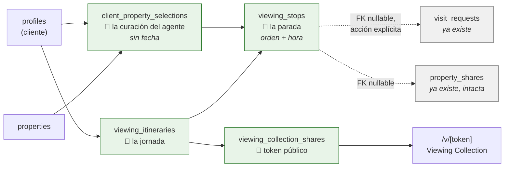

**Cuatro entidades nuevas. Cero modificaciones a tablas existentes.** Las dos flechas punteadas son FK nullable que salen de lo nuevo hacia lo viejo; nada apunta en sentido contrario, así que el módulo se puede apagar sin romper nada.

### Las siete decisiones de diseño que propone este documento

Son decisiones **nuevas**, no cubiertas por D-01…D-05, y son las que conviene revisar con más atención:

| # | Decisión | Razón |
|---|---|---|
| **P-01** | `viewing_stops` **no** guarda `property_id`. Solo `selection_id`. | La propiedad se deriva por join. Elimina la posibilidad de que la parada y la selección apunten a propiedades distintas. Además hace estructuralmente imposible una parada fuera de la selección — que es el invariante de D-01. |
| **P-02** | El estado de la selección tiene **3 valores almacenados**, no 8. `planned`, `visited` e `in_application` son **derivados**. | Task 2 pide evitar máquinas de estado innecesarias. Cada estado derivado que se almacena es un estado que se puede desincronizar. |
| **P-03** | El itinerario tiene **5 estados**. "ready" no es un estado, es una **validación derivada**. | Un itinerario está listo si tiene fecha, ≥1 parada y todas con hora. Guardarlo como estado obliga a recalcularlo en cada edición. |
| **P-04** | `ACTIVE / EXPIRED / REVOKED` del enlace **no se almacenan como enum**. Se derivan de `expires_at` y `revoked_at`. | Un estado `EXPIRED` almacenado exige un cron que lo actualice. Derivarlo es correcto por construcción. |
| **P-05** | La acción de permiso **`export` significa "publicar"**. No se extiende `PermissionAction`. | Añadir una acción nueva obliga a tocar las 7 matrices × 15 recursos existentes. `export` está sin usar y "sacar datos fuera del CRM" es exactamente lo que hace publicar. |
| **P-06** | `address_visibility = 'exact'` se protege con un **CHECK en base de datos**, no solo con lógica de aplicación. | D-04 exige que la dirección exacta dependa de la confirmación. Un CHECK lo hace imposible de saltar, incluso desde service role. |
| **P-07** | Los FK hacia `properties` son **`ON DELETE RESTRICT`**, no `CASCADE`. | Task 15 exige proteger el historial comercial. El patrón `CASCADE` del resto del esquema borraría en silencio paradas de itinerarios ya enviados. |

### Riesgo nuevo detectado en este sprint

**Los roles personalizados existentes perderán acceso al módulo en silencio.** `normalizeMatrix` ([lib/permissions.ts:386](lib/permissions.ts#L386)) itera `PERMISSION_RESOURCES` y asigna `false` a cualquier acción que no esté explícitamente en el JSON guardado. Al añadir `viewing_collections` al array, **todas las filas de `custom_roles` ya guardadas** devolverán `false` para el recurso nuevo hasta que alguien las vuelva a guardar. No es un fallo del diseño de este módulo, pero le toca a este módulo resolverlo (§23.5).

### Verificación del caso Paul

El escenario completo del brief —8 selecciones, 2 itinerarios, 4 confirmadas, 1 pendiente, 1 cancelada y sustituida, lunes publicado con caducidad y direcciones parciales, miércoles en draft— se recorre fila a fila en **§32**. El modelo lo soporta sin campos adicionales.

---

## 2. Product principles

Seis principios que resuelven los empates de diseño. Cuando dos opciones parezcan igual de buenas, gana la que respete el principio de número más bajo.

**PP-1 · Lo público es un privilegio, no un efecto secundario.**
Ningún dato llega a una superficie de cliente por defecto. Cada campo expuesto es una decisión explícita, escrita en un contrato tipado. La dirección exacta, el precio, el estado — todo se decide, nada se hereda.

**PP-2 · No romper lo que ya está en manos de clientes.**
Hay SmartLinks circulando por WhatsApp ahora mismo. `property_shares`, `/c/[token]` y `/compartir/[slug]` son intocables en este módulo. Todo lo nuevo va en tablas y rutas nuevas.

**PP-3 · Derivar antes que almacenar.**
Si un estado se puede calcular a partir de otros datos, se calcula. Un estado almacenado es un estado que puede mentir. Esto guía P-02, P-03 y P-04.

**PP-4 · Una entidad, una responsabilidad.**
La selección responde "¿qué le hemos elegido?". El itinerario responde "¿qué ve el lunes?". La parada responde "¿a qué hora y en qué orden?". La visita (`visit_requests`, ya existente) responde "¿está agendado en el CRM?". Ninguna asume el trabajo de otra.

**PP-5 · El agente decide, el sistema recuerda.**
El módulo no confirma visitas solo, no publica solo, no revela direcciones solo, no crea `visit_requests` solo (D-02). Automatiza el tedio (crear SmartLinks al publicar), nunca el criterio comercial.

**PP-6 · El historial comercial es sagrado.**
Lo que se le enseñó a un cliente, cuándo y a qué precio, no se borra por un efecto colateral. De ahí P-07.

---

## 3. Approved decisions

Decisiones humanas cerradas. Se registran aquí con su traducción a arquitectura.

| ID | Decisión | Cómo se materializa |
|---|---|---|
| **D-01** | Selección e itinerario son conceptos distintos | Dos tablas: `client_property_selections` (sin fecha) y `viewing_itineraries` (con fecha). Enlazadas por `viewing_stops.selection_id`. Sin duplicación de propiedades: la relación es por ID. §11, §12, §13 |
| **D-02** | Una parada NO crea `visit_request` automáticamente | `viewing_stops.visit_request_id` es **nullable**, se rellena mediante una acción explícita del agente ("Agendar en el CRM"). `visit_requests` no se sustituye ni se modifica. §13.4 |
| **D-03** | V1 solo con clientes en `profiles` | `client_property_selections.client_id` y `viewing_itineraries.client_id` son FK a `profiles` con `role='client'`. Sin contactos ligeros, sin leads. §31 lo difiere. |
| **D-04** | Dirección exacta bajo control del agente | `viewing_stops.address_visibility ∈ {area_only, exact}`, por parada, default `area_only`, con CHECK que exige confirmación (P-06). §20 |
| **D-05** | No tocar `property_shares` ni `/c/[token]` | `viewing_stops.property_share_id` nullable apuntando a la tabla existente. Al publicar se **crean** SmartLinks; al borrar/archivar la colección **no** se borran. §15 |

---

## 4. Terminology

### 4.1 Vocabulario interno (CRM)

| Término | Entidad | Definición operativa |
|---|---|---|
| **Property Selection** | `client_property_selections` | El conjunto de propiedades que el equipo ha elegido para un cliente. Sin fecha. Persistente. |
| **Selected Property** | una fila de la anterior | Una propiedad dentro de la selección de un cliente. |
| **Viewing Itinerary** | `viewing_itineraries` | Una jornada o sesión concreta de visitas para ese cliente. |
| **Viewing Stop** | `viewing_stops` | Una propiedad dentro de un itinerario, con orden, hora y estado de confirmación. |
| **Viewing Collection** | *(no es tabla)* | La **representación pública** de un itinerario publicado. Es una vista, no una entidad. |
| **Collection Share** | `viewing_collection_shares` | El enlace con token que da acceso a una Viewing Collection. |

> ⚠️ **Viewing Collection no es una tabla.** Es lo que el cliente ve cuando abre `/v/[token]`. Confundirlo con una entidad lleva a duplicar datos, que es justo lo que D-01 y Task 7 prohíben.

### 4.2 Vocabulario de cara al cliente

Provisional. El copy final se diseña en la fase Luxury (§19 del brief, §31.3 aquí).

| Concepto interno | Provisional cara al cliente |
|---|---|
| Viewing Collection | *Private Viewing Collection* |
| Viewing Itinerary | *Your Viewing Day* |
| Property / Stop | *Residence* |
| Visita | *Private Viewing* |
| Enlace al SmartLink | *Explore Residence* |

### 4.3 Nombres prohibidos

| Prohibido | Por qué |
|---|---|
| `catalog` / `catalogo` en rutas de API | `/api/v1/catalogos` ya existe y significa "datos maestros" (enums, pipelines, regiones). Sprint 0 §11.3. |
| `solicitud` para cualquier entidad nueva | Ya significa tres cosas distintas en `/admin/solicitudes`: visitas, mensajes web y leads de Idealista. Sprint 0 §6.4. |
| `collection` como tabla | Genérico y colisiona conceptualmente con `viewing_collection_shares`. Si algún día hace falta la tabla, `viewing_collections`. |
| `viewing` a secas | Ambiguo entre "la jornada" y "la visita individual". Siempre cualificado. |

---

## 5. Domain model

### 5.1 Diagrama entidad-relación

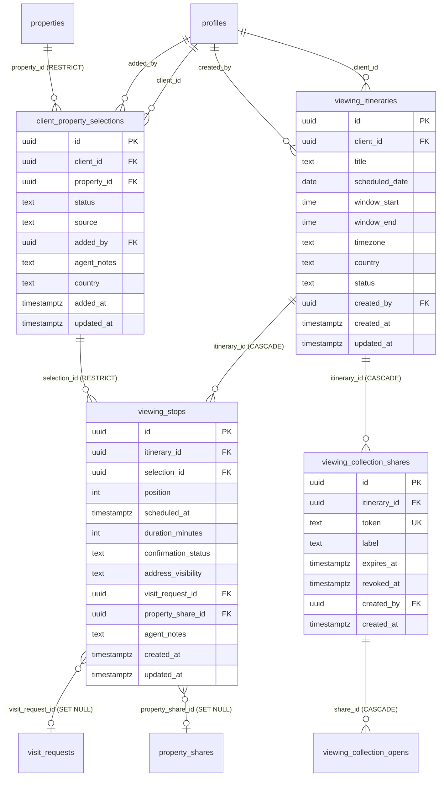

### 5.2 Por qué la parada no guarda `property_id` (P-01)

Es la decisión estructural más importante del modelo, y merece justificación.

La alternativa obvia sería `viewing_stops(itinerary_id, property_id, selection_id)`. Se descarta por tres razones:

1. **Elimina una clase entera de bugs.** Con dos rutas hacia la propiedad (directa y vía selección), pueden divergir. Con una, no.
2. **Hace cumplir D-01 estructuralmente.** "Un itinerario usa un subconjunto de la selección" deja de ser una regla de negocio que el código debe recordar y pasa a ser una imposibilidad del esquema: sin fila en la selección, no hay parada.
3. **El join no cuesta nada.** Toda consulta que pinta una parada necesita los datos de la propiedad de todos modos.

**Contrapartida aceptada:** si el agente añade una propiedad directamente al itinerario (sin pasar por la selección), el sistema debe crear la fila de selección de forma transparente. Es una regla de UX, especificada en §16.5.

### 5.3 Lo que deliberadamente NO se modela

| No modelado | Por qué |
|---|---|
| Snapshot de precio / fotos | Task 7: **live data**. §18.4 documenta la consecuencia. |
| Ruta entre paradas / optimización | Fuera de alcance. Requiere servicio externo, choca con "todo en el VPS". |
| Feedback del cliente | Fuera de alcance. Diferido a §31. |
| Estado "propuesto al cliente" a nivel de selección | Duplicaría el estado del itinerario. |
| Duración de desplazamiento entre paradas | Derivable de `scheduled_at` + `duration_minutes` de la parada anterior. No se almacena. |
| Asignación de agente por parada | El itinerario tiene `created_by`; `visit_requests.assigned_to` cubre el resto. Si hace falta agente por parada, es una fase posterior. |

---

## 6. Entity responsibilities

Contrato de responsabilidad única (PP-4). Si una funcionalidad no encaja en ninguna casilla, es señal de que falta una entidad — o de que sobra la funcionalidad.

| Entidad | Responde a | **No** responde a |
|---|---|---|
| `client_property_selections` | *"¿Qué propiedades ha elegido el equipo para Paul, y en qué punto está cada una?"* | Cuándo se ven. En qué orden. Quién las confirma. |
| `viewing_itineraries` | *"¿Qué sesión de visitas hay planificada, qué día y en qué franja?"* | Qué propiedades concretas (eso es la parada). Si el cliente ya las vio. |
| `viewing_stops` | *"¿En qué orden, a qué hora, cuánto dura, está confirmada, se enseña la dirección?"* | Si la propiedad interesa al cliente (eso es la selección). El registro oficial de la visita (eso es `visit_requests`). |
| `viewing_collection_shares` | *"¿Quién puede ver esto públicamente, hasta cuándo, y sigue vigente?"* | Qué contiene la colección. Eso lo resuelve el itinerario en vivo. |
| `visit_requests` *(existente)* | *"¿Hay una visita registrada en el CRM, con su estado y su agente?"* | Nada del itinerario. Sigue funcionando igual sin el módulo. |
| `property_shares` *(existente)* | *"¿Cuál es el enlace público de esta propiedad y cuántas veces se ha abierto?"* | Nada de colecciones. **Intacta** (D-05). |

### 6.1 La frontera crítica: parada vs. `visit_requests`

Es donde más fácil resulta duplicar. La regla:

```
viewing_stops.confirmation_status   →  estado DEL PLAN del agente
visit_requests.status               →  estado DEL REGISTRO en el CRM
```

Un ejemplo concreto: el agente propone las 11:00 a Paul. La parada pasa a `proposed`. Todavía **no** existe `visit_request` — porque D-02 dice que no se crea sola, y porque hasta que Paul no confirme no hay nada que registrar. Paul confirma: la parada pasa a `confirmed`, y **entonces** el agente pulsa "Agendar en el CRM", que crea la `visit_request` y rellena `visit_request_id`.

A partir de ese momento hay dos estados, y hay que decidir cuál manda. **Regla: la parada es la fuente de verdad del plan; `visit_requests` es la fuente de verdad del CRM.** La sincronización es unidireccional (parada → visita) y solo en las transiciones que el agente dispara explícitamente. Si alguien cambia el estado desde `/admin/solicitudes`, la parada **no** se entera — y eso es aceptable en V1, pero debe mostrarse: la UI del itinerario enseña ambos estados cuando difieren, en lugar de fingir que son uno solo.

`⬜ DECISIÓN PENDIENTE (Q-1):` ¿Debe la parada reflejar automáticamente los cambios de estado hechos desde `/admin/solicitudes`? Sincronizar bidireccional es más "mágico" pero introduce un acoplamiento que D-02 parece querer evitar. **Recomendación: no sincronizar en V1; mostrar la divergencia.**

---

## 7. Proposed relationships

### 7.1 Cardinalidades

| Relación | Cardinalidad | Nota |
|---|---|---|
| `profiles` (cliente) → `client_property_selections` | 1:N | La "selección de Paul" es el conjunto de sus filas. No hay entidad contenedora. |
| `properties` → `client_property_selections` | 1:N | Una propiedad puede estar en la selección de varios clientes. |
| (cliente, propiedad) → selección | **1:1** | `UNIQUE (client_id, property_id)`. Ver §9.1. |
| `profiles` (cliente) → `viewing_itineraries` | 1:N | Paul tiene lunes y miércoles. |
| `viewing_itineraries` → `viewing_stops` | 1:N | |
| `client_property_selections` → `viewing_stops` | 1:N | Una selección puede aparecer en varios itinerarios (Task 6). |
| (itinerario, selección) → parada | **1:1** | `UNIQUE (itinerary_id, selection_id)`. Evita duplicados accidentales. |
| `viewing_stops` → `visit_requests` | N:0..1 | Nullable. D-02. |
| `viewing_stops` → `property_shares` | N:0..1 | Nullable. D-05. |
| `viewing_itineraries` → `viewing_collection_shares` | 1:N | Varios enlaces por itinerario: uno revocado + uno nuevo, o uno por destinatario. |

### 7.2 Por qué no existe una entidad "Selection" contenedora

Podría existir `property_selections(id, client_id)` con `selected_properties(selection_id, property_id)`. Se descarta: **un cliente tiene exactamente una selección**, así que la tabla contenedora sería una fila por cliente sin más contenido que el `client_id`. La selección de Paul es, sencillamente, `WHERE client_id = paul`.

Esto se revisaría solo si apareciera el requisito de **selecciones con nombre** ("zona centro" vs "zona norte"), que hoy no está pedido.

`⬜ DECISIÓN PENDIENTE (Q-2):` ¿Hará falta que un cliente tenga varias selecciones nombradas? Si la respuesta es sí a corto plazo, conviene modelar el contenedor ahora — añadirlo después es una migración de datos, no solo de esquema.

### 7.3 Política de borrado (P-07)

| FK | Política | Razón |
|---|---|---|
| `client_property_selections.property_id → properties` | **RESTRICT** | PP-6. El resto del esquema usa CASCADE y borraría el historial en silencio. En la práctica las propiedades se archivan (soft), no se borran, así que la fricción es mínima. |
| `client_property_selections.client_id → profiles` | **CASCADE** | Si se borra el cliente, su selección deja de tener sentido. Coherente con `favorites`. |
| `viewing_stops.selection_id → client_property_selections` | **RESTRICT** | Impide quitar de la selección una propiedad que está en un itinerario. La UI ofrece "quitar del itinerario primero". |
| `viewing_stops.itinerary_id → viewing_itineraries` | **CASCADE** | Las paradas no existen sin su itinerario. |
| `viewing_stops.visit_request_id → visit_requests` | **SET NULL** | Si se borra la visita del CRM, la parada sobrevive sin registro. |
| `viewing_stops.property_share_id → property_shares` | **SET NULL** | D-05: el SmartLink es independiente. |
| `viewing_itineraries.client_id → profiles` | **CASCADE** | |
| `viewing_itineraries.created_by → profiles` | **SET NULL** | Un agente que se va no borra itinerarios. Mismo criterio que `property_shares.created_by`. |
| `viewing_collection_shares.itinerary_id → viewing_itineraries` | **CASCADE** | Sin itinerario no hay nada que servir. El enlace debe morir. |
| `viewing_collection_opens.share_id → viewing_collection_shares` | **CASCADE** | Igual que `property_share_opens`. |

> ⚠️ **Nota sobre RESTRICT y el borrado de propiedades.** Hoy `archiveProperty` es borrado lógico, así que RESTRICT no molesta. Pero si alguna vez se implementa borrado físico, fallará con un error de FK. Es intencionado: obliga a decidir qué pasa con el historial en vez de destruirlo. El mensaje de error debe ser legible, no un `23503` en crudo.

---

## 8. Proposed fields

Definiciones conceptuales. Los tipos son orientativos; el sprint de implementación fija el SQL exacto.

### 8.1 `client_property_selections`

| Campo | Tipo | Null | Default | Nota |
|---|---|---|---|---|
| `id` | uuid | no | `gen_random_uuid()` | |
| `client_id` | uuid FK profiles | no | | Debe tener `role='client'` (validación de aplicación, ver §9.4) |
| `property_id` | uuid FK properties | no | | RESTRICT |
| `status` | text | no | `'selected'` | `selected \| interested \| discarded`. §10.1 |
| `source` | text | no | `'manual'` | `suggestion \| favorite \| search \| manual`. Analítica de qué canal funciona |
| `added_by` | uuid FK profiles | sí | | SET NULL. El agente que la añadió |
| `agent_notes` | text | sí | | **INTERNO.** Nunca sale en el contrato público |
| `country` | text | no | | `'es' \| 'cl'`. Coherencia con el resto del esquema. Se deriva de `properties.country` al insertar |
| `added_at` | timestamptz | no | `now()` | |
| `updated_at` | timestamptz | no | `now()` | Trigger `set_updated_at()` ya existente |

**Descartados y por qué:**

| Campo descartado | Razón |
|---|---|
| `position` / `rank` | La selección no tiene orden. El orden es del itinerario. Si hiciera falta priorizar, es un campo nuevo con nombre honesto (`priority`), no un orden implícito. |
| `client_visible` | En V1 la selección **no** se expone al cliente; solo se expone vía itinerario publicado. Un flag aquí crearía una segunda superficie pública sin diseño. |
| `viewed_at` | Derivado: la parada completada más reciente. PP-3. |
| `rejected_reason` | Sin requisito. Cabe en `agent_notes` hasta que se pida estructurado. |

### 8.2 `viewing_itineraries`

| Campo | Tipo | Null | Default | Nota |
|---|---|---|---|---|
| `id` | uuid | no | | |
| `client_id` | uuid FK profiles | no | | |
| `title` | text | sí | | Ej. "Visitas del lunes". Si es null, la UI muestra la fecha. **Aparece en la superficie pública** — validar longitud y contenido |
| `scheduled_date` | date | **sí** | | **Nullable a propósito**: un draft puede existir sin fecha. Obligatoria para publicar |
| `window_start` | time | sí | | Franja de disponibilidad del cliente ("de 10:00 a 14:00") |
| `window_end` | time | sí | | |
| `timezone` | text | no | `'Europe/Madrid'` | Derivado del país. Chile lo necesita de verdad |
| `country` | text | no | | Aislamiento por país |
| `status` | text | no | `'draft'` | §10.2 |
| `created_by` | uuid FK profiles | sí | | SET NULL |
| `created_at` / `updated_at` | timestamptz | no | `now()` | |

**Sobre `timezone`:** parece exagerado hasta que un agente en Madrid planifica un itinerario en Santiago. `scheduled_at` de las paradas es `timestamptz`; sin la zona del itinerario, "las 11:00" es ambiguo al renderizar. Coste: una columna con default. Beneficio: no rehacerlo después.

**Descartados:**

| Campo | Razón |
|---|---|
| `assigned_to` | `created_by` + `visit_requests.assigned_to` cubren V1. Añadirlo abre "¿quién ve qué?" antes de tiempo. |
| `published_at` | Derivable del `created_at` del primer share activo. PP-3. |
| `is_ready` | P-03: validación derivada, no estado. |
| `notes` | `agent_notes` está a nivel de parada, que es donde surge la necesidad real. |

### 8.3 `viewing_stops`

| Campo | Tipo | Null | Default | Nota |
|---|---|---|---|---|
| `id` | uuid | no | | |
| `itinerary_id` | uuid FK | no | | CASCADE |
| `selection_id` | uuid FK | no | | RESTRICT. **La propiedad se deriva de aquí** (P-01) |
| `position` | int | no | | Orden. Ver §9.2 sobre la estrategia de reordenación |
| `scheduled_at` | timestamptz | **sí** | | Null = parada sin hora. `unscheduled` se deriva de esto (P-02) |
| `duration_minutes` | int | sí | `30` | Previsto, no real |
| `confirmation_status` | text | no | `'pending'` | §10.3 |
| `address_visibility` | text | no | `'area_only'` | `area_only \| exact`. D-04, P-06 |
| `visit_request_id` | uuid FK | sí | | SET NULL. D-02 |
| `property_share_id` | uuid FK | sí | | SET NULL. D-05 |
| `agent_notes` | text | sí | | **INTERNO** |
| `created_at` / `updated_at` | timestamptz | no | | |

**Descartados:**

| Campo | Razón |
|---|---|
| `property_id` | P-01. Se deriva vía `selection_id`. |
| `travel_minutes` | Derivable. Y sin routing real sería un número inventado. |
| `client_feedback` | Fuera de alcance. |
| `actual_duration` | Sin requisito. |
| `is_visible` | Ocultar una parada sin borrarla no está pedido; y una parada oculta en una colección publicada confunde más de lo que ayuda. |

### 8.4 `viewing_collection_shares`

Hermana deliberada de `property_shares`. Mismas columnas donde tiene sentido, para que el código sea reconocible.

| Campo | Tipo | Null | Default | Nota |
|---|---|---|---|---|
| `id` | uuid | no | | |
| `itinerary_id` | uuid FK | no | | CASCADE |
| `token` | text UNIQUE | no | | 28 chars base64url, **mismo `randomToken()`** que SmartLinks ([actions.ts:693](app/(admin)/admin/propiedades/actions.ts#L693)). ~168 bits |
| `label` | text | sí | | Interno. Ej. "Enviado a Paul por WhatsApp" |
| `expires_at` | timestamptz | **no** | | **NOT NULL, a diferencia de `property_shares`.** §22 |
| `revoked_at` | timestamptz | sí | | Revocación manual |
| `created_by` | uuid FK | sí | | SET NULL |
| `created_at` | timestamptz | no | `now()` | |

**Diferencia clave con `property_shares`:** allí `expires_at` es nullable y nunca se rellena. Aquí es **NOT NULL**. Una colección expone la estrategia comercial completa con un cliente —qué le enseñas, en qué orden, a qué precio, a qué hora, y a veces la dirección exacta—; eso no puede vivir en un enlace eterno.

### 8.5 `viewing_collection_opens`

Espejo de `property_share_opens`.

| Campo | Tipo | Nota |
|---|---|---|
| `id` | uuid | |
| `share_id` | uuid FK | CASCADE |
| `opened_at` | timestamptz | `now()` |
| `ip` | text | **SENSITIVE** |
| `user_agent` | text | **SENSITIVE** |

`⬜ DECISIÓN PENDIENTE (Q-3):` ¿Hace falta esta tabla, teniendo `page_views` con `page_type='viewing_collection'`? **Sí, y por la misma razón que existe `property_share_opens`:** `page_views` se inserta desde el navegador vía `/api/tracking`, así que un cliente con bloqueador no aparece. `viewing_collection_opens` se inserta en servidor y no se puede bloquear. Son dos medidas distintas: aperturas reales vs. sesiones instrumentadas. Merece la pena mantener ambas.

---

## 9. Constraints

### 9.1 Unicidad

| Constraint | Tabla | Propósito |
|---|---|---|
| `UNIQUE (client_id, property_id)` | `client_property_selections` | **La más importante.** Una propiedad aparece una sola vez en la selección de un cliente. Convierte "añadir a la selección" en un UPSERT idempotente: pulsar dos veces no duplica. |
| `UNIQUE (itinerary_id, selection_id)` | `viewing_stops` | Task 6: evita duplicados accidentales dentro de un itinerario. |
| `UNIQUE (token)` | `viewing_collection_shares` | Igual que `property_shares`. |

### 9.2 Orden de las paradas — estrategia de reordenación

Task 3 exige drag & drop. Hay tres opciones y la elección tiene consecuencias reales:

| Opción | Cómo | Problema |
|---|---|---|
| `UNIQUE (itinerary_id, position)` con enteros consecutivos | 1, 2, 3… | Mover la parada 5 a la 2 exige **reescribir 4 filas** en una transacción. Y con UNIQUE no diferido, cualquier orden de UPDATE viola la constraint a mitad de camino. |
| Enteros espaciados | 100, 200, 300… | Insertar en medio = punto medio (150). Sin reescrituras. Requiere renumerar cuando se agotan los huecos (tras ~10 inserciones en el mismo punto). |
| Fraccional / lexicográfico | `numeric` o rank strings | Nunca se agota. Más complejo de leer al depurar. |

**Recomendación: enteros espaciados de 100 en 100, SIN constraint UNIQUE sobre `position`.** El desempate al ordenar es `ORDER BY position, created_at`. Renumeración perezosa cuando el hueco entre vecinos es < 2. Con itinerarios de 5-10 paradas, esto no se activará casi nunca.

**Descartado explícitamente:** `UNIQUE (itinerary_id, position)`. Con un itinerario de 8 paradas y drag & drop, la reescritura completa en cada movimiento es coste innecesario y una fuente de errores de concurrencia si dos agentes editan a la vez.

### 9.3 CHECK constraints

```
client_property_selections.status    ∈ {selected, interested, discarded}
client_property_selections.source    ∈ {suggestion, favorite, search, manual}
client_property_selections.country   ∈ {es, cl}

viewing_itineraries.status           ∈ {draft, published, completed, cancelled, archived}
viewing_itineraries.country          ∈ {es, cl}
viewing_itineraries.window_end       IS NULL OR window_start IS NULL OR window_end > window_start

viewing_stops.confirmation_status    ∈ {pending, proposed, confirmed, declined, cancelled, completed}
viewing_stops.address_visibility     ∈ {area_only, exact}
viewing_stops.duration_minutes       IS NULL OR (duration_minutes > 0 AND duration_minutes <= 480)

-- P-06 · La joya de la corona de la seguridad de D-04:
viewing_stops CHECK (
  address_visibility = 'area_only'
  OR confirmation_status IN ('confirmed', 'completed')
)
```

**Sobre el último CHECK.** Hace estructuralmente imposible que una parada no confirmada exponga la dirección exacta — ni por un bug de la UI, ni por un endpoint mal escrito, ni desde el service role. Efecto secundario **deseado**: cancelar una parada que tenía `exact` **falla** salvo que el mismo UPDATE ponga `address_visibility='area_only'`. Es decir, cancelar revierte la exposición automáticamente. Hay que documentarlo para quien escriba la action, porque si no se ve venir parece un bug.

### 9.4 Invariantes que **no** se pueden expresar en SQL

Estos van en la capa de aplicación y necesitan test:

| Invariante | Dónde se aplica |
|---|---|
| `client_id` debe apuntar a un perfil con `role='client'` | Validación en la action de creación. Un FK no puede filtrar por columna del destino. |
| `viewing_itineraries.client_id` == `client_property_selections.client_id` de todas sus paradas | **Crítico.** Sin esto, una parada podría meter una propiedad de la selección de otro cliente en el itinerario de Paul, y eso es una fuga de datos entre clientes. Validar al insertar la parada + test de regresión obligatorio. |
| `country` de la selección == `country` de la propiedad | Se deriva al insertar. |
| `country` del itinerario == `country` de las selecciones de sus paradas | Coherencia de aislamiento por país. |
| Un itinerario `published` debe tener ≥1 parada y `scheduled_date` no nula | Validación de publicación (§21). No es CHECK porque el estado y las paradas viven en tablas distintas. |
| `address_visibility='exact'` requiere además que el itinerario esté publicado | Complementa el CHECK. |

> El segundo invariante es el más peligroso de la lista. Un CHECK no lo alcanza (cruza tres tablas). O se resuelve con un trigger, o con una validación de aplicación acompañada de un test. **Recomendación: trigger `BEFORE INSERT OR UPDATE` en `viewing_stops`.** Es una fuga de datos entre clientes; no debe depender de que nadie se salte la action.

### 9.5 Índices propuestos

```
client_property_selections (client_id, status)          -- la vista de la ficha
client_property_selections (property_id)                -- "¿en cuántas selecciones está?"
viewing_itineraries        (client_id, scheduled_date DESC)
viewing_itineraries        (status) WHERE status IN ('draft','published')
viewing_stops              (itinerary_id, position)     -- el render del itinerario
viewing_stops              (selection_id)               -- "¿en qué itinerarios aparece?"
viewing_collection_shares  (token)                      -- resolución pública, la ruta caliente
viewing_collection_shares  (itinerary_id)
viewing_collection_opens   (share_id, opened_at DESC)
```

---

## 10. State machines

### 10.1 Property Selection

**Almacenado: 3 estados.** El análisis que lleva ahí (Task 2 pide explícitamente descartar los que dupliquen):

| Estado propuesto en el brief | Veredicto | Razón |
|---|---|---|
| `suggested` | ❌ Descartado | Una sugerencia no persiste hoy. En cuanto el agente la añade, está seleccionada. Sería un estado sin escritor. |
| `selected` | ✅ Almacenado | El default. |
| `client_interested` | ✅ Almacenado como `interested` | Señal positiva que el agente registra. Ojo: **no** es `favorites` (eso lo marca el cliente). |
| `viewing_planned` | ❌ **Derivado** | `EXISTS(stop WHERE selection_id = X AND itinerary.status NOT IN ('cancelled','archived'))` |
| `visited` | ❌ **Derivado** | `EXISTS(stop WHERE selection_id = X AND confirmation_status = 'completed')` |
| `shortlisted` | ❌ Descartado | Sinónimo de `selected`. Dos nombres para lo mismo garantiza que se usen mal. |
| `rejected` | ✅ Almacenado como `discarded` | Descartada. "Rejected" suena a que rechazó el propietario. |
| `application` | ❌ **Derivado** | `property_applications` ya existe con `client_id` + `property_id`. Duplicarlo es garantizar divergencia. |

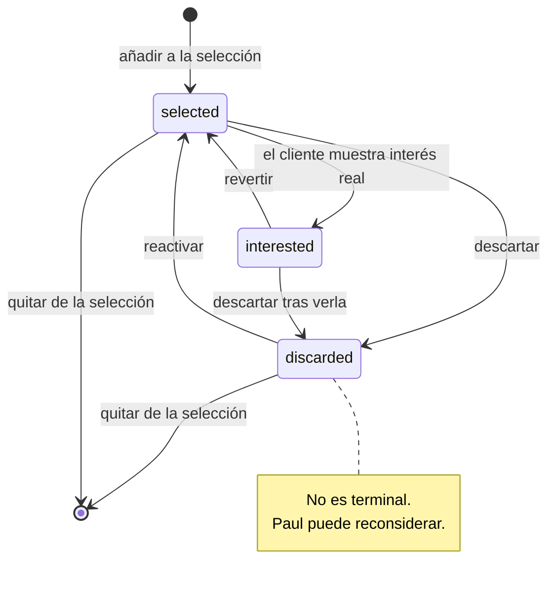

**Insignias derivadas** (se calculan al renderizar, no se guardan):
`📅 En itinerario` · `✅ Visitada` · `📄 En tramitación` · `❤️ Favorita del cliente` (join con `favorites`)

> **Quitar de la selección ≠ descartar.** Quitar borra la fila (y RESTRICT lo impide si hay paradas). Descartar conserva el historial: sabemos que se le enseñó y no le gustó. La UI debe empujar hacia `discarded`; quitar es para errores.

### 10.2 Viewing Itinerary

**5 estados.** `planning` y `ready` del brief se descartan: el primero es indistinguible de `draft`, el segundo es una validación derivada (P-03).

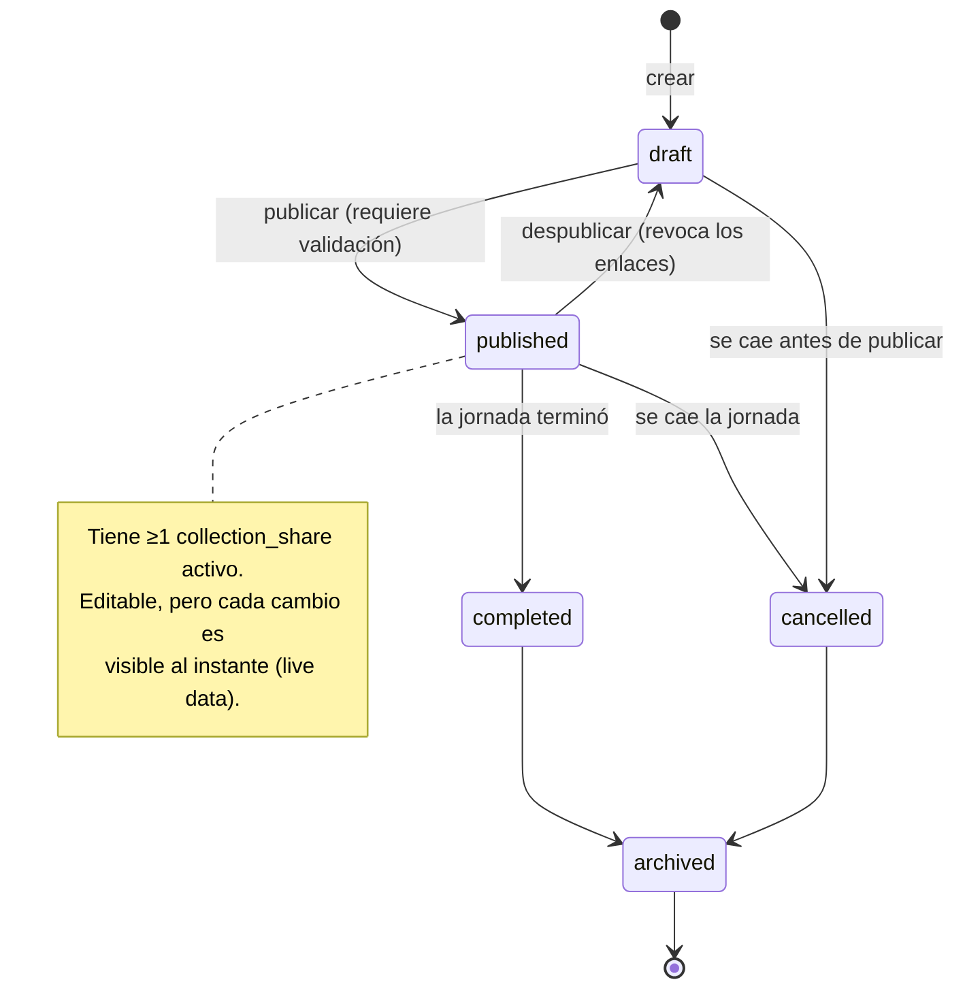

| Estado | Editable | Enlace público | Visible en la ficha |
|---|---|---|---|
| `draft` | ✅ total | ❌ | ✅ |
| `published` | ⚠️ con aviso ("el cliente ve los cambios") | ✅ | ✅ |
| `completed` | ❌ salvo notas | ⚠️ hasta que caduque | ✅ |
| `cancelled` | ❌ | ❌ revocado automáticamente | ✅ atenuado |
| `archived` | ❌ | ❌ | solo con filtro |

**Validación "listo para publicar"** (derivada, P-03) — todas deben cumplirse:
1. `scheduled_date` no nula
2. ≥1 parada
3. Todas las paradas con `scheduled_at` no nulo
4. Ninguna parada con la propiedad en `archived`
5. Sin solapes de horario (§17.3)

La UI muestra esto como una checklist en vivo, no como un estado.

### 10.3 Viewing Stop

Task 3 pregunta si conviene separar schedule / confirmation / visit. **Análisis: solo uno merece ser enum.**

| Dimensión | Cómo se representa | Razón |
|---|---|---|
| **Schedule state** | Derivado de `scheduled_at IS NULL` | Un enum de dos valores que duplica un campo existente es ruido. `unscheduled` del brief se elimina así. |
| **Confirmation state** | ✅ Enum `confirmation_status` | Tiene 6 valores con transiciones reales. Es el enum de verdad. |
| **Visit state** | Delegado a `visit_requests.status` | PP-4. Duplicarlo garantiza divergencia. |

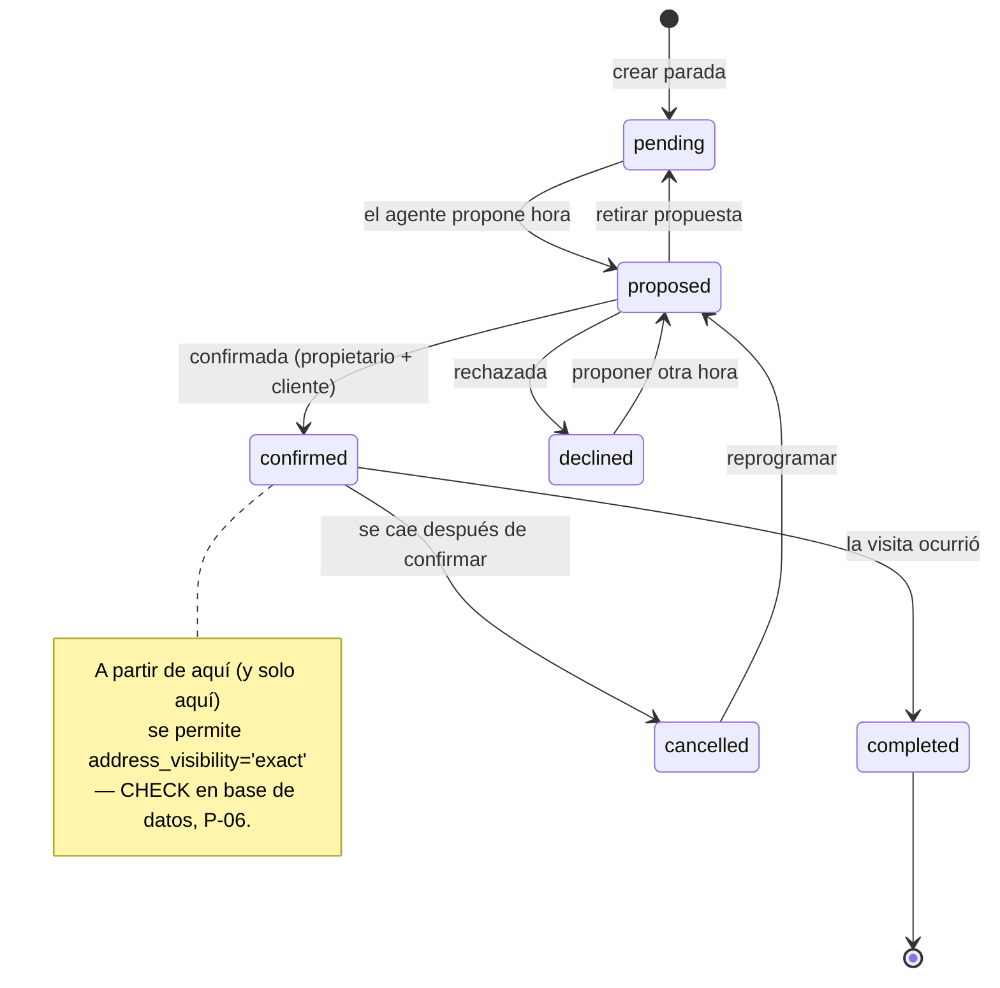

| Estado | Significado | ¿Dirección exacta? | ¿Cuenta como "planificada"? |
|---|---|---|---|
| `pending` | En el itinerario, sin hora propuesta | ❌ | ✅ |
| `proposed` | Hora propuesta, sin confirmar | ❌ | ✅ |
| `confirmed` | Confirmada | ✅ permitida | ✅ |
| `declined` | Rechazada (no llegó a ocurrir) | ❌ | ❌ |
| `cancelled` | Cancelada tras confirmar | ❌ (revierte) | ❌ |
| `completed` | Ocurrió | ✅ permitida | ✅ |

**`declined` vs `cancelled`.** Parece un matiz y no lo es: el caso Paul incluye "1 cancelada y sustituida por otra propiedad". Distinguir "nunca cuajó" de "se cayó a última hora" cambia lo que se le cuenta al cliente y lo que se mide después.

---

## 11. Client Property Selection

### 11.1 Qué resuelve

El vacío que Sprint 0 §9.4 documentó: hoy no hay dónde guardar *"el equipo ha elegido estas 8 propiedades para Paul"*. Ni `favorites` (es del cliente, y la RLS impide que el staff escriba) ni `visit_requests` (exige fecha) sirven.

### 11.2 Cómo entra una propiedad

Tres orígenes, un solo destino (`source` registra cuál):

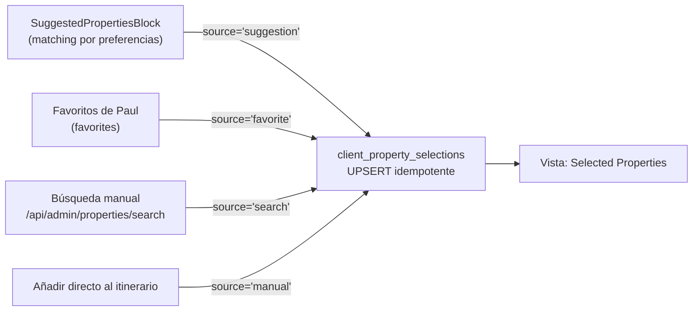

**Los favoritos NO se convierten automáticamente** (Task 3-B). El bloque de favoritos muestra un botón "Añadir a la selección" por propiedad y un "Añadir todos". La distinción se mantiene visible: una propiedad puede ser favorita de Paul y no estar seleccionada, o al revés, y ambas cosas significan algo distinto.

Gracias a `UNIQUE (client_id, property_id)`, todas las rutas son UPSERT: añadir algo ya presente no duplica, actualiza `updated_at` y no toca `status` (para no resucitar un `discarded` por accidente).

### 11.3 Lo que el agente ve

Un listado con filtro por estado y las insignias derivadas de §10.1. Por fila: miniatura (vía proxy `/p/`), título, referencia BC, zona, precio, estado, insignias, y en qué itinerarios aparece.

Acciones por fila: cambiar estado · añadir a itinerario · ver/crear SmartLink · abrir la ficha · notas internas · quitar.

Wireframe en §26.2.

### 11.4 `agent_notes` es interno, y hay que decirlo dos veces

Se muestra en el panel, se excluye del contrato público (§19) y **no debe aparecer en ninguna query cuyo resultado pueda llegar a una superficie de cliente**. Es exactamente el tipo de campo que Sprint 0 §14 identificó como riesgo: útil internamente, tóxico si se filtra.

---

## 12. Viewing Itinerary

### 12.1 Qué es

Una jornada de visitas para un cliente: fecha, franja horaria y un conjunto ordenado de paradas tomadas de su selección.

### 12.2 Creación

Desde la selección de Paul, "Crear itinerario", con las propiedades preseleccionadas por checkbox. Lo único obligatorio para crear el draft es el `client_id`. Ni fecha ni paradas: **el agente debe poder guardar un itinerario incompleto** (Task 5).

Progresión de obligatoriedad:

| Momento | Obligatorio |
|---|---|
| Crear draft | `client_id` |
| Guardar draft | nada más |
| **Publicar** | `scheduled_date` + ≥1 parada + todas las paradas con hora + ninguna propiedad archivada + sin solapes |

### 12.3 Título en superficie pública

`title` es el único campo de texto libre del agente que **sí** aparece en la colección pública. Implica: límite de longitud (~80 chars), sin HTML, y un aviso en la UI ("este título lo verá el cliente"). Si es null, la pública muestra la fecha formateada según `getCountryConfig(country).locale`.

### 12.4 Relación con el calendario del CRM

Sprint 0 §5.4 documentó que hay dos modelos de agenda y uno está muerto (`calendar_events` no se referencia desde ninguna línea de código; el calendario real usa `visit_requests`).

**Este módulo no crea un tercero.** Las paradas aparecen en `/admin/calendario` **solo** cuando el agente las agenda explícitamente, porque entonces existe una `visit_request` y el calendario ya la lee. Un itinerario en draft es invisible al calendario, y eso es correcto: todavía no es un compromiso.

`⬜ DECISIÓN PENDIENTE (Q-4):` ¿Debería `/admin/calendario` mostrar también itinerarios publicados sin `visit_requests`? Sería útil para ver la carga del día, pero exige que el calendario lea de dos fuentes. **Recomendación: no en V1.**

---

## 13. Viewing Stop

### 13.1 Qué es

Una propiedad dentro de un itinerario, con su orden, su hora, su duración, su estado de confirmación y su política de dirección.

### 13.2 Orden

Enteros espaciados de 100 en 100 (§9.2). El reorder por drag & drop calcula el punto medio entre vecinos y escribe **una sola fila**.

```
Antes:  A(100)  B(200)  C(300)  D(400)
Mover D entre A y B  →  D.position = 150
Después: A(100)  D(150)  B(200)  C(300)
```

Si el hueco es < 2, renumerar el itinerario completo (100, 200, 300…) en una transacción. Con 5-10 paradas es un evento raro y barato.

### 13.3 Horario

`scheduled_at` es `timestamptz`; se renderiza en `viewing_itineraries.timezone`. `duration_minutes` (default 30) es lo previsto, no lo real.

Solapes: se **detectan y avisan**, no se bloquean. Un agente puede tener razones (dos pisos en el mismo portal). Es un warning de la validación de publicación, no un error.

### 13.4 Enlace con `visit_requests` (D-02)

**La parada nunca crea una `visit_request` por existir.** El agente pulsa "Agendar en el CRM" y entonces:

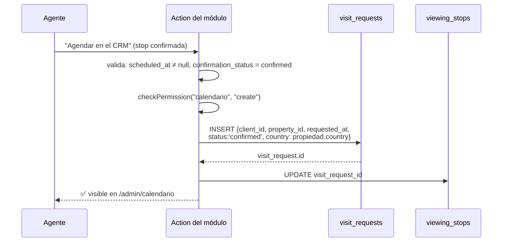

Notas:
- El `country` se deriva de la propiedad, igual que hace el endpoint existente ([app/api/admin/calendario/events/route.ts:80](app/api/admin/calendario/events/route.ts#L80)).
- Requiere permiso sobre **`calendario`**, no sobre `viewing_collections`: se está escribiendo en el calendario del CRM, y quien no puede escribir ahí no debe poder hacerlo por la puerta de atrás.
- Es **reversible**: "Desvincular" pone `visit_request_id = NULL` sin borrar la visita.
- Si ya hay `visit_request_id`, el botón cambia a "Ver en el calendario".

### 13.5 Sustituir una parada

Del caso Paul: *"1 cancelada y sustituida por otra propiedad"*.

No hay "reemplazar" como operación atómica. Son dos:

1. La parada de la propiedad cancelada → `confirmation_status = 'cancelled'` (y el CHECK fuerza `address_visibility = 'area_only'` en el mismo UPDATE).
2. Añadir una parada nueva desde la selección, en la posición que ocupaba.

**La parada cancelada no se borra.** Queda en el itinerario, visible para el agente y —decisión de §25.4— también para el cliente, marcada como cancelada. Si desapareciera sin más, el cliente que ya abrió la colección vería cambiar el plan sin explicación.

---

## 14. Collection Share

### 14.1 Reutilización del patrón (D-05)

| Pieza | De dónde sale | Cambio |
|---|---|---|
| Generación de token | `randomToken()`, [actions.ts:693](app/(admin)/admin/propiedades/actions.ts#L693) | Ninguno. **Extraer a `lib/` y compartir** en lugar de copiar. |
| Resolución por token | Patrón de `getPropertyByShareToken` | Adaptado: resuelve itinerario + paradas + propiedades |
| Registro de apertura | Patrón de `recordShareOpen` (fire-and-forget) | Ninguno |
| `robots: noindex` | Patrón de `/c/[token]` | **+ cabecera `X-Robots-Tag`** (Task 10) |
| RLS | `select` solo `is_staff()`, escritura `is_admin()` | Ninguno |
| Acceso público | Service role, solo en servidor | Ninguno |

### 14.2 Lo que cambia respecto a `property_shares`

| | `property_shares` | `viewing_collection_shares` |
|---|---|---|
| Apunta a | Una propiedad | Un itinerario |
| `expires_at` | Nullable, nunca se usa | **NOT NULL** |
| Revocación | Solo borrado | `revoked_at`, conserva la analítica |
| `X-Robots-Tag` | No | Sí |
| Ruta | `/c/[token]` | `/v/[token]` |

### 14.3 Varios enlaces por itinerario

Permitido (1:N). Casos: revocar el enviado y emitir otro; enlaces distintos para Paul y su pareja; renovar tras caducar.

El estado del enlace se **deriva** (P-04):

```
revoked_at IS NOT NULL   → REVOKED
expires_at < now()       → EXPIRED
resto                    → ACTIVE
```

Sin columna de estado, sin cron que la mantenga, sin posibilidad de que mienta.

---

## 15. SmartLink integration

### 15.1 Modelo

`viewing_stops.property_share_id` → `property_shares.id`, nullable, `ON DELETE SET NULL`. **`property_shares` no se modifica** (D-05).

### 15.2 Al publicar

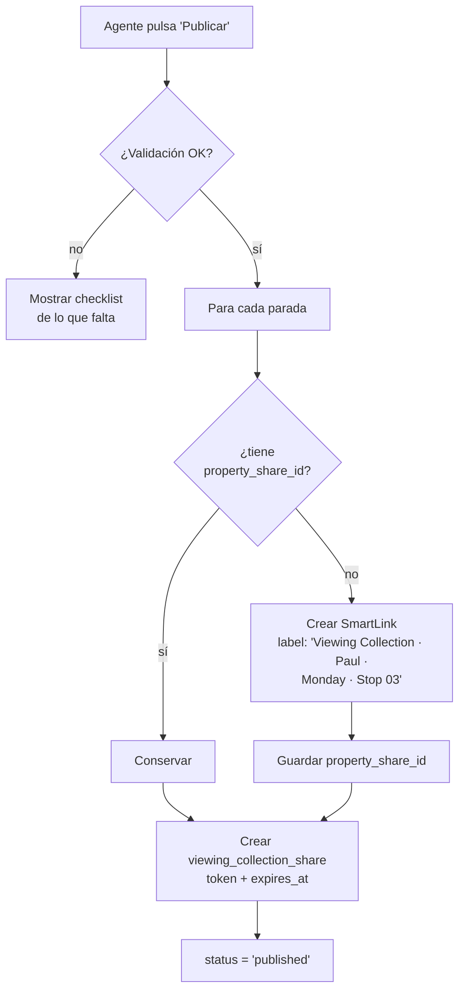

Formato del label (D-05): `Viewing Collection · {cliente} · {título o fecha} · Stop {NN}`

Es texto libre en la tabla existente, así que no requiere migración y aparece legible en el panel de SmartLinks de la propiedad — un agente que mire esa propiedad verá de dónde salió el enlace.

### 15.3 Usar un SmartLink existente

Task 8 lo pide explícitamente. En el editor de parada, un selector alimentado por `getSharesForProperty(propertyId)` (query existente) permite elegir uno ya creado, con su etiqueta y su número de aperturas.

**Cuándo tiene sentido:** el agente ya le mandó ese piso a Paul la semana pasada y quiere que las aperturas se acumulen en el mismo enlace en vez de repartirse entre dos.

**Advertencia obligatoria en la UI:** si el SmartLink elegido tiene un label que menciona a otro cliente, avisar. `label` es texto libre y contiene nombres de personas (Sprint 0 §14.4 lo clasifica como dato con PII potencial). Reutilizar el enlace "Para María Pérez" en la colección de Paul mezcla la analítica de dos clientes.

### 15.4 Ciclo de vida

**Los SmartLinks creados por el módulo NO se borran** al borrar, cancelar o archivar la colección (D-05). Sobreviven como enlaces de propiedad normales. Si el agente quiere limpiarlos, lo hace desde el panel de la propiedad, como cualquier otro.

Consecuencia asumida: publicar itinerarios genera SmartLinks acumulativos. Con volumen alto, el panel de una propiedad popular puede llenarse. Mitigación futura (no V1): filtro "creados por colecciones" en `SmartLinksPanel`.

### 15.5 Paradas sin SmartLink en la pública

Aunque al publicar se crean todos, puede faltar alguno (creado después, o borrado desde la propiedad). Cascada de fallback:

```
1. property_share_id no nulo y el share existe  →  /c/{token}         ✅ con tracking
2. Sin share                                    →  /compartir/{shareSlug(slug, bcReference)}
                                                                       ⚠️ estable, SIN tracking, indexable
3. Propiedad archivada                          →  sin enlace, "Ya no disponible"
```

> ⚠️ **El nivel 2 tiene un coste que hay que aceptar conscientemente:** `/compartir/[slug]` es indexable y no atribuye la visita a la colección. Es aceptable como red de seguridad, no como camino habitual. Si en producción se ve que el nivel 2 se usa mucho, es señal de que la creación al publicar está fallando.

### 15.6 Prerequisito: `/c/[token]` no muestra vídeos ni planos

Sprint 0 §10.1 lo verificó: `getPropertyByShareToken` no carga `property_media`, así que el enlace con tracking no enseña vídeos ni planos, mientras que `/compartir/[slug]` sí.

**Para este módulo importa más que hoy.** La colección envía al cliente a `/c/[token]` desde cada residencia. Si el destino es peor que la alternativa pública, el embudo entero pierde calidad justo en el clic que más interesa medir.

**Recomendación: arreglarlo ANTES del lanzamiento** (§29.2). Es un cambio pequeño y contenido: añadir la carga de `property_media` a `getPropertyByShareToken` y pasar `videos`/`plans` a `PublicPropertyView`, que ya acepta ambas props.

---

## 16. Agent user journey

### 16.1 Punto de entrada

`/{country}/admin/clientes/[id]` — la ficha de Paul. Sprint 0 §17 identificó los puntos de anclaje; aquí se concretan.

`ClientFichaView` ya está compuesta por bloques en dos columnas ([client-ficha-view.tsx:233-249](app/[country]/(admin)/admin/clientes/[id]/client-ficha-view.tsx#L233)). **Se respeta esa estructura** (Task 3): se añaden bloques, no se convierte en tabs.

```
ClientFichaView
├── Header · Contacto · ActivityCards            (sin cambios)
└── Grid
    ├── izquierda: PreferencesCard, NotesCard    (sin cambios)
    └── derecha:
        ├── FavoritesCard          ← + botón "Añadir a la selección"
        ├── 🆕 SelectedPropertiesBlock
        ├── 🆕 ViewingItinerariesBlock
        ├── SuggestedPropertiesBlock ← + botón "Añadir a la selección"
        └── VisitsCard              (sin cambios)
```

**Orden deliberado:** selección e itinerarios van **por encima** de sugerencias, porque son el estado actual del trabajo comercial; las sugerencias son materia prima. Y `FavoritesCard` queda arriba porque es la señal del propio cliente.

`⬜ DECISIÓN PENDIENTE (Q-5):` con cinco bloques la columna derecha se hace larga. ¿Colapsables, con el estado recordado por agente? Es cuestión de UX; no afecta al modelo.

### 16.2 Recorrido completo

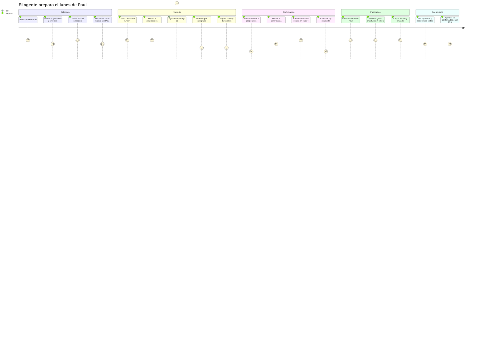

### 16.3 Añadir propiedades — las tres vías

| Vía | Componente | Acción | `source` |
|---|---|---|---|
| **A · Sugerencias** | `SuggestedPropertiesBlock` | "Añadir a la selección" por tarjeta | `suggestion` |
| **B · Favoritos** | `FavoritesCard` | Por propiedad + "Añadir todos" | `favorite` |
| **C · Búsqueda** | Modal nuevo sobre `/api/admin/properties/search` | Autocompletado, añadir | `search` |

⚠️ **La vía A depende de un bug activo.** `getSuggestedProperties` devuelve `[]` siempre (Sprint 0 §13.1). Sin arreglarlo, el principal punto de entrada al módulo está muerto. Especificación del fix en §29.1.

### 16.4 Búsqueda manual

`/api/admin/properties/search?q=` ya devuelve `id, slug, title, address, bc_reference, cover_photo_url, price, operation` — justo lo que necesita un autocompletado.

Dos ajustes necesarios:
1. **La guarda de rol es un array hardcodeado** que omite `captadora` y no consulta la matriz de permisos. Migrar a `requirePermission("properties", "view")`. *(Saneamiento, no bloqueante.)*
2. **No filtra por país ni por archivadas.** El selector debe filtrar por el país del cliente y excluir archivadas.

### 16.5 Añadir directo al itinerario

Si el agente añade una propiedad desde el editor del itinerario sin pasar por la selección, el sistema **crea la fila de selección de forma transparente** con `source='manual'` y `status='selected'`, y luego la parada. Es la contrapartida de P-01 y debe ser invisible: el agente no debería tener que entender el modelo de dos niveles para trabajar rápido.

---

## 17. Multi-day scenarios

### 17.1 Varios itinerarios por cliente

Soportado por diseño: `viewing_itineraries.client_id` es 1:N. Paul tiene lunes (`published`) y miércoles (`draft`) simultáneamente.

### 17.2 Propiedades sin itinerario

La consulta natural desde la selección:

```
Propiedades de Paul SIN parada en ningún itinerario activo
  = selección de Paul
  − las que tienen stop en itinerario con status ∉ {cancelled, archived}
```

Es un filtro de primera clase en la vista de selección ("Sin planificar"), porque es la pregunta que el agente se hace al abrir la ficha: *¿qué me queda por colocar?*

### 17.3 Una propiedad en varios itinerarios

**Permitido** (Task 6), con dos salvaguardas:

- `UNIQUE (itinerary_id, selection_id)` impide el duplicado **dentro** de un itinerario.
- Entre itinerarios activos, **no hay constraint**, pero la UI muestra un aviso: *"Esta propiedad ya está en 'Visitas del lunes'. ¿Añadirla también al miércoles?"*

Razones legítimas: segunda visita con la pareja; la del lunes se canceló y se replanifica sin borrar el histórico.

En la vista de selección, cada propiedad muestra en qué itinerarios aparece — así el aviso no llega por sorpresa.

### 17.4 Solapes de horario

Se detectan **dentro** de un itinerario (comparando `scheduled_at` + `duration_minutes`) y se muestran como warning en la validación de publicación. **No se bloquea.**

Entre itinerarios de días distintos no aplica. Entre itinerarios del mismo día (posible: mañana y tarde como dos itinerarios) sí debería avisarse.

`⬜ DECISIÓN PENDIENTE (Q-6):` ¿Dos sesiones el mismo día son dos itinerarios o uno con hueco? El modelo soporta ambas. **Recomendación: dos itinerarios** — cada uno con su enlace, su franja y su título, que es más claro para el cliente.

---

## 18. Public collection journey

### 18.1 Ruta

**`/v/[token]`** — verificado libre (`app/` contiene `c`, `p`, `og`, `compartir`, `web`, `admin`, `api`, `login`, `auth`, `[country]`, y los grupos de ruta).

Se añade `/v` a `PUBLIC_PATHS` en [middleware.ts:14](middleware.ts#L14).

### 18.2 Recorrido del cliente

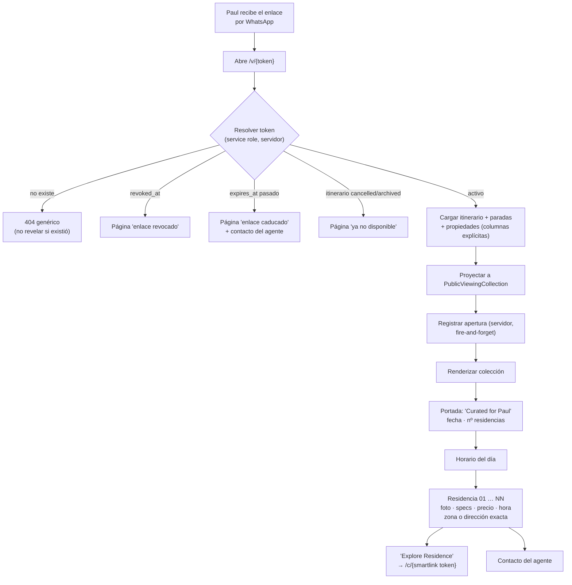

### 18.3 Qué ve el cliente por residencia

| Sí | No |
|---|---|
| Foto principal (proxy `/p/`) | Datos del propietario |
| Título, tipo, zona/subzona | Notas internas (ni de la propiedad ni de la parada) |
| Habitaciones, baños, m² | Portal de origen (`source_url`, `external_id`) |
| Precio (formato del país) | Estado del resto de propiedades de la selección |
| Hora y duración prevista | Otros clientes, otros itinerarios |
| Estado de confirmación (legible) | Presupuesto de Paul, sus etiquetas, sus preferencias |
| Dirección exacta **solo si** `address_visibility='exact'` | El `label` de los SmartLinks |
| Enlace "Explore Residence" | Cualquier UUID interno |

### 18.4 Live data — decisión y consecuencia (Task 7)

**Sprint 1 usa datos en vivo. No hay snapshot ni versionado.**

Consecuencias, documentadas para que no sorprendan:

| Cambia en el CRM | Paul ve |
|---|---|
| Baja el precio | El nuevo precio, sin aviso |
| Se añaden fotos | Las nuevas |
| Cambia el título | El nuevo |
| Propiedad → `reserved`/`sold` | El estado actual (§25) |
| Propiedad → `archived` | "Ya no disponible" |
| El agente reordena las paradas | El orden nuevo |
| El agente cambia una hora | La hora nueva |

**Por qué es la decisión correcta ahora:** es lo que hace todo el sistema hoy (SmartLinks incluidos), es lo más barato, y evita la pregunta difícil de "¿qué versión mostrar?" antes de saber si importa. El coste real es el escenario "Paul vio 450.000 € el viernes y hoy pone 470.000 €", que es un problema comercial resoluble con una convención de equipo (no subir precios con colecciones publicadas) hasta que se demuestre que hace falta el snapshot.

**Mitigación V1:** la UI del itinerario publicado muestra un banner *"Este itinerario está publicado — los cambios son visibles al instante para el cliente"*.

---

## 19. Client-safe data contract

### 19.1 El tipo

Task 9 pide un tipo TypeScript exclusivo de la superficie pública. Nombre propuesto: **`PublicViewingCollection`**.

```ts
// Contrato PÚBLICO. Todo lo que entra aquí lo puede leer cualquiera
// con el enlace. Añadir un campo a este tipo es una decisión de
// seguridad, no de conveniencia.

type PublicViewingCollection = {
  // — Itinerario —
  title: string;                    // o la fecha formateada si es null
  dateLabel: string;                // ya formateado en el locale del país
  windowLabel: string | null;       // "10:00 – 14:00"
  clientFirstName: string;          // ⚠️ SOLO el nombre de pila. Ver §19.3
  stopCount: number;

  // — Vigencia (para la UI, no para autorizar) —
  expiresAtLabel: string;

  // — Paradas —
  stops: PublicViewingStop[];

  // — Agente —
  agent: {
    displayName: string;
    email: string | null;
    phone: string | null;
    avatarUrl: string | null;
  };
};

type PublicViewingStop = {
  order: number;                    // 1..N — NO el `position` interno
  timeLabel: string | null;         // "11:00"
  durationLabel: string | null;     // "30 min"
  status: "confirmed" | "pending" | "cancelled";   // ⚠️ colapsado, ver §19.4

  // — Propiedad (proyección segura) —
  title: string;
  propertyTypeLabel: string | null;
  zone: string;
  subzone: string | null;
  exactAddress: string | null;      // ⚠️ null salvo address_visibility='exact'
  bedrooms: number;
  bathrooms: number;
  squareMeters: number | null;
  priceLabel: string;               // ya formateado, no el número crudo
  bcReference: string | null;       // BC-0871 — referencia neutra
  coverPhotoUrl: string;            // SIEMPRE /p/{slug}/{idx}
  photoUrls: string[];              // idem
  availability: "available" | "reserved" | "sold" | "unavailable";

  // — SmartLink —
  smartLinkUrl: string | null;      // /c/{token} o fallback /compartir/{slug}

  // — Mapa —
  latitude: number | null;          // ⚠️ null si address_visibility='area_only'
  longitude: number | null;         // (ver §20.4)
};
```

### 19.2 Prohibiciones explícitas

El tipo **nunca** puede contener, ni directa ni anidadamente:

```
owner_name · owner_phone · owner_email
properties.internal_notes · selection.agent_notes · stop.agent_notes
source_url · external_id · cover_photo_url (la URL cruda de Storage)
agency_partnerships.* (comisiones de cualquier tipo)
client_preferences.* (presupuesto, zonas, ocupantes, universidades)
client_tags · client_tag_assignments
email o teléfono del cliente
UUIDs internos (property.id, client_id, itinerary_id, selection_id, stop.id)
property_shares.label · token de otros shares
otros clientes · otros itinerarios · otras selecciones
property_applications · documentos
objetos crudos de profiles o properties
```

### 19.3 Dos decisiones sutiles pero importantes

**`clientFirstName`, no `clientName`.** La portada dice "Curated for Paul". Si Paul reenvía el enlace, el apellido completo es un dato personal extra sin ninguna ganancia. Solo el nombre de pila, derivado en servidor.

**Ningún UUID.** El orden de las paradas es `1..N`, no el `position` interno; no hay `property_id` ni `stop.id` en el contrato. Un UUID en el HTML público es una invitación a probarlo contra otros endpoints. El `slug` de la propiedad sí aparece, pero indirectamente (dentro de las URLs del proxy y del SmartLink), y ya es público por diseño.

### 19.4 El estado de la parada se colapsa

Internamente hay 6 estados (`pending, proposed, confirmed, declined, cancelled, completed`). Al cliente se le muestran **3**: `confirmed`, `pending`, `cancelled`.

Razón: `proposed` vs `pending` es una distinción del proceso interno del agente ("¿ya llamé al propietario?") que al cliente no le aporta y sí le confunde. `declined` (el propietario rechazó) se colapsa a `cancelled` porque el motivo es información comercial interna.

Mapeo: `confirmed|completed → confirmed` · `pending|proposed → pending` · `declined|cancelled → cancelled`

### 19.5 La query pública

**Obligatorio (Task 9): `select()` con columnas explícitas. Nunca `select("*")`.**

Sprint 0 §14 documentó que hoy la query pública hace `select("*")` con service role y solo el adaptador impide la fuga. Aquí se cierra en origen:

```
properties:
  slug, title, title_rent, property_type, zone, subzone, address,
  bedrooms, bathrooms, square_meters, price, rent_price, currency,
  operation, operations, status, archived_at, bc_reference,
  latitude, longitude, country

property_photos:
  url, position, is_cover        (para calcular índices del proxy)

viewing_stops:
  position, scheduled_at, duration_minutes, confirmation_status,
  address_visibility, property_share_id

viewing_itineraries:
  title, scheduled_date, window_start, window_end, timezone, country, status

profiles (agente):
  full_name, email, phone, avatar_url

profiles (cliente):
  full_name                      (solo para derivar el nombre de pila)
```

`address` y las coordenadas entran en la query porque **puede** hacer falta según la parada; la proyección decide por parada si pasan al contrato (§20.4). Es el único punto donde un dato condicional cruza la frontera, y por eso se aísla en una función pura con test dedicado.

**Nunca se seleccionan** `owner_*`, `internal_notes`, `source_url`, `external_id`, `cover_photo_url`.

### 19.6 Defensa en profundidad

| Capa | Mecanismo |
|---|---|
| 1 · Query | Columnas explícitas: lo sensible ni se lee |
| 2 · Proyección | Función pura `toPublicCollection()`, sin acceso a BD, testeable aislada |
| 3 · Tipo | `PublicViewingCollection` no tiene los campos: el compilador rechaza el error |
| 4 · Props | Solo el objeto proyectado cruza al Client Component |
| 5 · Test | Test que falle si el HTML público contiene `owner_`, `@`, un dominio de portal externo, o un UUID |

La capa 5 es la que atrapa lo que las otras cuatro no previeron. Debe ser criterio de aceptación (§32).

---

## 20. Address visibility policy

### 20.1 Regla (D-04)

**Por defecto: zona y subzona. La dirección exacta solo si el agente la autoriza expresamente, y solo en paradas suficientemente confirmadas.**

| `address_visibility` | Requisito | El cliente ve |
|---|---|---|
| `area_only` *(default)* | ninguno | "Chamberí · Trafalgar" |
| `exact` | `confirmation_status ∈ {confirmed, completed}` (CHECK) + itinerario publicado | "Calle Trafalgar 24, 3ºB" + mapa preciso |

### 20.2 Por qué un CHECK y no solo lógica (P-06)

D-04 es una decisión de privacidad, y las decisiones de privacidad no deberían depender de que todos los caminos de escritura recuerden validar. El CHECK lo hace imposible incluso desde el service role.

**Efecto secundario intencionado:** cancelar una parada con `exact` **falla** salvo que el mismo UPDATE revierta a `area_only`. La exposición se revierte sola al cancelar. Hay que documentarlo en la action o parecerá un bug.

### 20.3 Control en la UI

Un toggle por parada en el editor, **deshabilitado** mientras la parada no esté confirmada, con el motivo visible: *"Disponible al confirmar la visita"*.

Además: acción masiva "Mostrar dirección en todas las confirmadas" — el caso de Paul (4 confirmadas) sería tedioso una a una.

### 20.4 Coordenadas: el detalle que se escapa

Una dirección oculta y un mapa con coordenadas exactas es lo mismo que enseñar la dirección. Task 12 lo dice sin rodeos: *no ocultarlo únicamente mediante CSS*.

| `address_visibility` | `exactAddress` | `latitude`/`longitude` | Mapa |
|---|---|---|---|
| `area_only` | `null` | **`null`** | Mapa de la **zona**, centrado en el centroide del barrio, sin marcador de la propiedad |
| `exact` | dirección | coordenadas reales | Marcador preciso |

El centroide de zona no sale de la propiedad: se resuelve desde el catálogo de zonas. `lib/madrid-zones.ts` existe y es el punto de partida para España. Para Chile hay `chile_zones` / `location_hierarchies`.

`⬜ DECISIÓN PENDIENTE (Q-7):` ¿Existe un centroide fiable por zona en ambos países, o hay que calcularlo? Si no lo hay, el fallback V1 es no mostrar mapa en paradas `area_only` — peor visualmente, pero correcto.

### 20.5 Lo que nunca se expone, con `exact` o sin él

`properties.address` puede contener anotaciones del agente ("portal azul, llamar al 3ºB, llaves en portería"). El campo es texto libre y **no está saneado**.

> ⚠️ **Requisito:** antes de exponer `address`, revisar en producción qué contiene realmente. Si hay anotaciones operativas mezcladas con la dirección postal, hace falta o bien un campo `public_address` separado, o bien una revisión manual. **No asumir que `address` es solo una dirección.** Esto entra en los prerequisitos (§29.3).

---

## 21. Publishing lifecycle

### 21.1 Validación previa

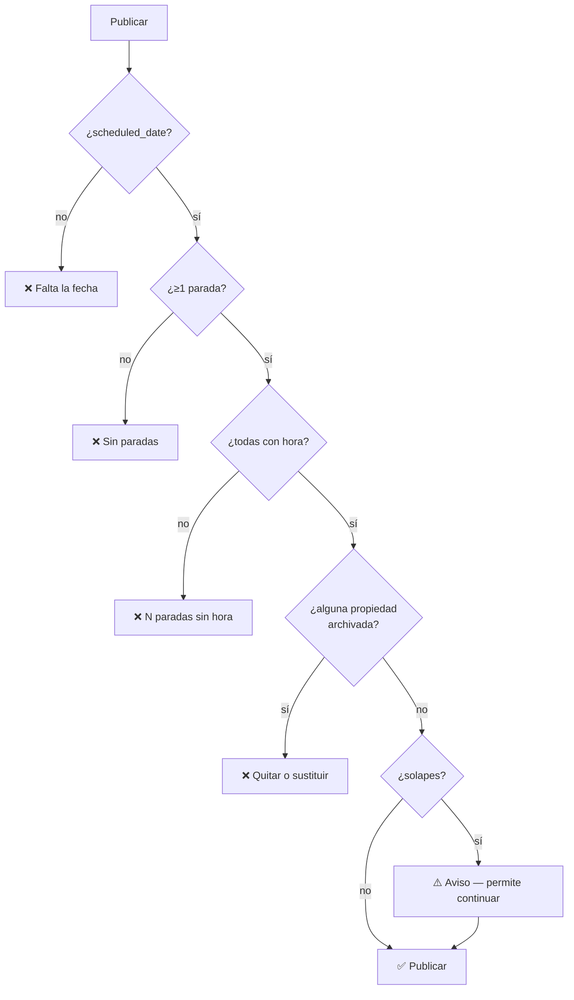

Bloqueantes: fecha, paradas, horas, archivadas. **Aviso, no bloqueo:** solapes, propiedades `reserved`/`sold`, paradas sin confirmar.

### 21.2 Qué ocurre al publicar

Transacción:
1. Crear SmartLinks para las paradas que no tengan (§15.2)
2. Crear `viewing_collection_share` con token y `expires_at = now() + default`
3. `status = 'published'`
4. Registro de auditoría

Todo o nada: si falla la creación de un SmartLink, no queda un itinerario medio publicado.

### 21.3 Despublicar

`published → draft`: **revoca todos los enlaces activos** (`revoked_at = now()`). Los SmartLinks de las paradas **sobreviven** (D-05).

Confirmación explícita: *"El cliente ya no podrá abrir el enlace que le enviaste."*

### 21.4 Editar publicado

Permitido, con el banner de §18.4. Cada guardado es visible al instante.

Excepción: quitar una parada de un itinerario publicado pide confirmación reforzada, porque si Paul ya lo abrió, la residencia desaparece sin explicación. **Alternativa recomendada en el propio diálogo: cancelarla en lugar de quitarla** (§13.5).

---

## 22. Expiration & revocation

### 22.1 Caducidad obligatoria

`expires_at` es **NOT NULL**. Default **60 días** (Task 11).

Configurable en `app_settings`, siguiendo el patrón de `video_generation`:

```
key: 'viewing_collections'
value: {
  "default_expiry_days": 60,
  "max_expiry_days": 180,
  "allow_renewal": true
}
```

`app_settings` ya tiene RLS (`select` autenticado, escritura admin) y una UI de configuración. Cero infraestructura nueva.

### 22.2 Estados derivados (P-04)

```
revoked_at IS NOT NULL   → REVOKED
expires_at < now()       → EXPIRED
resto                    → ACTIVE
```

Sin columna, sin cron, sin posibilidad de desincronización.

### 22.3 Renovar y revocar

**Renovar:** `expires_at = now() + default`, mismo token. El enlace que Paul tiene sigue funcionando. Requiere permiso `export` (§23).

**Revocar:** `revoked_at = now()`. Se conserva la fila y su analítica. **Nunca borrar**: perder el histórico de aperturas por revocar es perder información comercial.

### 22.4 UX de las páginas terminales

| Estado | Página |
|---|---|
| `EXPIRED` | Marca BC + *"Esta colección ha caducado"* + contacto del agente + **sin ningún dato de las propiedades** |
| `REVOKED` | Mismo tratamiento. **No revelar que fue revocado** — al cliente le da igual y "revocado" suena a castigo |
| Token inexistente | **404 idéntico** al de caducado. No confirmar nunca si un token existió |
| Itinerario `cancelled`/`archived` | *"Ya no está disponible"* + contacto |

Las cuatro páginas deben ser **indistinguibles en contenido de datos**: ninguna filtra ni el nombre del cliente ni cuántas propiedades había. Un atacante que pruebe tokens no debe aprender nada.

Wireframe en §26.8.

---

## 23. Permission model

### 23.1 Recurso nuevo

**Sí** (recomendación de Task 14 confirmada): `viewing_collections` en `PERMISSION_RESOURCES`.

Alternativa descartada: colgarlo de `clientes`. Impediría dar acceso a la selección sin dar acceso a toda la ficha del cliente, y sobre todo impediría distinguir "puede preparar" de "puede publicar" — que es la distinción de control que más importa.

### 23.2 Mapeo de acciones (P-05)

`PermissionAction` tiene 5 valores y el módulo necesita 6 capacidades. Se mapean así en vez de extender el tipo:

| Capacidad | Acción | Razón |
|---|---|---|
| Ver selecciones e itinerarios | `view` | |
| Crear selecciones e itinerarios | `create` | |
| Editar paradas, reordenar, horarios, confirmar | `edit` | |
| Borrar entradas y drafts | `delete` | |
| **Publicar, renovar, revocar** | **`export`** | Publicar es sacar datos del CRM al mundo. Es exactamente lo que `export` significa, y está sin usar. |
| Archivar | `edit` | |

**Por qué no extender `PermissionAction`:** añadir `publish` obligaría a tocar las **7 matrices × 15 recursos existentes** (105 celdas) además de la UI del drawer y el endpoint de permisos. Coste alto, beneficio semántico marginal.

`⬜ DECISIÓN PENDIENTE (Q-8):` ¿Es aceptable esta sobrecarga semántica? Es la decisión menos evidente del documento. La alternativa honesta es extender el tipo y aceptar la migración.

### 23.3 Matriz por rol

| Rol | view | create | edit | delete | export (publicar) |
|---|:---:|:---:|:---:|:---:|:---:|
| `owner` | ✅ | ✅ | ✅ | ✅ | ✅ |
| `admin` | ✅ | ✅ | ✅ | ✅ | ✅ |
| `advisor` | ✅ | ✅ | ✅ | ✅ | ✅ |
| `agent_admin` | ✅ | ✅ | ✅ | ✅ | ✅ |
| `agent_senior` | ✅ | ✅ | ✅ | ❌ | ✅ |
| `agent_junior` | ✅ | ✅ | ✅ | ❌ | **❌** |
| `captadora` | ❌ | ❌ | ❌ | ❌ | ❌ |
| `client` / `viewer` | ❌ | ❌ | ❌ | ❌ | ❌ |

**`agent_junior` puede preparar pero no publicar.** Es la decisión de control de este módulo: un junior arma el itinerario, un senior lo revisa y lo publica. Coherente con su matriz actual, donde tiene `view` en casi todo y `create/edit` en casi nada.

Nótese que se le da `create`/`edit` sobre `viewing_collections` aunque no los tenga sobre `clientes` — porque preparar una selección no es editar el cliente, y bloquearlo dejaría al junior sin poder trabajar.

### 23.4 Scope de visibilidad

Añadir `viewing_collections` a `isScopedBusinessData` en [getViewRestriction](lib/permissions.ts#L597), junto a `clientes` y `solicitudes`:

| Rol | Restricción | Alcance |
|---|---|---|
| owner/admin/advisor/agent_admin | `all` | Todo |
| `agent_senior` | `team` | Los de sus clientes asignados (hoy ≡ `own`) |
| `agent_junior` | `own_only` | Ídem |
| `captadora` | `none` | Nada |

**Puente de propiedad:** igual que `visit_requests`, estas tablas no tienen dueño propio — lo tienen vía `client_id`. Se reutiliza `getAssignedClientIds(advisorId, country)` ([view-scope.ts](lib/db/queries/view-scope.ts)), que ya resuelve exactamente esto.

Regla adicional: quien puede ver la ficha de un cliente puede ver sus selecciones. No tiene sentido ver a Paul y no ver qué se le ha elegido.

### 23.5 ⚠️ El problema de los roles personalizados

`normalizeMatrix` ([lib/permissions.ts:386](lib/permissions.ts#L386)) itera `PERMISSION_RESOURCES` y asigna `false` a toda acción no presente en el JSON guardado:

```ts
out[resource][action] = srcResource[action] === true;   // ausente → false
```

Al añadir `viewing_collections`, **todas las filas existentes de `custom_roles` devolverán `false`** para el recurso nuevo. Los usuarios con rol personalizado no verán el módulo, sin mensaje de error y sin pista de por qué.

Tres salidas:

| Opción | Valoración |
|---|---|
| Migración que añade el recurso a los `custom_roles` existentes copiando lo de `clientes` | ✅ **Recomendada.** Es una migración de datos, no de esquema, y es idempotente. |
| Cambiar el default de `normalizeMatrix` a "hereda del rol base" | ❌ Cambia el comportamiento de todos los recursos. Riesgo desproporcionado. |
| Documentarlo y que el admin re-guarde cada rol | ⚠️ Aceptable si hay pocos roles personalizados. **Verificar cuántos hay en producción.** |

### 23.6 Checklist de implementación (7 puntos)

Del comentario de cabecera de `lib/permissions.ts` más lo verificado:

1. `PermissionResource` — union de tipos (:15)
2. `PERMISSION_RESOURCES` — array canónico (:38)
3. `RESOURCE_LABELS` (:66)
4. `RESOURCE_DESCRIPTIONS` (:84)
5. Las **7** matrices: `AGENT_JUNIOR`, `AGENT_SENIOR`, `AGENT_ADMIN`, `FULL_ACCESS`, `ADVISOR`, `CAPTADORA`, `NO_ACCESS`
6. `getViewRestriction` → `isScopedBusinessData` (:607)
7. Migración de datos de `custom_roles` (§23.5)

`app/api/admin/usuarios/[id]/permissions/route.ts` y `components/admin/permissions/permissions-drawer.tsx` **importan** `PERMISSION_RESOURCES` en vez de duplicarlo — verificado. No hay que tocarlos.

**Sidebar:** no se añade entrada. El módulo vive dentro de la ficha del cliente.
`⬜ DECISIÓN PENDIENTE (Q-9):` ¿hará falta una vista global "todos los itinerarios" (útil para un jefe de equipo)? No en V1.

---

## 24. Analytics model

### 24.1 Dos sistemas, como en SmartLinks

| Sistema | Inserción | Qué mide | Bloqueable |
|---|---|---|---|
| `viewing_collection_opens` | Servidor, al resolver el token | Aperturas reales | ❌ No |
| `page_views` + `page_events` | Navegador vía `/api/tracking` | Sesión, dispositivo, geo, eventos | ✅ Sí |

Ambos, por la misma razón que SmartLinks tiene ambos (§8.5).

### 24.2 Eventos

`page_views.page_type` es **texto libre** → `'viewing_collection'` no requiere migración. ✅

`page_events.event_type` es un **CHECK cerrado**:

```sql
CHECK (event_type IN (
  'photo_view','video_play','plan_view','scroll',
  'contact_click','visit_request','share_click','time_on_page'
))
```

| Evento necesario | ¿Existe? | Acción |
|---|---|---|
| `collection_open` | ❌ | Añadir |
| `stop_view` | ❌ | Añadir (una residencia entra en viewport) |
| `stop_expand` | ❌ | Añadir (el cliente abre el detalle) |
| `smartlink_click` | ✅ **`share_click`** | **Reutilizar** |
| `photo_view` | ✅ | Reutilizar |
| `scroll` | ✅ | Reutilizar |
| `time_on_page` | ✅ | Reutilizar |
| `contact_click` | ✅ | Reutilizar |
| `map_view` | ❌ | Añadir *(opcional)* |

**Solo 3 eventos nuevos obligatorios** (+1 opcional). Reutilizar `share_click` reduce la migración y hace comparables las métricas de SmartLinks y colecciones.

`collection_expired` **no** es un evento de `page_events`: no hay página válida que instrumentar. Se registra en `viewing_collection_opens` con una marca, o se deriva comparando `opened_at` con `expires_at`.

### 24.3 Migración necesaria — ESPECIFICADA, NO APLICADA

```sql
-- Migración futura. NO aplicar en Sprint 1.
-- Numerar desde 0117+ (hay duplicados hasta 0116; ver Sprint 0 R-6).
-- Debe ser idempotente: post-deploy.sh relanza todas las migraciones.

ALTER TABLE page_events DROP CONSTRAINT IF EXISTS valid_event_type;
ALTER TABLE page_events ADD CONSTRAINT valid_event_type CHECK (event_type IN (
  'photo_view','video_play','plan_view','scroll',
  'contact_click','visit_request','share_click','time_on_page',
  'collection_open','stop_view','stop_expand','map_view'
));

ALTER TABLE page_views
  ADD COLUMN IF NOT EXISTS collection_share_id uuid
  REFERENCES viewing_collection_shares(id) ON DELETE SET NULL;

CREATE INDEX IF NOT EXISTS idx_page_views_collection_share
  ON page_views(collection_share_id, created_at DESC)
  WHERE collection_share_id IS NOT NULL;
```

`page_views.collection_share_id` es imprescindible: sin él, la analítica de navegador no se puede atribuir a una colección. Es el espejo exacto del `share_id` que ya existe para `property_shares`.

### 24.4 Métricas

**Principal — Collection engagement:**
```
(residencias vistas / residencias totales) × (1 si hubo ≥1 smartlink_click, si no 0.5)
```
Un número por colección, comparable entre ellas. La fórmula exacta es ajustable; lo importante es tener **una** métrica de cabecera.

**Secundarias:** aperturas únicas (por `session_id`) · residencias vistas · clics a SmartLink · tiempo en la colección · visitas confirmadas tras la apertura · dispositivo.

**Lo que el agente ve en la ficha de Paul:**
```
Visitas del lunes · Publicado
Abierta 3 veces · última hace 2h
5 de 6 residencias vistas · 2 SmartLinks abiertos
```

### 24.5 Privacidad

`viewing_collection_opens.ip` y `user_agent` son SENSITIVE (Sprint 0 §14.4). Solo staff. Nunca en el contrato público. Misma política que `property_share_opens`.

---

## 25. Property availability behaviour

### 25.1 Panorama

| Cambio | Agente ve | Cliente ve | Enlace |
|---|---|---|---|
| → `reserved` | ⚠️ Aviso en el itinerario | Insignia "Reservada" | Activo |
| → `sold` | ⚠️ Aviso | Insignia "Vendida" | Activo |
| → `archived` | 🔴 Bloquea la publicación | "Ya no disponible", sin datos | Sin enlace |
| Borrado físico | **Imposible** (RESTRICT) | — | — |

### 25.2 `reserved` / `sold`

**Se muestran, con insignia explícita.** No se ocultan.

Razón: si una residencia desaparece de una colección que Paul ya abrió, el plan cambia sin explicación y eso genera una llamada. Con la insignia, Paul entiende la situación y la conversación con el agente empieza informada. Además, una propiedad reservada puede caerse, y a veces se visita igual.

Hoy las rutas públicas **no filtran** `reserved`/`sold` — un SmartLink de un piso vendido lo muestra como disponible (Sprint 0 R-9). El módulo **no hereda ese comportamiento**: muestra el estado real.

`⬜ DECISIÓN PENDIENTE (Q-10):` ¿el precio debe seguir viéndose en una propiedad vendida? **Recomendación: sí**, con el estado bien visible. Ocultarlo parece más raro que mostrarlo.

### 25.3 `archived`

- **Bloquea la publicación** (§21.1).
- Si se archiva **después** de publicar: la residencia se muestra como "Ya no disponible" — sin fotos, sin precio, sin enlace. Solo el hueco y su hora, para que el plan del día siga siendo legible.
- El agente recibe un aviso en la ficha del cliente.

Nota: `getPropertyBySlugPublic` y el proxy `/p/` ya filtran archivadas, así que las fotos dejarían de servirse igualmente. Aquí se hace explícito en vez de que se rompa la imagen.

### 25.4 Paradas canceladas

Se muestran al cliente, tachadas o atenuadas, con la etiqueta "Cancelada". Misma razón que §25.2: un hueco sin explicación es peor que una cancelación explícita.

`⬜ DECISIÓN PENDIENTE (Q-11):` ¿podría el agente querer ocultarlas? El caso "cancelada y sustituida" del brief sugiere que a veces sí. Se resolvería con un campo `hidden_from_client` en la parada — descartado en §8.3 por falta de requisito, pero es el candidato más probable a aparecer.

### 25.5 Detección de cambios

Sin snapshot (Task 7), no se puede saber "cambió desde que se publicó". Lo que sí se puede: **al abrir el itinerario, comprobar el estado actual de cada propiedad y avisar de lo que no sea `available`**. Cubre el 90% del valor sin snapshot.

```
⚠️ 2 propiedades de este itinerario han cambiado de estado
   · Piso en Trafalgar — Reservada
   · Ático en Chamberí — Vendida
```

---

## 26. Wireframes

Estructura funcional. **Sin diseño visual** — eso es la fase Luxury (§31.3).

### 26.1 Ficha del cliente con selecciones

```
┌─────────────────────────────────────────────────────────────────────┐
│  ← Clientes                                        🔔  [ES ▾]       │
├─────────────────────────────────────────────────────────────────────┤
│  ⬤ PC   Paul Cabrera                    ● Activo  Trabajador        │
│         ✉ paul@…   ☎ +34 6…   📍 Madrid            [Enviar mensaje] │
├─────────────────────────────────────────────────────────────────────┤
│  👁 0 vistas   ❤ 3 favoritas   📅 4 visitas   💬 2 mensajes         │
├──────────────────────────┬──────────────────────────────────────────┤
│ PREFERENCIAS             │ ❤ FAVORITAS DEL CLIENTE            (3)   │
│ Operación   Alquiler     │  · Piso en Trafalgar   [+ a selección]   │
│ Zona        Chamberí     │  · Ático en Chamberí   ✓ en selección    │
│ Presupuesto 1.400–1.900€ │  · Estudio en Malasaña [+ a selección]   │
│ Ocupantes   2            │                    [+ Añadir todas (2)]  │
│                          ├──────────────────────────────────────────┤
│ NOTAS INTERNAS           │ 🎯 PROPIEDADES SELECCIONADAS        (8)  │
│ · Busca exterior         │  [Todas] [Sin planificar 2] [Descartadas]│
│ · Puede visitar lunes    │                          [+ Buscar]      │
│                          │  ┌────────────────────────────────────┐  │
│                          │  │[img] Piso en Trafalgar             │  │
│                          │  │      BC-0871 · 1.750 €/mes         │  │
│                          │  │      Seleccionada 📅 Lunes ❤       │  │
│                          │  │      [Estado▾][A itinerario][⋯]    │  │
│                          │  └────────────────────────────────────┘  │
│                          │  … 7 más                    [Ver todas]  │
│                          ├──────────────────────────────────────────┤
│                          │ 📅 ITINERARIOS                      (2)  │
│                          │  ┌────────────────────────────────────┐  │
│                          │  │ Visitas del lunes    ● Publicado   │  │
│                          │  │ Lun 18 ago · 10:00–14:00 · 6 resid.│  │
│                          │  │ ✅4 confirmadas ⏳1 ❌1 cancelada  │  │
│                          │  │ 👁 Abierta 3 veces · hace 2h       │  │
│                          │  │ 5/6 vistas · 2 SmartLinks abiertos │  │
│                          │  │ 🔗 Caduca en 58 días               │  │
│                          │  │ [Abrir][Copiar enlace][Analítica]  │  │
│                          │  └────────────────────────────────────┘  │
│                          │  ┌────────────────────────────────────┐  │
│                          │  │ Visitas del miércoles  ○ Borrador  │  │
│                          │  │ Mié 20 ago · sin horas · 2 resid.  │  │
│                          │  │ ⚠ Faltan horas para publicar       │  │
│                          │  │ [Editar]              [Eliminar]   │  │
│                          │  └────────────────────────────────────┘  │
│                          │           [+ Crear itinerario]           │
│                          ├──────────────────────────────────────────┤
│                          │ ✨ PROPIEDADES SUGERIDAS            (5)  │
│                          │  · Piso en Ríos Rosas 92% [+ selección]  │
│                          ├──────────────────────────────────────────┤
│                          │ 📆 VISITAS EN EL CRM                (4)  │
└──────────────────────────┴──────────────────────────────────────────┘
```

### 26.2 Selección — vista completa

```
┌─────────────────────────────────────────────────────────────────────┐
│ ← Paul Cabrera            SELECCIÓN DE PROPIEDADES                  │
├─────────────────────────────────────────────────────────────────────┤
│ [Todas 8][Seleccionadas 6][Interesado 2][Sin planificar 2][Desc. 2] │
│                                    [🔍 Buscar propiedad] [+ Añadir] │
├─────────────────────────────────────────────────────────────────────┤
│ ☐ │ PROPIEDAD          │ PRECIO   │ ESTADO      │ ITINERARIOS │ ⋯   │
│───┼────────────────────┼──────────┼─────────────┼─────────────┼─────│
│ ☑ │[img] Trafalgar     │1.750€/mes│ Selecc.  ▾  │ 📅 Lunes    │ ⋯   │
│   │      BC-0871 · Chamberí · 2h 1b 68m²   ❤ favorita          │     │
│───┼────────────────────┼──────────┼─────────────┼─────────────┼─────│
│ ☑ │[img] Chamberí Ático│1.900€/mes│ Interesado ▾│ 📅 Lunes    │ ⋯   │
│   │      BC-0912 · 3h 2b 95m²   ❤ favorita   ✅ visitada       │     │
│───┼────────────────────┼──────────┼─────────────┼─────────────┼─────│
│ ☐ │[img] Ríos Rosas    │1.650€/mes│ Selecc.  ▾  │ —           │ ⋯   │
│   │      BC-0934 · 2h 1b 71m²        ⚠ Reservada               │     │
│───┼────────────────────┼──────────┼─────────────┼─────────────┼─────│
│ ☐ │[img] Malasaña      │1.400€/mes│ Descartada ▾│ —           │ ⋯   │
│   │      BC-0888 · 1h 1b 45m²    "Demasiado ruidoso" (nota)    │     │
├─────────────────────────────────────────────────────────────────────┤
│ 2 seleccionadas          [Crear itinerario] [Cambiar estado] [Quitar]│
└─────────────────────────────────────────────────────────────────────┘

  ⋯ = Ver ficha · SmartLink · Notas internas · Quitar de la selección
```

### 26.3 Crear itinerario

```
┌───────────────────────────────────────────────────────────┐
│  CREAR ITINERARIO · Paul Cabrera                      [✕] │
├───────────────────────────────────────────────────────────┤
│  Título    [Visitas del lunes___________________]         │
│            ⓘ El cliente verá este título                  │
│                                                           │
│  Fecha     [18/08/2026 📅]   (opcional en borrador)       │
│  Franja    [10:00] – [14:00]                              │
│                                                           │
│  PROPIEDADES DE LA SELECCIÓN                              │
│  ┌───────────────────────────────────────────────────┐    │
│  │ ☑ Piso en Trafalgar      1.750 €/mes              │    │
│  │ ☑ Ático en Chamberí      1.900 €/mes              │    │
│  │ ☑ Piso en Ríos Rosas     1.650 €/mes  ⚠ Reservada │    │
│  │ ☑ Estudio en Malasaña    1.400 €/mes              │    │
│  │ ☑ Piso en Bilbao         1.800 €/mes              │    │
│  │ ☑ Loft en Alonso Martínez1.550 €/mes              │    │
│  │ ☐ Piso en Chueca         1.700 €/mes  📅 ya en Mié│    │
│  │ ☐ Ático en Salamanca     2.100 €/mes              │    │
│  └───────────────────────────────────────────────────┘    │
│  6 seleccionadas · ~3h 30min estimadas                    │
│                                                           │
│                    [Cancelar]  [Crear borrador]           │
└───────────────────────────────────────────────────────────┘
```

### 26.4 Editor de itinerario

```
┌─────────────────────────────────────────────────────────────────────┐
│ ← Paul   VISITAS DEL LUNES  ○ Borrador      [Previsualizar][Publicar]│
├─────────────────────────────────────────────────────────────────────┤
│ 📅 Lun 18 ago 2026 · 🕐 10:00–14:00 · Europe/Madrid      [Editar]   │
├─────────────────────────────────────────────────────────────────────┤
│ ⚠ Para publicar falta:  · 1 parada sin hora                         │
├─────────────────────────────────────────────────────────────────────┤
│ ⠿ │ # │ HORA  │ PROPIEDAD        │ CONFIRM.  │ DIR.  │ 🔗 │  ⋯      │
│───┼───┼───────┼──────────────────┼───────────┼───────┼────┼─────────│
│ ⠿ │ 1 │ 10:00 │[img] Trafalgar   │✅Confirm. │Exacta │ ✓  │ Editar  │
│   │   │ 30min │      BC-0871     │           │       │    │         │
│───┼───┼───────┼──────────────────┼───────────┼───────┼────┼─────────│
│ ⠿ │ 2 │ 10:45 │[img] Chamberí    │✅Confirm. │Exacta │ ✓  │ Editar  │
│───┼───┼───────┼──────────────────┼───────────┼───────┼────┼─────────│
│ ⠿ │ 3 │ 11:30 │[img] Ríos Rosas  │⏳Propuesta│ Zona  │ ✓  │ Editar  │
│   │   │       │      ⚠ Reservada │           │       │    │         │
│───┼───┼───────┼──────────────────┼───────────┼───────┼────┼─────────│
│ ⠿ │ 4 │ 12:15 │[img] Malasaña    │✅Confirm. │Exacta │ ✓  │ Editar  │
│───┼───┼───────┼──────────────────┼───────────┼───────┼────┼─────────│
│ ⠿ │ 5 │ 13:00 │[img] Bilbao      │✅Confirm. │Exacta │ ✓  │ Editar  │
│───┼───┼───────┼──────────────────┼───────────┼───────┼────┼─────────│
│ ⠿ │ 6 │  —    │[img] Alonso M.   │❌Cancelada│ Zona  │ ✓  │ Editar  │
│   │   │       │      (sustituida por Bilbao)                        │
├─────────────────────────────────────────────────────────────────────┤
│ [+ Añadir de la selección]  [+ Buscar propiedad]                    │
│ [Mostrar dirección en todas las confirmadas]                        │
└─────────────────────────────────────────────────────────────────────┘
```

### 26.5 Editor de parada

```
┌─────────────────────────────────────────────────────────────┐
│  PARADA 1 · Piso en Trafalgar                           [✕] │
├─────────────────────────────────────────────────────────────┤
│  [img]  Piso en Trafalgar · BC-0871                         │
│         Chamberí · Trafalgar · 2h 1b 68m² · 1.750 €/mes     │
│         ● Disponible                        [Ver ficha ↗]   │
├─────────────────────────────────────────────────────────────┤
│  HORARIO                                                    │
│  Hora [10:00]   Duración [30 ▾] min   → termina 10:30       │
│                                                             │
│  CONFIRMACIÓN                                               │
│  ( ) Pendiente   ( ) Propuesta   (•) Confirmada             │
│  ( ) Rechazada   ( ) Cancelada   ( ) Completada             │
│                                                             │
│  DIRECCIÓN VISIBLE PARA EL CLIENTE                          │
│  ( ) Solo zona — "Chamberí · Trafalgar"                     │
│  (•) Dirección exacta — "Calle Trafalgar 24, 3ºB"           │
│      ⓘ Disponible porque la visita está confirmada          │
│                                                             │
│  SMARTLINK                                                  │
│  (•) Crear uno nuevo al publicar                            │
│  ( ) Usar existente:  [Para Paul – ago ▾]  (12 aperturas)   │
│      ⚠ Comprueba que el enlace no sea de otro cliente       │
│                                                             │
│  VISITA EN EL CRM                                           │
│  Sin agendar          [📆 Agendar en el calendario]         │
│                                                             │
│  NOTAS INTERNAS  🔒 nunca visibles para el cliente          │
│  [El propietario pide avisar 30 min antes___________]       │
├─────────────────────────────────────────────────────────────┤
│  [Quitar del itinerario]            [Cancelar]  [Guardar]   │
└─────────────────────────────────────────────────────────────┘
```

### 26.6 Previsualizar y publicar

```
┌─────────────────────────────────────────────────────────────┐
│  PUBLICAR COLECCIÓN                                     [✕] │
├─────────────────────────────────────────────────────────────┤
│  ✅ Fecha       Lun 18 ago 2026                             │
│  ✅ Paradas     6 residencias                               │
│  ✅ Horarios    todas con hora                              │
│  ✅ Disponib.   ninguna archivada                           │
│  ⚠️  Avisos      1 reservada · 1 sin confirmar               │
│                                                             │
│  AL PUBLICAR                                                │
│  · Se crearán 4 SmartLinks (2 ya existen)                   │
│  · Se generará un enlace privado con token                  │
│  · Caducará el 17/10/2026 (60 días)     [Cambiar]           │
│  · 4 residencias mostrarán dirección exacta                 │
│                                                             │
│  [👁 Previsualizar como Paul]                               │
│                                                             │
│                    [Cancelar]  [Publicar]                   │
└─────────────────────────────────────────────────────────────┘

Tras publicar:
┌─────────────────────────────────────────────────────────────┐
│  ✅ COLECCIÓN PUBLICADA                                     │
│  https://portal.bcousinoprop.com/v/kR8mZ…             [📋]  │
│  [WhatsApp]  [Email]  [Abrir]                               │
│  ⓘ El cliente ve los cambios que hagas al instante          │
└─────────────────────────────────────────────────────────────┘
```

### 26.7 Colección pública

```
┌───────────────────────────────────────────────────────────┐
│                    [ LOGO BC ]                            │
├───────────────────────────────────────────────────────────┤
│                                                           │
│              PRIVATE VIEWING COLLECTION                   │
│                  Curated for Paul                         │
│                                                           │
│              Lunes, 18 de agosto de 2026                  │
│                  6 residencias                            │
│                                                           │
├───────────────────────────────────────────────────────────┤
│  YOUR VIEWING DAY                                         │
│   10:00  Trafalgar          · Chamberí        ✓ Confirmada│
│   10:45  Chamberí Ático     · Chamberí        ✓ Confirmada│
│   11:30  Ríos Rosas         · Chamberí        ⏳ Pendiente │
│   12:15  Malasaña           · Centro          ✓ Confirmada│
│   13:00  Bilbao             · Chamberí        ✓ Confirmada│
│    —     Alonso Martínez                      ✕ Cancelada │
├───────────────────────────────────────────────────────────┤
│  ─────────────────  RESIDENCE 01  ──────────────────      │
│  ┌─────────────────────────────────────────────────┐      │
│  │                                                 │      │
│  │              [ FOTO PRINCIPAL ]                 │      │
│  │                                                 │      │
│  └─────────────────────────────────────────────────┘      │
│                                                           │
│  Piso en Trafalgar                          BC-0871       │
│  1.750 € / mes                                            │
│                                                           │
│  🕐 10:00 · 30 min          ✓ Visita confirmada           │
│  📍 Calle Trafalgar 24, 3ºB · Chamberí                    │
│      (dirección exacta: visita confirmada)                │
│                                                           │
│  🛏 2 hab    🛁 1 baño    📐 68 m²                        │
│                                                           │
│  ┌───────────────────────────┐                            │
│  │  [ MAPA · marcador ]      │                            │
│  └───────────────────────────┘                            │
│                                                           │
│              [ EXPLORE RESIDENCE → ]                      │
│                (abre el SmartLink)                        │
├───────────────────────────────────────────────────────────┤
│  ─────────────────  RESIDENCE 03  ──────────────────      │
│  Piso en Ríos Rosas                         BC-0934       │
│  1.650 € / mes                        ⚠ Reservada         │
│  🕐 11:30 · 30 min       ⏳ Pendiente de confirmar        │
│  📍 Chamberí · Ríos Rosas                                 │
│      (zona — dirección al confirmar)                      │
│  ┌───────────────────────────┐                            │
│  │  [ MAPA · zona, sin       │                            │
│  │    marcador exacto ]      │                            │
│  └───────────────────────────┘                            │
│              [ EXPLORE RESIDENCE → ]                      │
├───────────────────────────────────────────────────────────┤
│  ─────────────────  RESIDENCE 06  ──────────────────      │
│  Loft en Alonso Martínez                    ✕ Cancelada   │
│  Esta visita ha sido cancelada.                           │
├───────────────────────────────────────────────────────────┤
│  YOUR AGENT                                               │
│  ⬤  María López                                           │
│     ✉ maria@bcousinoprop.com   ☎ +34 694 20 97 63         │
│                    [ WhatsApp ]                           │
├───────────────────────────────────────────────────────────┤
│  Benjamín Cousiño Propiedades                             │
│  Colección privada · válida hasta el 17/10/2026           │
└───────────────────────────────────────────────────────────┘
```

### 26.8 Colección caducada / revocada / inexistente

```
┌───────────────────────────────────────────────────────────┐
│                    [ LOGO BC ]                            │
├───────────────────────────────────────────────────────────┤
│                                                           │
│                                                           │
│                         🔒                                │
│                                                           │
│              Esta colección ya no está disponible         │
│                                                           │
│         Si necesitas acceder de nuevo, ponte en           │
│         contacto con nosotros y te enviaremos un          │
│         enlace actualizado.                               │
│                                                           │
│              ✉ contacto@bcousinoprop.com                  │
│              ☎ +34 694 20 97 63                           │
│                                                           │
│                                                           │
├───────────────────────────────────────────────────────────┤
│  Benjamín Cousiño Propiedades                             │
└───────────────────────────────────────────────────────────┘

  ⚠️ IDÉNTICA para: caducada · revocada · token inexistente ·
     itinerario cancelado o archivado.
     Sin nombre de cliente, sin fecha, sin número de propiedades,
     sin pista de si el token existió alguna vez.
```

---

## 27. API concepts

Conceptual. Firmas orientativas.

### 27.1 Server actions (panel)

Siguen el patrón de `createShareLink`: `checkPermission` → `requireStaff` → mutación → `revalidatePath`.

Usan **`checkPermission`** (no `assertPermission`), porque devuelven `{ok:false,error}` y así el motivo real llega al usuario — Next.js redacta los mensajes de excepción en producción ([guard.ts](lib/auth/guard.ts) lo documenta).

| Action | Permiso | Nota |
|---|---|---|
| `addToSelection(clientId, propertyId, source)` | `viewing_collections.create` | UPSERT idempotente |
| `removeFromSelection(selectionId)` | `.delete` | Falla si hay paradas (RESTRICT) |
| `updateSelectionStatus(selectionId, status)` | `.edit` | |
| `updateSelectionNotes(selectionId, notes)` | `.edit` | |
| `createItinerary(clientId, input)` | `.create` | Solo `clientId` obligatorio |
| `updateItinerary(itineraryId, input)` | `.edit` | |
| `deleteItinerary(itineraryId)` | `.delete` | Solo drafts |
| `addStop(itineraryId, selectionId)` | `.edit` | Crea la selección si no existe (§16.5) |
| `removeStop(stopId)` | `.edit` | Confirmación reforzada si está publicado |
| `reorderStops(itineraryId, orderedStopIds)` | `.edit` | Enteros espaciados |
| `updateStop(stopId, input)` | `.edit` | Hora, duración, confirmación, dirección, notas |
| `linkVisitRequest(stopId)` | **`calendario.create`** | D-02. §13.4 |
| `unlinkVisitRequest(stopId)` | `viewing_collections.edit` | |
| `attachSmartLink(stopId, shareId \| 'new')` | `properties.edit` | Crear share exige permiso sobre propiedades |
| `publishItinerary(itineraryId, opts)` | **`.export`** | P-05. Transaccional |
| `unpublishItinerary(itineraryId)` | `.export` | Revoca enlaces |
| `renewShare(shareId, days?)` | `.export` | |
| `revokeShare(shareId)` | `.export` | |

### 27.2 Route handlers

| Endpoint | Método | Guarda | Para qué |
|---|---|---|---|
| `/api/admin/clientes/[clientId]/selection` | GET | `requirePermission("viewing_collections","view")` | Cargar la selección desde cliente |
| `/api/admin/itineraries/[id]/analytics` | GET | `.view` | Aperturas y engagement |
| `/api/admin/properties/search` | GET | *(existente — migrar a `requirePermission`)* | Selector |

### 27.3 Ruta pública

```
GET /v/[token]     Server Component, force-dynamic
                   · service role, SOLO en servidor
                   · nunca el cliente Supabase del navegador
                   · noindex + X-Robots-Tag: noindex, nofollow
                   · registra apertura fire-and-forget
```

### 27.4 Query pública — forma

Una sola query con joins, no N+1 (Sprint 0 R-11 avisó de que `getPropertyBySlugPublic` hace 2-3 queries **por propiedad**; con 6 residencias serían ~18 round-trips):

```
viewing_collection_shares (por token)
  → viewing_itineraries (columnas explícitas)
      → profiles (cliente: full_name | agente: full_name, email, phone, avatar_url)
      → viewing_stops (ordenadas por position)
          → client_property_selections
              → properties (columnas explícitas)
                  → property_photos (url, position, is_cover)
          → property_shares (solo `token`, NUNCA `label`)
```

**`property_shares.label` no se selecciona nunca en la query pública.** Contiene nombres de personas ("Para María Pérez").

### 27.5 No hay `/api/v1`

El módulo no se expone en la API pública externa en V1. No hay integrador que lo pida y ampliaría la superficie sin necesidad.

---

## 28. Frontend integration points

| # | Fichero | Cambio | Coste |
|---|---|---|---|
| 1 | [client-ficha-view.tsx:241](app/[country]/(admin)/admin/clientes/[id]/client-ficha-view.tsx#L241) | Insertar `SelectedPropertiesBlock` y `ViewingItinerariesBlock` | 🟢 Bajo |
| 2 | [client-ficha-view.tsx:374](app/[country]/(admin)/admin/clientes/[id]/client-ficha-view.tsx#L374) `FavoritesCard` | Botones "Añadir a la selección" | 🟢 Bajo |
| 3 | [suggested-properties-block.tsx:94](components/admin/clientes/suggested-properties-block.tsx#L94) | Botón en `PropertyCard`. **Requiere §29.1** | 🟢 Bajo |
| 4 | [middleware.ts:14](middleware.ts#L14) | `/v` en `PUBLIC_PATHS` | 🟢 Una línea |
| 5 | [lib/permissions.ts](lib/permissions.ts) | Recurso nuevo, 7 puntos (§23.6) | 🟡 Medio |
| 6 | `randomToken()` en [actions.ts:693](app/(admin)/admin/propiedades/actions.ts#L693) | **Extraer a `lib/tokens.ts`** y compartir | 🟢 Bajo |
| 7 | `components/ui/**` | Reutilizar `Modal`, `Button`, `Card`, `EmptyState`, `Skeleton`, `Toast` | 🟢 Gratis |
| 8 | `PropertyGallery` | Reutilizar en la colección pública | 🟢 Bajo |
| 9 | `lib/country-config.ts` | `formatPrice` y locale — **usar desde el día uno** | 🟢 Gratis |
| 10 | `hooks/use-analytics.ts` | Ampliar `PageType` con `'viewing_collection'` | 🟢 Bajo |
| 11 | `lib/i18n/dictionary.ts` | Claves nuevas del panel | 🟡 Medio |
| 12 | `app_settings` | Clave `viewing_collections` | 🟢 Bajo |

**Componentes nuevos:** `SelectedPropertiesBlock`, `ViewingItinerariesBlock`, `PropertySearchModal`, `CreateItineraryModal`, `ItineraryBuilder`, `StopEditorModal`, `PublishModal`, `ViewingCollectionView` (pública), `CollectionUnavailableView`.

**Dónde viven las actions:** en `app/[country]/(admin)/admin/clientes/actions.ts` (árbol nuevo), **no** en el árbol legacy `app/(admin)/**` (Sprint 0 §2.2).

---

## 29. Technical prerequisites

Tres cosas que deberían resolverse **antes** de implementar el módulo. Ninguna se toca en este sprint.

### 29.1 🔴 BLOQUEANTE · Arreglar `getSuggestedProperties`

**Fichero:** [lib/db/queries/suggested-properties.ts](lib/db/queries/suggested-properties.ts)
**Síntoma:** el bloque "Propiedades sugeridas" muestra siempre "No hay propiedades disponibles", en todos los clientes.
**Por qué bloquea:** es la vía A de entrada al módulo (§16.3).

**Especificación exacta del fix** (Task 16 — especificar, no aplicar):

| # | Línea | Ahora | Debe ser |
|---|---|---|---|
| 1 | :70 | `photos(url)` | `property_photos(url, position, is_cover)` — **no existe ninguna tabla `photos`**; verificado contra las 135 migraciones |
| 2 | :76 | `.eq("stay", prefs.stay)` incondicional | Aplicar **solo si** `prefs.stay != null`. Con `null` no casa nada, y en ventas `stay` es null |
| 3 | — | sin filtro | Añadir `.is("archived_at", null)` |
| 4 | — | sin filtro | Añadir `.eq("country", <país del cliente>)` — hoy un cliente español puede recibir sugerencias chilenas |
| 5 | :75 | `.eq("operation", prefs.operation)` | Aplicar solo si no es null; contemplar `operations[]` (propiedades duales) |
| 6 | :154 | `prop.photos` | `prop.property_photos` |
| 7 | :169 | `photos.map(p => p.url)` | **URLs del proxy** `/p/{slug}/{idx}` — hoy devolvería la URL cruda de Storage, que delata el portal de origen (Sprint 0 §14.2) |
| 8 | :45 | `if (prefsError \|\| !prefs) return []` | Distinguir "sin preferencias" de "error de query". Hoy ambos devuelven `[]` y por eso el bug pasó desapercibido |

El punto 7 es de seguridad, no de corrección: aunque hoy no se vea porque la query falla antes, en cuanto se arregle el punto 1 empezaría a emitir URLs de Storage.

**Test mínimo:** un cliente con preferencias y ≥1 propiedad que casa debe devolver ≥1 sugerencia, con `photos[0]` empezando por `/p/`.

### 29.2 🟠 RECOMENDADO · Vídeos y planos en `/c/[token]`

**Ficheros:** [lib/db/queries/shares.ts:69](lib/db/queries/shares.ts#L69), [app/c/[token]/page.tsx](app/c/[token]/page.tsx)
**Síntoma:** el enlace con tracking no muestra vídeos ni planos; el estable sí.
**Por qué importa aquí:** la colección envía al cliente a `/c/[token]` desde cada residencia (§15.6). Un destino degradado empeora justo el clic que más queremos medir.

**Fix:** replicar en `getPropertyByShareToken` el bloque `withMedia` de `getPropertyBySlugPublic` ([properties.ts:102](lib/db/queries/properties.ts#L102)) y pasar `videos`/`plans` a `PublicPropertyView` — que ya acepta ambas props, así que el componente no cambia.

**Decisión:** debería entrar en el sprint de implementación, **antes** del lanzamiento. Es pequeño, contenido y no toca el esquema.

### 29.3 🟡 A VERIFICAR · Contenido real de `properties.address`

Antes de exponer direcciones exactas (§20.5), **inspeccionar en producción** qué contiene el campo. Si mezcla anotaciones operativas ("llaves en portería", "llamar antes") con la dirección postal, exponerlo filtra información interna aunque `address_visibility='exact'` sea correcto.

Consulta de diagnóstico (solo lectura, sobre el contenedor `supabase-db`):
```sql
SELECT address FROM properties
WHERE address IS NOT NULL AND archived_at IS NULL
ORDER BY random() LIMIT 50;
```

Si hay contaminación: campo `public_address` separado, o saneado manual. **Es un prerequisito de D-04, no un detalle.**

### 29.4 🔵 SANEAMIENTO · Guardas de rol hardcodeadas

`/api/admin/properties/search` y `/api/admin/clientes/search` usan arrays de roles en línea que omiten `captadora` y no consultan la matriz de permisos ni los overrides (Sprint 0 §11.2). Migrar a `requirePermission`. No bloqueante, pero el módulo los va a usar.

---

## 30. Risks

Riesgos **específicos de este diseño**. Los generales están en Sprint 0 §16.

### 🔴 Críticos

**VR-1 · Fuga entre clientes vía `viewing_stops`**
Una parada cuyo `selection_id` apunte a la selección de otro cliente metería propiedades ajenas —y su contexto— en el itinerario de Paul. El FK no lo impide: `viewing_stops → client_property_selections` es válido apunte a quien apunte.
→ **Mitigación:** trigger `BEFORE INSERT OR UPDATE` que valide `itinerary.client_id = selection.client_id` (§9.4). No basta con validar en la action. Test de regresión obligatorio.

**VR-2 · La dirección exacta se escapa por las coordenadas**
Ocultar `address` y mandar `latitude`/`longitude` reales es no ocultar nada.
→ **Mitigación:** la proyección anula ambas coordenadas cuando `address_visibility='area_only'` (§20.4). Test que verifique que el HTML no contiene las coordenadas reales en ese caso.

**VR-3 · El contrato público crece por conveniencia**
`PublicViewingCollection` es correcto el día 1. El riesgo es el mes 6, cuando alguien añada un campo "solo para depurar".
→ **Mitigación:** comentario de advertencia en el tipo + test de §19.6 capa 5 + revisión obligatoria de cualquier PR que lo toque.

### 🟠 Altos

**VR-4 · Los roles personalizados pierden acceso en silencio** — §23.5. Migración de datos.

**VR-5 · Rendimiento de la colección pública**
6 residencias × (propiedad + fotos + share) por el camino ingenuo son ~18 round-trips, y el proxy `/p/` sirve las imágenes desde el mismo proceso Node que el CRM y ffmpeg.
→ **Mitigación:** una query con joins (§27.4). Medir con 6 galerías concurrentes antes de lanzar.

**VR-6 · Divergencia parada ↔ `visit_request`**
Cambiar el estado desde `/admin/solicitudes` no actualiza la parada (§6.1, Q-1).
→ **Mitigación V1:** mostrar ambos estados cuando difieran, en vez de fingir que son uno.

**VR-7 · El CHECK de dirección sorprende al implementador**
Cancelar una parada con `exact` falla si el UPDATE no revierte la visibilidad (§9.3).
→ **Mitigación:** documentarlo en la action y en el comentario de la migración.

### 🟡 Medios

**VR-8 · Proliferación de SmartLinks** — cada publicación crea hasta N. No se borran (D-05). Con volumen, `SmartLinksPanel` se llena. Mitigación futura: filtro por origen.

**VR-9 · Live data sorprende al cliente** — §18.4. Mitigación: banner al agente + convención de equipo.

**VR-10 · Reordenación concurrente** — dos agentes reordenando a la vez producen posiciones inconsistentes. Con enteros espaciados el daño es orden raro, no pérdida de datos. Aceptable en V1.

**VR-11 · Título del itinerario en superficie pública** — texto libre que ve el cliente. Longitud, sin HTML, aviso en la UI.

**VR-12 · Reutilizar un SmartLink de otro cliente** — mezcla analítica y el `label` puede llevar el nombre de otra persona. Mitigación: advertencia (§15.3).

**VR-13 · `/v` colisiona en el futuro** — hoy libre. Si alguien crea `app/v/**` para otra cosa, choque silencioso. Mitigación: comentario en `middleware.ts`.

**VR-14 · Sin control de acceso a la analítica de la colección** — `getViewRestriction` cubre las entidades, pero la vista de analítica es una superficie nueva que debe respetar el mismo scope.

### 🔵 Bajos

**VR-15** · i18n del panel — claves nuevas.
**VR-16** · Idioma de la colección pública — muchos leads son internacionales (`idealista_leads.is_international`). Pendiente.
**VR-17** · Contacto del agente hardcodeado — `BC_CONTACT` está en el componente. La colección necesita el agente real.
**VR-18** · Numeración de migraciones — hay duplicados hasta 0116. Empezar en 0117 e idempotencia estricta.

---

## 31. Deferred features

### 31.1 Diferido explícitamente por el brief

| Función | Por qué se difiere | Cuándo |
|---|---|---|
| **Feedback del cliente** | Escritura pública sin login: la mayor superficie de riesgo del módulo. Necesita su propio diseño de seguridad (rate limiting, anti-spam, anti-suplantación entre paradas) | Sprint 3+ |
| Ratings / like-maybe-reject desde el enlace | Ídem | Sprint 3+ |
| PDF del itinerario | Extensión natural de `lib/pdf/property-pdf.tsx`. No crítica | Sprint 3+ |
| Snapshot / versionado | §18.4. Añadir si el problema se materializa | Cuando se demuestre |
| Ruta entre propiedades | Servicio externo → choca con "todo en el VPS" | Sin fecha |
| Envío automático WhatsApp/email | SES y SMTP existen, pero el envío manual funciona | Sprint 3+ |
| Leads sin `profile` (D-03) | Cambio del modelo de identidad | Sprint 4+ |
| Rediseño de SmartLinks / tocar `property_shares` (D-05) | PP-2 | No previsto |
| Diseño luxury final | §31.3 | Fase propia |

### 31.2 Diferido por decisión de este documento

| Función | Razón |
|---|---|
| Selecciones múltiples por cliente | §7.2 — sin requisito. Q-2 |
| Vista global de itinerarios (fuera de la ficha) | §23.6 — Q-9 |
| Agente asignado por parada | §8.2 |
| Ocultar paradas canceladas al cliente | §25.4 — Q-11 |
| Sincronización bidireccional con `visit_requests` | §6.1 — Q-1 |
| Itinerarios en `/admin/calendario` sin `visit_request` | §12.4 — Q-4 |
| Colección multi-día (varios días en un enlace) | Un enlace = un itinerario = un día. Más simple |
| Plantillas de itinerario | Sin requisito |
| Notificar al agente cuando el cliente abre | Deseable. Necesita `crm_notifications`. Sprint 2 |

### 31.3 Fase futura · Luxury Viewing Collection Design System

Fase **propia**, posterior. Este sprint solo enumera **qué componentes necesitará**, sin diseñarlos.

Estudiará: Christie's International Real Estate · DAMAC · EMAAR · Douglas Elliman · Sotheby's International Realty · SERHANT.

Objetivo: estética editorial luxury en una web app responsive.

**Inventario de componentes que la capa deberá cubrir:**

| Componente | Responsabilidad | Datos que consume |
|---|---|---|
| **Cover** | Portada: marca, "Curated for [Cliente]", fecha, nº de residencias | `title`, `dateLabel`, `clientFirstName`, `stopCount` |
| **Day Overview** | Cronograma del día, escaneable | `stops[].timeLabel`, `.title`, `.zone`, `.status` |
| **Residence Chapter** | Bloque editorial por residencia: foto, specs, precio, hora | `PublicViewingStop` completo |
| **Schedule Block** | Hora, duración, estado de confirmación | `timeLabel`, `durationLabel`, `status` |
| **Location Block** | Zona o dirección exacta + mapa (preciso o de zona) | `zone`, `subzone`, `exactAddress`, coords |
| **Navigation** | Salto entre residencias, progreso | derivado de `stops` |
| **SmartLink CTA** | "Explore Residence" | `smartLinkUrl` |
| **Private Viewing Information** | Qué esperar, cómo llegar, qué llevar | estático + `windowLabel` |
| **Agent Contact** | Foto, nombre, teléfono, email, WhatsApp | `agent` |
| **Collection Footer** | Marca, vigencia, aviso legal | `expiresAtLabel` |
| **Availability Badge** | Reservada / Vendida / No disponible / Cancelada | `availability`, `status` |
| **Unavailable State** | Caducada / revocada / inexistente | ninguno (§26.8) |

**Restricciones no negociables para esa fase:**
- Consume **exclusivamente** `PublicViewingCollection`. No accede a base de datos ni añade campos al contrato sin revisión de seguridad.
- Todas las imágenes por el proxy `/p/`.
- Responsive obligatorio: el cliente abrirá el enlace en el móvil, probablemente de camino a la primera visita.
- Rendimiento en móvil con datos: las 6 galerías no pueden cargarse todas de golpe.

---

## 32. Acceptance criteria

### 32.1 Prueba de aceptación — el caso Paul

Recorrido del escenario del brief contra el modelo, fila a fila.

**Estado inicial: `client_property_selections` (8 filas, `client_id = paul`)**

| # | Propiedad | status | source |
|---|---|---|---|
| 1 | Trafalgar | `selected` | `favorite` |
| 2 | Chamberí Ático | `interested` | `favorite` |
| 3 | Ríos Rosas | `selected` | `suggestion` |
| 4 | Malasaña | `selected` | `suggestion` |
| 5 | Bilbao | `selected` | `search` |
| 6 | Alonso Martínez | `selected` | `suggestion` |
| 7 | Chueca | `selected` | `search` |
| 8 | Salamanca | `selected` | `manual` |

**`viewing_itineraries` (2 filas)**

| id | title | scheduled_date | window | status |
|---|---|---|---|---|
| IT-1 | Visitas del lunes | 2026-08-18 | 10:00–14:00 | `published` |
| IT-2 | Visitas del miércoles | 2026-08-20 | null | `draft` |

**`viewing_stops` de IT-1 (6 filas)** — el brief pide 4 confirmadas, 1 pendiente, 1 cancelada y sustituida:

| pos | selección | scheduled_at | confirmation | address_vis | visit_request | share |
|---|---|---|---|---|---|---|
| 100 | Trafalgar | 10:00 | `confirmed` | **`exact`** | VR-1 | PS-a |
| 200 | Chamberí Ático | 10:45 | `confirmed` | **`exact`** | VR-2 | PS-b |
| 300 | Ríos Rosas | 11:30 | `proposed` | `area_only` | null | PS-c |
| 400 | Malasaña | 12:15 | `confirmed` | **`exact`** | VR-3 | PS-d |
| 500 | Bilbao | 13:00 | `confirmed` | **`exact`** | VR-4 | PS-e |
| 600 | Alonso Martínez | null | `cancelled` | `area_only` | null | PS-f |

*(Bilbao en posición 500 es la sustituta de Alonso Martínez, que queda en 600 como cancelada — §13.5.)*

**`viewing_stops` de IT-2 (2 filas)**

| pos | selección | scheduled_at | confirmation |
|---|---|---|---|
| 100 | Chueca | null | `pending` |
| 200 | Salamanca | null | `pending` |

**`viewing_collection_shares` (1 fila)**

| itinerary | token | expires_at | revoked_at |
|---|---|---|---|
| IT-1 | `kR8mZ…` (28 ch) | 2026-10-17 | null |

### 32.2 Verificación punto por punto

| Requisito del brief | ¿Soportado? | Cómo |
|---|---|---|
| 8 propiedades seleccionadas | ✅ | 8 filas en `client_property_selections` |
| Lunes: 6 · Miércoles: 2 | ✅ | 6 + 2 paradas. **Sin duplicar propiedades** — las paradas referencian selecciones por ID (D-01) |
| 4 confirmadas | ✅ | `confirmation_status='confirmed'` |
| 1 esperando confirmación | ✅ | Ríos Rosas, `proposed` |
| 1 cancelada y sustituida | ✅ | Alonso Martínez `cancelled` (pos 600), Bilbao `confirmed` (pos 500). Ambas visibles |
| Lunes publicado | ✅ | `status='published'` + share activo |
| Token privado | ✅ | 28 chars, ~168 bits, mismo `randomToken()` |
| Caduca | ✅ | `expires_at` NOT NULL, 60 días |
| Muestra horarios | ✅ | `scheduled_at` + `duration_minutes`, renderizados en `timezone` |
| Dirección exacta **solo** en autorizadas | ✅ | 4 con `exact`, 2 con `area_only`. El CHECK garantiza que solo las confirmadas puedan tenerla. Coordenadas anuladas en las otras |
| Cada residencia enlaza a un SmartLink | ✅ | `property_share_id` en las 6. Creados al publicar |
| Registra aperturas y navegación | ✅ | `viewing_collection_opens` (servidor) + `page_views`/`page_events` (navegador) |
| No expone datos internos | ✅ | `PublicViewingCollection` + query con columnas explícitas + 5 capas (§19.6) |
| Miércoles en draft | ✅ | `status='draft'`, sin fecha ni horas, sin enlace |
| **El agente entiende todo desde la ficha de Paul** | ✅ | Wireframe §26.1: selección con insignias, ambos itinerarios con su estado, avisos, analítica |

**Veredicto: el modelo soporta el escenario completo sin campos adicionales.**

### 32.3 Criterios de aceptación del sprint de implementación

**Funcionales**
- [ ] El agente añade a la selección desde sugerencias, favoritos y búsqueda; el `source` queda registrado
- [ ] Añadir dos veces la misma propiedad no duplica (UPSERT)
- [ ] Un itinerario se crea y guarda **sin fecha ni paradas**
- [ ] Drag & drop reordena escribiendo **una sola fila** salvo renumeración
- [ ] Publicar exige fecha + paradas + horas; avisa de solapes sin bloquear
- [ ] Publicar crea los SmartLinks que falten con el label especificado
- [ ] Una propiedad puede estar en dos itinerarios, con aviso
- [ ] Cancelar una parada la deja visible, no la borra
- [ ] "Agendar en el CRM" crea la `visit_request` y aparece en `/admin/calendario`
- [ ] El caso Paul completo se puede montar de principio a fin

**Seguridad — bloqueantes**
- [ ] La colección pública **no** contiene `owner_name`, `owner_phone`, `owner_email`, `internal_notes`, `agent_notes`, `source_url`, `external_id`, ni ningún UUID
- [ ] Una parada `area_only` **no** emite `address` ni coordenadas reales (verificado sobre el HTML, no sobre el DOM renderizado)
- [ ] Intentar `address_visibility='exact'` en una parada no confirmada **falla en base de datos**
- [ ] Una parada cuyo `selection_id` sea de otro cliente **falla** (VR-1)
- [ ] Caducada, revocada, inexistente y cancelada devuelven **la misma página**, sin datos
- [ ] La colección pública **no** carga el cliente Supabase del navegador
- [ ] `X-Robots-Tag: noindex, nofollow` presente
- [ ] La query pública no contiene ningún `select("*")`
- [ ] `property_shares.label` no aparece en ninguna respuesta pública

**Permisos**
- [ ] `agent_junior` prepara pero **no** publica
- [ ] `captadora` no ve nada del módulo
- [ ] `agent_junior` solo ve las selecciones de sus clientes asignados
- [ ] Los roles personalizados existentes conservan acceso (migración §23.5)

**No regresión — igual de importante**
- [ ] `/c/[token]` y `/compartir/[slug]` siguen funcionando **exactamente** igual
- [ ] `property_shares` no ha cambiado de esquema
- [ ] Los SmartLinks creados antes del módulo funcionan
- [ ] `visit_requests`, el calendario y la ficha del cliente funcionan igual
- [ ] La ficha del cliente carga igual de rápido que antes
- [ ] Las migraciones son idempotentes (ejecutar dos veces seguidas no falla)

**Rendimiento**
- [ ] Una colección de 6 residencias resuelve en **≤3 queries** a base de datos
- [ ] Carga en móvil con 3G simulado en tiempo razonable (fijar umbral en implementación)

---

## 33. Recommended Sprint 2

### 33.1 Qué debe producir

**Especificación técnica implementable**: SQL exacto, firmas de funciones, contratos de componentes, plan de tests.

### 33.2 Alcance propuesto

**Bloque A · Prerequisitos** (antes que nada)
- Fix de `getSuggestedProperties` según §29.1 — 🔴 bloqueante
- Fix de vídeos/planos en `/c/[token]` según §29.2
- Verificación del contenido de `properties.address` según §29.3
- Recuento de `custom_roles` en producción (§23.5)

**Bloque B · SQL exacto**
- 4 tablas + índices + CHECKs + trigger de VR-1
- Migración de datos de `custom_roles`
- Migración de `page_events`/`page_views` (§24.3)
- Numeración desde 0117, idempotencia estricta, **probadas dos veces seguidas**
- ⚠️ Verificar antes el esquema **vivo** con `\d+` en el contenedor `supabase-db` — hay migraciones con número duplicado y el repo puede no reflejar producción (Sprint 0 Apéndice B.1)

**Bloque C · Contratos**
- `PublicViewingCollection` completo
- Función pura `toPublicCollection()` con su suite de tests
- Query pública con columnas explícitas
- Tipos internos del panel

**Bloque D · Especificación de componentes**
- Props e interfaces de los 9 componentes nuevos
- Contrato de extensión de los 3 existentes

**Bloque E · Permisos**
- Diff exacto de `lib/permissions.ts` (7 puntos)
- Plan de la migración de roles personalizados

**Bloque F · Plan de tests**
- Los criterios de seguridad de §32.3 como tests concretos
- Fixture del caso Paul, reutilizable

### 33.3 Decisiones que hay que cerrar antes

Las 11 marcadas `⬜` en este documento. Las cinco que **cambian el esquema**, y por tanto son bloqueantes:

| # | Pregunta | Recomendación | §  |
|---|---|---|---|
| **Q-2** | ¿Selecciones múltiples nombradas por cliente? | No en V1. **Pero si va a hacer falta pronto, decidirlo ahora** — añadirlo después es migración de datos | §7.2 |
| **Q-8** | ¿`export` significa "publicar"? | Sí. La alternativa es extender `PermissionAction` (105 celdas) | §23.2 |
| **Q-11** | ¿Ocultar paradas canceladas al cliente? | No en V1. Es el campo con más papeletas de aparecer después | §25.4 |
| **Q-7** | ¿Hay centroide fiable por zona en ES y CL? | Verificar. Sin él, no hay mapa en paradas `area_only` | §20.4 |
| **Q-3** | ¿`viewing_collection_opens` además de `page_views`? | Sí — mide cosas distintas | §8.5 |

Las otras seis (Q-1, Q-4, Q-5, Q-6, Q-9, Q-10) son de producto o UX y no bloquean el esquema.

### 33.4 Orden de implementación sugerido (Sprint 3+)

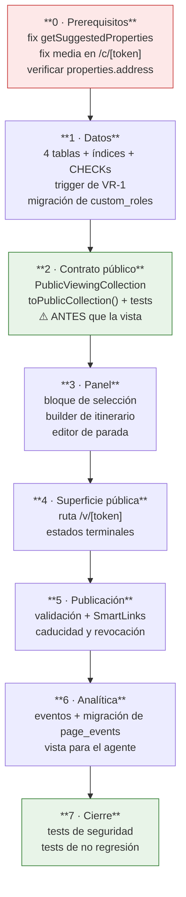

**Regla de oro del orden:** el contrato público y sus tests de seguridad se escriben **antes** que la vista pública. Si la vista existe primero, la tentación de "añado este campo y ya lo limpio luego" es demasiado fuerte, y ese es exactamente el fallo que PP-1 existe para evitar.

---

## Apéndice A · Resumen de decisiones

### Cerradas (humanas)

| ID | Decisión |
|---|---|
| D-01 | Selección e itinerario son entidades distintas |
| D-02 | La parada no crea `visit_request` automáticamente; FK nullable |
| D-03 | V1 solo con clientes en `profiles` |
| D-04 | Dirección exacta bajo control del agente, por niveles |
| D-05 | No tocar `property_shares` ni `/c/[token]`; SmartLink por parada |

### Propuestas en este documento

| ID | Decisión | § |
|---|---|---|
| P-01 | La parada no guarda `property_id`; solo `selection_id` | §5.2 |
| P-02 | 3 estados de selección almacenados; el resto derivados | §10.1 |
| P-03 | 5 estados de itinerario; "ready" es validación, no estado | §10.2 |
| P-04 | ACTIVE/EXPIRED/REVOKED derivados, no almacenados | §14.3 |
| P-05 | `export` = publicar | §23.2 |
| P-06 | CHECK en BD para la dirección exacta | §9.3 |
| P-07 | RESTRICT en lugar de CASCADE hacia `properties` | §7.3 |

### Abiertas

| ID | Pregunta | ¿Bloquea esquema? | § |
|---|---|---|---|
| Q-1 | ¿Sincronizar parada ↔ `visit_request`? | No | §6.1 |
| Q-2 | ¿Selecciones múltiples nombradas? | **Sí** | §7.2 |
| Q-3 | ¿`viewing_collection_opens` además de `page_views`? | **Sí** | §8.5 |
| Q-4 | ¿Itinerarios en `/admin/calendario`? | No | §12.4 |
| Q-5 | ¿Bloques colapsables en la ficha? | No | §16.1 |
| Q-6 | ¿Dos sesiones el mismo día = dos itinerarios? | No | §17.4 |
| Q-7 | ¿Centroide por zona en ES y CL? | No (afecta a UI) | §20.4 |
| Q-8 | ¿`export` = publicar? | **Sí** (permisos) | §23.2 |
| Q-9 | ¿Vista global de itinerarios? | No | §23.6 |
| Q-10 | ¿Precio visible en propiedad vendida? | No | §25.2 |
| Q-11 | ¿Ocultar paradas canceladas? | **Sí** (campo nuevo) | §25.4 |

## Apéndice B · Trazabilidad con las tareas del brief

| Task | Contenido | Sección |
|---|---|---|
| 1 | Domain model | §5, §8 |
| 2 | Lifecycle | §10 |
| 3 | Agent user flow | §16 |
| 4 | Selection experience | §11, §26.2 |
| 5 | Create itinerary flow | §12, §26.3–26.6 |
| 6 | Multi-day | §17 |
| 7 | Viewing Collection (live data) | §18 |
| 8 | SmartLink integration | §15 |
| 9 | Public contract | §19 |
| 10 | Public route | §18.1, §27.3 |
| 11 | Expiration | §22 |
| 12 | Address visibility | §20 |
| 13 | Analytics | §24 |
| 14 | Permissions | §23 |
| 15 | Property availability | §25 |
| 16 | Fix `getSuggestedProperties` | §29.1 |
| 17 | `/c/[token]` sin vídeos ni planos | §15.6, §29.2 |
| 18 | Wireframes | §26 |
| 19 | Luxury layer | §31.3 |
| Acceptance | Caso Paul | §32.1–32.2 |

---

*Fin del documento. Sprint de arquitectura de producto: no se ha escrito código, ni migraciones, ni diseño visual. Ninguna tabla existente se modifica en el diseño propuesto.*
