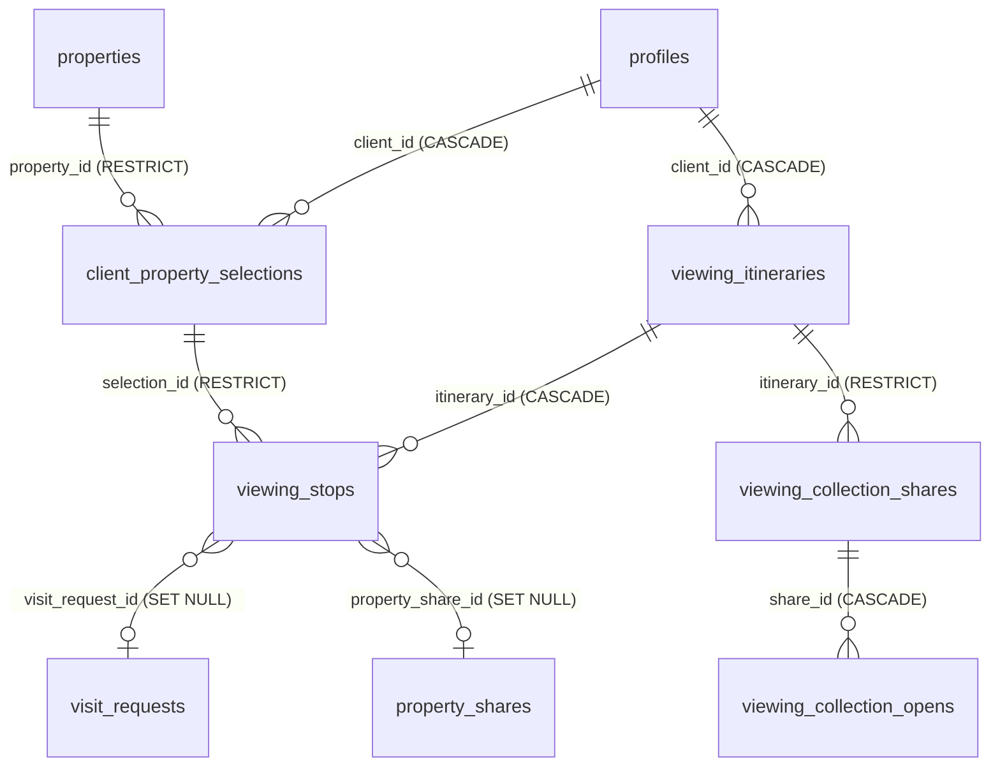
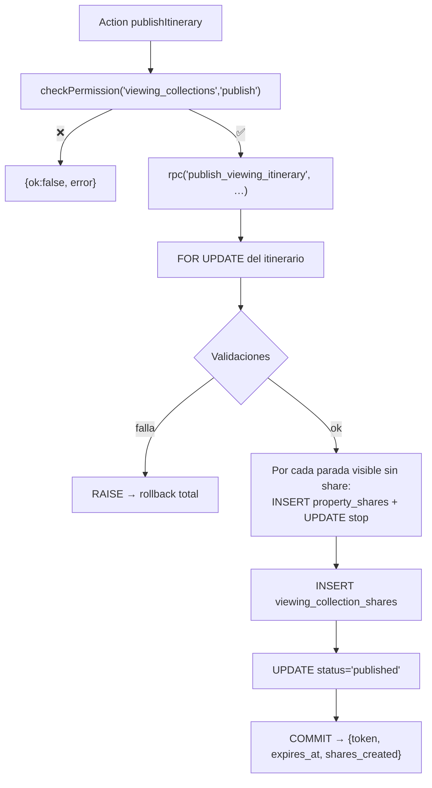

# Viewing Collections & Itineraries — Technical Architecture

**Sprint 2 · BCP · v0.1 · Especificación de implementación**

| | |
|---|---|
| Fecha | 2026-08-15 |
| Repositorio | `smartbc` · rama `main` · commit `d46121c` |
| Entradas | [crm_architecture_discovery_v0.1.md](crm_architecture_discovery_v0.1.md) · [viewing_collections_product_architecture_v0.1.md](viewing_collections_product_architecture_v0.1.md) |
| Esquema vivo | **Verificado por SSH read-only** contra `supabase-db` en `178.105.185.125`, 2026-08-15 |
| Alcance | Especificación técnica. **No se ha modificado código, ni esquema, ni datos.** |
| Estado final | **READY FOR IMPLEMENTATION** — ver §33 |

---

## 1. Executive summary

Este documento cierra la arquitectura técnica del módulo. Todo el SQL, los tipos, las firmas de actions, las policies, los tests y el orden de implementación están especificados. Sprint 3A puede empezar sin reinterpretar decisiones.

### La verificación contra producción cambió cinco cosas

Se inspeccionó el PostgreSQL vivo en modo solo lectura. Cinco hallazgos alteran lo planificado en Sprint 1:

| # | Hallazgo | Consecuencia |
|---|---|---|
| **V-1** | Producción tiene aplicadas las migraciones **`0119`, `0120`, `0121`, que no existen en el repositorio** | **`0117` NO está libre.** La numeración segura empieza en **`0122`**. Sprint 1 §33.2 se corrige. |
| **V-2** | **`custom_roles` = 0 filas** | El riesgo VR-4 de Sprint 1 (roles personalizados perdiendo acceso en silencio) **no tiene datos afectados**. El backfill se convierte en una migración defensiva de coste cero. |
| **V-3** | **`property_shares` = 0 filas · `property_share_opens` = 0 · `favorites` = 0 · `visit_requests` = 0 · 6 clientes** | **No hay SmartLinks vivos en manos de clientes.** El riesgo de retrocompatibilidad que dominaba PP-2 es hoy teórico. No cambia el diseño (D-05 es decisión humana), pero sí rebaja la criticidad de los tests de regresión de SmartLinks. |
| **V-4** | `properties.address`: 251 no nulas, **0 contaminadas con datos operativos**, pero **4 contienen la descripción completa del anuncio** (máx. 1.727 caracteres) | **No hace falta `public_address`.** Basta una guarda de longitud en la proyección. Task 10 resuelta. |
| **V-5** | `geofence_zones` = 0 filas · `location_hierarchies` = 0 filas · sin PostGIS · `chile_zones` sin coordenadas · `ZONE_COORDS` cubre **7 de los 21 distritos** de Madrid y cae a Puerta del Sol | **No hay centroides fiables.** Q-7 se resuelve: `area_only` **no muestra mapa** en V1. |

### Decisiones técnicas nuevas de este sprint

| # | Decisión | Razón |
|---|---|---|
| **T-01** | La publicación se ejecuta en una **función PL/pgSQL** (`publish_viewing_itinerary`), no en la action | Es la **única** forma de atomicidad real: el cliente Supabase JS no tiene transacciones. Evita el estado parcial "4 SmartLinks creados, colección sin token, itinerario ya en `published`". |
| **T-02** | `viewing_collection_shares.itinerary_id` pasa de `CASCADE` a **`RESTRICT`** | Resuelve Task 3 sin código extra: publicar crea un share, y con un share el borrado físico del itinerario queda bloqueado por la FK. Los drafts nunca publicados sí se pueden borrar. La política de historial se vuelve estructural. |
| **T-03** | La protección cross-cliente es un **trigger**, no una validación de aplicación | Falla incluso desde service role. Es una fuga entre clientes; no puede depender de que nadie se salte la action. |
| **T-04** | Las paradas ocultas se filtran **en la query y se vuelven a verificar en la proyección** | Doble barrera. La primera evita cargar el dato; la segunda evita que un fallo del filtro llegue al HTML. |
| **T-05** | La numeración pública se recalcula sobre las paradas visibles, **después** de filtrar | Q-11 exige que no queden huecos. `order = índice + 1` sobre el array ya filtrado. |
| **T-06** | RLS **gruesa** (staff sí/no) + scoping fino en TypeScript | Es el patrón existente del repositorio, documentado en `lib/db/queries/clients.ts`. Introducir scoping fino en RLS crearía dos fuentes de verdad. |

### Cifras

**5 tablas nuevas · 2 funciones · 4 triggers · 1 función RPC de publicación · 2 migraciones de esquema ajeno (`page_events`, `page_views`) · 0 modificaciones a `property_shares` o `visit_requests`.**

---

## 2. Confirmed decisions

### 2.1 Decisiones humanas

| ID | Decisión | Estado |
|---|---|---|
| D-01 | Selección e itinerario son entidades distintas | ✅ Cerrada |
| D-02 | La parada no crea `visit_request` automáticamente | ✅ Cerrada |
| D-03 | V1 solo con clientes en `profiles` | ✅ Cerrada |
| D-04 | Dirección exacta bajo control del agente | ✅ Cerrada |
| D-05 | No tocar `property_shares` ni `/c/[token]` | ✅ Cerrada |
| **D-06** | **`publish` es una acción de permiso propia. NO reutilizar `export`.** | ✅ **Nueva — sustituye a P-05** |

### 2.2 Propuestas de Sprint 1

| ID | Decisión | Estado |
|---|---|---|
| P-01 | La parada no guarda `property_id`, solo `selection_id` | ✅ Aprobada |
| P-02 | 3 estados de selección almacenados; el resto derivados | ✅ Aprobada |
| P-03 | 5 estados de itinerario; "ready" es validación derivada | ✅ Aprobada |
| P-04 | `ACTIVE/EXPIRED/REVOKED` derivados de timestamps | ✅ Aprobada |
| ~~P-05~~ | ~~`export` = publicar~~ | ❌ **Sustituida por D-06** |
| P-06 | CHECK en BD para la dirección exacta | ✅ Aprobada |
| P-07 | `RESTRICT` en lugar de `CASCADE` hacia `properties` | ✅ Aprobada |

### 2.3 Preguntas cerradas

| ID | Resolución | Impacto en el esquema |
|---|---|---|
| Q-1 | Sin sincronización bidireccional. El panel muestra ambos estados si divergen | Ninguno |
| Q-2 | Una selección implícita por cliente. Sin entidad contenedora | Ninguno |
| Q-3 | **Sí** a `viewing_collection_opens` → **5 tablas** | +1 tabla |
| Q-4 | Los itinerarios no salen en `/admin/calendario` salvo vía `visit_request` | Ninguno |
| Q-5 | Bloques colapsables. Orden: Favoritos → Selección → Itinerarios → Sugeridas → Visitas. Sin persistir estado | Ninguno |
| Q-6 | Dos sesiones el mismo día = dos itinerarios independientes | Ninguno |
| Q-7 | **No hay centroides fiables (V-5). `area_only` sin mapa en V1** | Ninguno |
| Q-8 | Sustituida por D-06 | +1 valor en `PermissionAction` |
| Q-9 | Sin vista global en V1 | Ninguno |
| Q-10 | Precio visible siempre; estado `RESERVED`/`SOLD` bien visible | Ninguno |
| Q-11 | **`hidden_from_client BOOLEAN NOT NULL DEFAULT FALSE`** en `viewing_stops`, solo válido si `confirmation_status ∈ {cancelled, declined}` | +1 columna +1 CHECK |

---

## 3. Corrections to Sprint 1

Errores y omisiones detectados. Este documento prevalece.

| # | Sprint 1 decía | Corrección | Origen |
|---|---|---|---|
| **C-1** | "4 tablas nuevas" (§1, §5) | **5 tablas nuevas.** `viewing_collection_opens` es tabla propia | Q-3 |
| **C-2** | Fixture Paul: lunes `2026-08-18`, miércoles `2026-08-20` | **Lunes `2026-08-17`, miércoles `2026-08-19`.** Verificado: 2026-08-18 es martes y 2026-08-20 es jueves | Corrección humana, confirmada con `date` |
| **C-3** | "Numerar desde 0117" (§33.2) | **Desde `0122`.** Producción tiene `0119`, `0120`, `0121` aplicadas y ausentes del repositorio | V-1 |
| **C-4** | P-05: `export` significa publicar | **D-06:** acción `publish` propia | Decisión humana |
| **C-5** | `viewing_collection_shares.itinerary_id → CASCADE` (§7.3) | **`RESTRICT`.** El CASCADE destruiría analítica histórica | T-02 / Task 3 |
| **C-6** | "hay duplicados hasta 0116" — Sprint 0 §16 dijo 6 números duplicados | **18 números duplicados**: 0007, 0008, 0009, 0016, 0017, 0030, 0033, 0034, 0046, 0047, 0051, 0055, 0057, 0058, 0087, 0088, 0096, 0111 | Recuento directo |
| **C-7** | VR-4 "los roles personalizados perderán acceso en silencio" — riesgo alto | **Riesgo real pero sin datos afectados**: `custom_roles` = 0 filas. Se mantiene la migración defensiva | V-2 |
| **C-8** | PP-2 / VR-7 asumían SmartLinks vivos en manos de clientes | **`property_shares` = 0 filas.** El riesgo es hoy teórico. Se mantiene D-05 por decisión humana, pero los tests de regresión bajan de bloqueantes a recomendados | V-3 |
| **C-9** | §29.3 dejaba abierta la contaminación de `properties.address` | **Resuelta: no hay contaminación operativa.** Sí hay 4 filas con la descripción completa volcada. No hace falta `public_address` | V-4 |
| **C-10** | §20.4 dejaba abierto si hay centroides | **Resuelta: no los hay.** `area_only` sin mapa | V-5 |
| **C-11** | Sprint 1 no mencionaba `viewer` | El enum `user_role` **no contiene `viewer`**, pero `PERMISSIONS_BY_ROLE` sí. Es un rol solo-código, inalcanzable en BD. Se mantiene por coherencia | Verificación de enums |

---

## 4. Production schema verification

**Método:** SSH a `root@178.105.185.125` → `docker exec supabase-db psql -U postgres -d postgres`. Únicamente `SELECT` sobre catálogos del sistema y conteos. **No se escribió nada.**

### 4.1 Entorno

| Dato | Valor |
|---|---|
| Contenedor | `supabase-db`, up 25 h, healthy |
| Objetos en `public` | 100 (tablas + vistas) |
| Tablas creadas por migraciones del repo | 86 |
| Extensión PostGIS | **No instalada** |
| `pgcrypto` | Instalada (`0001_init.sql`) — `gen_random_uuid()` y `gen_random_bytes()` disponibles |

### 4.2 Discrepancias repositorio ↔ producción

| # | Discrepancia | Severidad | Acción |
|---|---|---|---|
| **D-1** | Migraciones `0119_zinto_integration_api.sql`, `0120_zinto_crm_cache.sql`, `0121_idealista_publish_unpublish_dates.sql` **aplicadas en producción, ausentes del repositorio** | 🔴 Alta | Empezar en `0122`. **Recuperar esos tres ficheros del VPS antes de Sprint 3** o quedarán fuera de control de versiones |
| **D-2** | Tablas en producción sin migración en el repo: `idealista_api_contacts`, `idealista_api_images`, `idealista_api_log`, `idealista_api_videos`, `zinto_crm_contacts`, `zinto_crm_notes`, `zinto_integration_api_log`, `zinto_integration_id_map`, `zinto_integration_sync_checkpoints`, `zinto_integration_webhook_events` | 🟠 Media | Consecuencia de D-1. No afecta al módulo |
| **D-3** | Vistas en producción sin migración: `communes_by_region`, `regions_by_country`, `sectors_by_commune` | 🔵 Baja | No afecta |
| **D-4** | `schema_migrations` tiene **38 filas** frente a 135 ficheros en el repo | 🟠 Media | El registro es incompleto: `post-deploy.sh` relanza todo de forma idempotente y solo registra algunas. **No fiarse de `schema_migrations` para saber qué está aplicado** |
| **D-5** | `supabase/migrations/0075_useful_square_meters.sql` existe en el repo, pero **no hay ninguna columna `%useful%` en `properties`** | 🟠 Media | No afecta al módulo. Señal de que el repo no refleja producción |
| **D-6** | 18 números de migración duplicados en el repo | 🟠 Media | El orden entre duplicados es indeterminado. Ver C-6 |
| **D-7** | `properties` en producción tiene `covered_area_m2`; el grep del repo sugería `covered_area_m` | 🔵 Baja | Usar el nombre real |

> ⚠️ **La conclusión operativa de D-1 y D-4 es importante:** el repositorio **no** es el reflejo fiel del esquema. Cualquier migración nueva debe verificarse contra el esquema vivo antes de escribirse, no solo contra `supabase/migrations/`.

### 4.3 Objetos verificados y confirmados

| Objeto | Estado | Detalle |
|---|---|---|
| `profiles` | ✅ | RLS activa. **`profiles_select USING (true)` confirmada en vivo** — riesgo R-3 de Sprint 0 es real |
| `properties` | ✅ | 59 columnas. `owner_name/phone/email`, `internal_notes`, `source_url`, `external_id` presentes |
| `favorites` | ✅ | 0 filas |
| `visit_requests` | ✅ | 14 columnas: incluye `assigned_to`, `country NOT NULL`, `google_event_id`, `calendar_synced_at`. 0 filas |
| `property_shares` | ✅ | 7 columnas, idénticas al repo. **0 filas** |
| `property_share_opens` | ✅ | 0 filas |
| `page_views` | ✅ | 16 columnas. **Sin `collection_share_id`** → migración necesaria |
| `page_events` | ✅ | `valid_event_type` CHECK con exactamente los 8 valores del repo |
| `custom_roles` | ✅ | **0 filas** |
| `is_staff()` | ✅ | Existe en `public` |
| `is_admin()` | ✅ | Existe en `public` |
| `set_updated_at()` | ✅ | Existe en `public` — reutilizable para los triggers nuevos |

### 4.4 Enums en producción

```
user_role          = client, admin, advisor, agent_junior, agent_senior,
                     agent_admin, captadora, owner        ← sin 'viewer' (C-11)
property_operation = rent, sale
property_stay      = short, long
property_status    = available, reserved, sold, archived
visit_status       = pending, confirmed, completed, cancelled
```

### 4.5 Volúmenes de datos

| Tabla | Filas | Lectura |
|---|---:|---|
| `properties` | 1.305 | Catálogo real |
| `properties` con coordenadas | 205 | **Solo el 16 % geocodificado** — relevante para los mapas |
| `properties.address` no nula | 251 | 19 % |
| `profiles` con `role='client'` | **6** | El CRM de clientes está prácticamente sin usar |
| `favorites` | **0** | |
| `visit_requests` | **0** | |
| `property_shares` | **0** | **No hay SmartLinks vivos** |
| `property_share_opens` | **0** | |
| `custom_roles` | **0** | |

> **Lectura honesta de estos números:** el módulo se construye sobre un flujo comercial que todavía no tiene datos históricos. Eso es una ventaja —cero backfill, cero migración de datos, cero riesgo de romper enlaces enviados— y a la vez un aviso: **no habrá datos reales con los que validar** hasta que el equipo empiece a usarlo. Los tests con la fixture de Paul (§28) son, de momento, la única red.

### 4.6 Comandos de verificación (reejecutables, solo lectura)

Para repetir la verificación antes de Sprint 3A:

```bash
# Plantilla segura: SQL en base64 para evitar problemas de quoting
SQL64=$(cat <<'SQL' | base64
SELECT version FROM schema_migrations ORDER BY 1 DESC LIMIT 10;
SELECT table_name FROM information_schema.tables WHERE table_schema='public' ORDER BY 1;
SELECT conname||' :: '||pg_get_constraintdef(oid) FROM pg_constraint WHERE conrelid='page_events'::regclass;
SELECT count(*) FROM custom_roles;
SELECT column_name FROM information_schema.columns WHERE table_name='page_views' ORDER BY ordinal_position;
SQL
)
ssh root@178.105.185.125 \
  "echo $SQL64 | base64 -d | docker exec -i supabase-db psql -U postgres -d postgres -A -t"
```

---

## 5. Final entity model



**Las cinco tablas nuevas. Cero cambios de esquema en tablas existentes**, salvo dos añadidos aislados en el sistema de analítica (`page_events.valid_event_type`, `page_views.collection_share_id`) que no afectan a nada en uso.

---

## 6. Exact SQL

Cuatro ficheros de migración. **Idempotentes** (`post-deploy.sh` los relanza en cada deploy). Numerados desde `0122` (C-3).

### 6.1 `0122_viewing_collections_core.sql`

```sql
-- ============================================================================
-- SmartBC · Viewing Collections & Itineraries — núcleo
-- ============================================================================
-- 5 tablas nuevas. NO modifica property_shares, visit_requests ni properties.
--
--   client_property_selections  · la curación del agente (sin fecha)
--   viewing_itineraries         · la jornada de visitas
--   viewing_stops               · la parada (orden + hora + confirmación)
--   viewing_collection_shares   · el enlace público con token
--   viewing_collection_opens    · aperturas registradas en servidor
--
-- Idempotente: IF NOT EXISTS en todo; DROP POLICY/TRIGGER antes de CREATE.
-- Verificado contra el esquema vivo el 2026-08-15:
--   · pgcrypto instalada  · is_staff()/is_admin()/set_updated_at() existen
--   · user_role incluye owner y los agent_*  · sin PostGIS
-- ============================================================================

-- ── 1 · client_property_selections ──────────────────────────────────────────
CREATE TABLE IF NOT EXISTS client_property_selections (
  id           uuid        PRIMARY KEY DEFAULT gen_random_uuid(),
  client_id    uuid        NOT NULL REFERENCES profiles(id)   ON DELETE CASCADE,
  property_id  uuid        NOT NULL REFERENCES properties(id) ON DELETE RESTRICT,
  status       text        NOT NULL DEFAULT 'selected',
  source       text        NOT NULL DEFAULT 'manual',
  added_by     uuid        REFERENCES profiles(id) ON DELETE SET NULL,
  agent_notes  text,
  country      text        NOT NULL DEFAULT 'es',
  added_at     timestamptz NOT NULL DEFAULT now(),
  updated_at   timestamptz NOT NULL DEFAULT now(),

  CONSTRAINT cps_unique_client_property UNIQUE (client_id, property_id),
  CONSTRAINT cps_status_valid  CHECK (status IN ('selected','interested','discarded')),
  CONSTRAINT cps_source_valid  CHECK (source IN ('suggestion','favorite','search','manual')),
  CONSTRAINT cps_country_valid CHECK (country IN ('es','cl'))
);

CREATE INDEX IF NOT EXISTS idx_cps_client_status ON client_property_selections(client_id, status);
CREATE INDEX IF NOT EXISTS idx_cps_property      ON client_property_selections(property_id);
CREATE INDEX IF NOT EXISTS idx_cps_country       ON client_property_selections(country);

DROP TRIGGER IF EXISTS cps_updated_at ON client_property_selections;
CREATE TRIGGER cps_updated_at BEFORE UPDATE ON client_property_selections
  FOR EACH ROW EXECUTE FUNCTION set_updated_at();

-- ── 2 · viewing_itineraries ─────────────────────────────────────────────────
CREATE TABLE IF NOT EXISTS viewing_itineraries (
  id             uuid        PRIMARY KEY DEFAULT gen_random_uuid(),
  client_id      uuid        NOT NULL REFERENCES profiles(id) ON DELETE CASCADE,
  title          text,
  scheduled_date date,                       -- NULL permitido: un draft no tiene fecha
  window_start   time,
  window_end     time,
  timezone       text        NOT NULL DEFAULT 'Europe/Madrid',
  country        text        NOT NULL DEFAULT 'es',
  status         text        NOT NULL DEFAULT 'draft',
  created_by     uuid        REFERENCES profiles(id) ON DELETE SET NULL,
  created_at     timestamptz NOT NULL DEFAULT now(),
  updated_at     timestamptz NOT NULL DEFAULT now(),

  CONSTRAINT vi_status_valid  CHECK (status IN ('draft','published','completed','cancelled','archived')),
  CONSTRAINT vi_country_valid CHECK (country IN ('es','cl')),
  CONSTRAINT vi_title_len     CHECK (title IS NULL OR char_length(title) <= 80),
  CONSTRAINT vi_window_order  CHECK (window_start IS NULL OR window_end IS NULL OR window_end > window_start)
);

CREATE INDEX IF NOT EXISTS idx_vi_client_date ON viewing_itineraries(client_id, scheduled_date DESC);
CREATE INDEX IF NOT EXISTS idx_vi_active      ON viewing_itineraries(status)
  WHERE status IN ('draft','published');
CREATE INDEX IF NOT EXISTS idx_vi_country     ON viewing_itineraries(country);

DROP TRIGGER IF EXISTS vi_updated_at ON viewing_itineraries;
CREATE TRIGGER vi_updated_at BEFORE UPDATE ON viewing_itineraries
  FOR EACH ROW EXECUTE FUNCTION set_updated_at();

-- ── 3 · viewing_stops ───────────────────────────────────────────────────────
-- P-01: NO hay property_id. La propiedad se deriva por selection_id.
CREATE TABLE IF NOT EXISTS viewing_stops (
  id                  uuid        PRIMARY KEY DEFAULT gen_random_uuid(),
  itinerary_id        uuid        NOT NULL REFERENCES viewing_itineraries(id)        ON DELETE CASCADE,
  selection_id        uuid        NOT NULL REFERENCES client_property_selections(id) ON DELETE RESTRICT,
  position            integer     NOT NULL,
  scheduled_at        timestamptz,
  duration_minutes    integer     DEFAULT 30,
  confirmation_status text        NOT NULL DEFAULT 'pending',
  address_visibility  text        NOT NULL DEFAULT 'area_only',
  hidden_from_client  boolean     NOT NULL DEFAULT false,
  visit_request_id    uuid        REFERENCES visit_requests(id) ON DELETE SET NULL,
  property_share_id   uuid        REFERENCES property_shares(id) ON DELETE SET NULL,
  agent_notes         text,
  created_at          timestamptz NOT NULL DEFAULT now(),
  updated_at          timestamptz NOT NULL DEFAULT now(),

  CONSTRAINT vs_unique_itinerary_selection UNIQUE (itinerary_id, selection_id),
  CONSTRAINT vs_confirmation_valid CHECK (confirmation_status IN
    ('pending','proposed','confirmed','declined','cancelled','completed')),
  CONSTRAINT vs_address_vis_valid  CHECK (address_visibility IN ('area_only','exact')),
  CONSTRAINT vs_duration_sane      CHECK (duration_minutes IS NULL
                                          OR (duration_minutes > 0 AND duration_minutes <= 480)),
  CONSTRAINT vs_position_positive  CHECK (position > 0),

  -- P-06 · La dirección exacta exige visita confirmada o completada.
  -- Efecto buscado: cancelar una parada con 'exact' FALLA salvo que el mismo
  -- UPDATE revierta address_visibility a 'area_only'. Ver §8.3.
  CONSTRAINT vs_exact_address_requires_confirmation CHECK (
    address_visibility = 'area_only'
    OR confirmation_status IN ('confirmed','completed')
  ),

  -- Q-11 · Ocultar al cliente solo tiene sentido en paradas caídas.
  CONSTRAINT vs_hidden_requires_cancelled CHECK (
    hidden_from_client = false
    OR confirmation_status IN ('cancelled','declined')
  )
);

-- SIN UNIQUE sobre (itinerary_id, position): enteros espaciados de 100 en 100
-- permiten reordenar escribiendo UNA fila. Desempate por created_at.
CREATE INDEX IF NOT EXISTS idx_vs_itinerary_position ON viewing_stops(itinerary_id, position);
CREATE INDEX IF NOT EXISTS idx_vs_selection          ON viewing_stops(selection_id);
CREATE INDEX IF NOT EXISTS idx_vs_visit_request      ON viewing_stops(visit_request_id)
  WHERE visit_request_id IS NOT NULL;
CREATE INDEX IF NOT EXISTS idx_vs_property_share     ON viewing_stops(property_share_id)
  WHERE property_share_id IS NOT NULL;

DROP TRIGGER IF EXISTS vs_updated_at ON viewing_stops;
CREATE TRIGGER vs_updated_at BEFORE UPDATE ON viewing_stops
  FOR EACH ROW EXECUTE FUNCTION set_updated_at();

-- ── 4 · viewing_collection_shares ───────────────────────────────────────────
-- T-02: itinerary_id es RESTRICT, no CASCADE. Un itinerario con shares (es
-- decir, que se publicó alguna vez) no se puede borrar físicamente. La
-- política de historial de PP-6 queda garantizada por la FK.
CREATE TABLE IF NOT EXISTS viewing_collection_shares (
  id           uuid        PRIMARY KEY DEFAULT gen_random_uuid(),
  itinerary_id uuid        NOT NULL REFERENCES viewing_itineraries(id) ON DELETE RESTRICT,
  token        text        NOT NULL UNIQUE,
  label        text,
  expires_at   timestamptz NOT NULL,
  revoked_at   timestamptz,
  created_by   uuid        REFERENCES profiles(id) ON DELETE SET NULL,
  created_at   timestamptz NOT NULL DEFAULT now(),

  CONSTRAINT vcs_token_len   CHECK (char_length(token) >= 24),
  CONSTRAINT vcs_expiry_sane CHECK (expires_at > created_at)
);

CREATE UNIQUE INDEX IF NOT EXISTS idx_vcs_token ON viewing_collection_shares(token);
CREATE INDEX IF NOT EXISTS idx_vcs_itinerary   ON viewing_collection_shares(itinerary_id);
CREATE INDEX IF NOT EXISTS idx_vcs_active      ON viewing_collection_shares(itinerary_id, expires_at)
  WHERE revoked_at IS NULL;

-- ── 5 · viewing_collection_opens ────────────────────────────────────────────
-- ip y user_agent son datos SENSIBLES. Solo staff. Nunca en superficie pública.
CREATE TABLE IF NOT EXISTS viewing_collection_opens (
  id         uuid        PRIMARY KEY DEFAULT gen_random_uuid(),
  share_id   uuid        NOT NULL REFERENCES viewing_collection_shares(id) ON DELETE CASCADE,
  opened_at  timestamptz NOT NULL DEFAULT now(),
  ip         text,
  user_agent text
);

CREATE INDEX IF NOT EXISTS idx_vco_share ON viewing_collection_opens(share_id, opened_at DESC);
```

### 6.2 `0123_viewing_collections_guards.sql`

```sql
-- ============================================================================
-- SmartBC · Viewing Collections — invariantes que un CHECK no alcanza
-- ============================================================================
-- Un CHECK solo ve su propia fila. Estos dos invariantes cruzan tablas, así
-- que van en triggers. El primero es una protección de FUGA ENTRE CLIENTES:
-- debe fallar incluso desde service role.
-- ============================================================================

-- ── T-03 · Protección cross-cliente ─────────────────────────────────────────
-- Una parada NUNCA puede usar una selección de otro cliente. Sin esto, un bug
-- en la action metería propiedades de la selección de María en el itinerario
-- de Paul — y de ahí a la colección pública de Paul.
CREATE OR REPLACE FUNCTION viewing_stops_assert_same_client()
RETURNS trigger
LANGUAGE plpgsql
AS $$
DECLARE
  v_itinerary_client uuid;
  v_selection_client uuid;
BEGIN
  SELECT client_id INTO v_itinerary_client
    FROM viewing_itineraries WHERE id = NEW.itinerary_id;

  SELECT client_id INTO v_selection_client
    FROM client_property_selections WHERE id = NEW.selection_id;

  IF v_itinerary_client IS NULL THEN
    RAISE EXCEPTION 'viewing_stops: itinerario % inexistente', NEW.itinerary_id
      USING ERRCODE = '23503';
  END IF;

  IF v_selection_client IS NULL THEN
    RAISE EXCEPTION 'viewing_stops: selección % inexistente', NEW.selection_id
      USING ERRCODE = '23503';
  END IF;

  IF v_itinerary_client <> v_selection_client THEN
    RAISE EXCEPTION
      'viewing_stops: la selección % pertenece al cliente %, pero el itinerario % es del cliente %',
      NEW.selection_id, v_selection_client, NEW.itinerary_id, v_itinerary_client
      USING ERRCODE = '23514',
            HINT = 'Una parada solo puede usar selecciones del mismo cliente que el itinerario.';
  END IF;

  RETURN NEW;
END;
$$;

DROP TRIGGER IF EXISTS vs_assert_same_client ON viewing_stops;
CREATE TRIGGER vs_assert_same_client
  BEFORE INSERT OR UPDATE OF itinerary_id, selection_id ON viewing_stops
  FOR EACH ROW EXECUTE FUNCTION viewing_stops_assert_same_client();

-- ── Coherencia de país ──────────────────────────────────────────────────────
-- El país de la selección debe ser el de la propiedad, y el del itinerario el
-- de sus paradas. Evita mezclar catálogos ES/CL en una misma colección.
CREATE OR REPLACE FUNCTION cps_set_country_from_property()
RETURNS trigger
LANGUAGE plpgsql
AS $$
BEGIN
  SELECT coalesce(country, 'es') INTO NEW.country
    FROM properties WHERE id = NEW.property_id;
  RETURN NEW;
END;
$$;

DROP TRIGGER IF EXISTS cps_country_sync ON client_property_selections;
CREATE TRIGGER cps_country_sync
  BEFORE INSERT OR UPDATE OF property_id ON client_property_selections
  FOR EACH ROW EXECUTE FUNCTION cps_set_country_from_property();
```

### 6.3 `0124_viewing_collections_publish_fn.sql`

```sql
-- ============================================================================
-- SmartBC · Publicación atómica de un itinerario  (T-01)
-- ============================================================================
-- El cliente Supabase JS no tiene transacciones. Sin esta función, una
-- publicación que falle a medias deja: unos SmartLinks creados, otros no,
-- sin token de colección y con el itinerario ya marcado 'published'.
--
-- Todo ocurre dentro de UNA transacción implícita de PL/pgSQL.
--
-- Genera tokens con el MISMO alfabeto y entropía que randomToken() de
-- lib/tokens.ts: 21 bytes aleatorios → 28 chars base64url = 168 bits.
-- (21 es múltiplo de 3, así que no hay padding que recortar.)
--
-- La autorización se hace ANTES, en la server action. Esta función asume que
-- quien la llama ya tiene permiso viewing_collections.publish.
-- ============================================================================

CREATE OR REPLACE FUNCTION generate_url_safe_token(n_bytes integer DEFAULT 21)
RETURNS text
LANGUAGE sql
VOLATILE
AS $$
  SELECT translate(encode(gen_random_bytes(n_bytes), 'base64'), '+/', '-_');
$$;

CREATE OR REPLACE FUNCTION publish_viewing_itinerary(
  p_itinerary_id uuid,
  p_created_by   uuid,
  p_expiry_days  integer DEFAULT 60,
  p_share_label  text    DEFAULT NULL
)
RETURNS TABLE (share_id uuid, token text, expires_at timestamptz, shares_created integer)
LANGUAGE plpgsql
AS $$
DECLARE
  v_client_name  text;
  v_title        text;
  v_status       text;
  v_date         date;
  v_stop         record;
  v_new_token    text;
  v_share_id     uuid;
  v_created      integer := 0;
  v_ordinal      integer := 0;
BEGIN
  -- 1 · Validación de estado y contenido -----------------------------------
  SELECT i.status, i.title, i.scheduled_date, p.full_name
    INTO v_status, v_title, v_date, v_client_name
    FROM viewing_itineraries i
    JOIN profiles p ON p.id = i.client_id
   WHERE i.id = p_itinerary_id
   FOR UPDATE OF i;

  IF v_status IS NULL THEN
    RAISE EXCEPTION 'Itinerario % no encontrado', p_itinerary_id USING ERRCODE='23503';
  END IF;

  IF v_status NOT IN ('draft','published') THEN
    RAISE EXCEPTION 'No se puede publicar un itinerario en estado %', v_status
      USING ERRCODE='23514';
  END IF;

  IF v_date IS NULL THEN
    RAISE EXCEPTION 'El itinerario no tiene fecha' USING ERRCODE='23514';
  END IF;

  IF NOT EXISTS (SELECT 1 FROM viewing_stops WHERE itinerary_id = p_itinerary_id) THEN
    RAISE EXCEPTION 'El itinerario no tiene paradas' USING ERRCODE='23514';
  END IF;

  IF EXISTS (
    SELECT 1 FROM viewing_stops
     WHERE itinerary_id = p_itinerary_id
       AND scheduled_at IS NULL
       AND hidden_from_client = false
  ) THEN
    RAISE EXCEPTION 'Hay paradas visibles sin hora asignada' USING ERRCODE='23514';
  END IF;

  IF EXISTS (
    SELECT 1
      FROM viewing_stops s
      JOIN client_property_selections sel ON sel.id = s.selection_id
      JOIN properties pr ON pr.id = sel.property_id
     WHERE s.itinerary_id = p_itinerary_id
       AND s.hidden_from_client = false
       AND (pr.archived_at IS NOT NULL OR pr.status = 'archived')
  ) THEN
    RAISE EXCEPTION 'Hay propiedades archivadas entre las paradas visibles'
      USING ERRCODE='23514';
  END IF;

  -- 2 · SmartLink por parada visible que no tenga uno -----------------------
  FOR v_stop IN
    SELECT s.id AS stop_id, s.position, sel.property_id
      FROM viewing_stops s
      JOIN client_property_selections sel ON sel.id = s.selection_id
     WHERE s.itinerary_id = p_itinerary_id
       AND s.hidden_from_client = false
       AND s.property_share_id IS NULL
     ORDER BY s.position, s.created_at
  LOOP
    v_ordinal := v_ordinal + 1;
    v_new_token := generate_url_safe_token(21);

    INSERT INTO property_shares (property_id, token, label, created_by)
    VALUES (
      v_stop.property_id,
      v_new_token,
      format('Viewing Collection · %s · %s · Stop %s',
             coalesce(v_client_name, 'Cliente'),
             coalesce(v_title, to_char(v_date, 'DD/MM/YYYY')),
             lpad(v_ordinal::text, 2, '0')),
      p_created_by
    )
    RETURNING id INTO v_share_id;

    UPDATE viewing_stops SET property_share_id = v_share_id WHERE id = v_stop.stop_id;
    v_created := v_created + 1;
  END LOOP;

  -- 3 · Enlace de la colección ----------------------------------------------
  v_new_token := generate_url_safe_token(21);

  INSERT INTO viewing_collection_shares (itinerary_id, token, label, expires_at, created_by)
  VALUES (
    p_itinerary_id,
    v_new_token,
    p_share_label,
    now() + make_interval(days => p_expiry_days),
    p_created_by
  )
  RETURNING id INTO v_share_id;

  -- 4 · Marcar publicado -----------------------------------------------------
  UPDATE viewing_itineraries
     SET status = 'published'
   WHERE id = p_itinerary_id;

  RETURN QUERY
    SELECT v_share_id, v_new_token,
           (now() + make_interval(days => p_expiry_days))::timestamptz,
           v_created;
END;
$$;
```

> **Nota sobre `property_shares`.** La función **inserta** en `property_shares`, pero **no altera su esquema**. D-05 prohíbe cambiar la tabla, no usarla — crear SmartLinks es exactamente para lo que existe.

### 6.4 `0125_viewing_collections_analytics.sql`

```sql
-- ============================================================================
-- SmartBC · Analítica de Viewing Collections
-- ============================================================================
-- Dos cambios en el sistema de analítica existente:
--   1. page_events.event_type es un CHECK cerrado → 3 valores nuevos
--   2. page_views necesita atribuir la sesión a una colección
--
-- page_views.page_type es TEXTO LIBRE, así que 'viewing_collection' no
-- requiere migración. Verificado en vivo el 2026-08-15.
--
-- smartlink_click NO se añade: se reutiliza 'share_click', que ya existe.
-- Así las métricas de SmartLinks y de colecciones son comparables.
-- ============================================================================

ALTER TABLE page_events DROP CONSTRAINT IF EXISTS valid_event_type;
ALTER TABLE page_events ADD CONSTRAINT valid_event_type CHECK (event_type IN (
  -- existentes (verificados en producción, no tocar)
  'photo_view','video_play','plan_view','scroll',
  'contact_click','visit_request','share_click','time_on_page',
  -- nuevos
  'collection_open','stop_view','stop_expand'
));

ALTER TABLE page_views
  ADD COLUMN IF NOT EXISTS collection_share_id uuid
  REFERENCES viewing_collection_shares(id) ON DELETE SET NULL;

CREATE INDEX IF NOT EXISTS idx_page_views_collection_share
  ON page_views(collection_share_id, created_at DESC)
  WHERE collection_share_id IS NOT NULL;
```

---

## 7. Constraints

### 7.1 Tabla resumen

| Tabla | Constraint | Tipo | Propósito |
|---|---|---|---|
| `client_property_selections` | `cps_unique_client_property` | UNIQUE | Una propiedad una vez por cliente. Hace el "añadir" idempotente |
| | `cps_status_valid` | CHECK | 3 estados (P-02) |
| | `cps_source_valid` | CHECK | Trazabilidad del canal |
| | `cps_country_valid` | CHECK | |
| `viewing_itineraries` | `vi_status_valid` | CHECK | 5 estados (P-03) |
| | `vi_title_len` | CHECK | El título es público: máx. 80 chars (VR-11) |
| | `vi_window_order` | CHECK | Franja coherente |
| `viewing_stops` | `vs_unique_itinerary_selection` | UNIQUE | Sin duplicados en un itinerario (Task 6) |
| | `vs_confirmation_valid` | CHECK | 6 estados |
| | `vs_address_vis_valid` | CHECK | 2 niveles (D-04) |
| | `vs_duration_sane` | CHECK | 1–480 min |
| | `vs_position_positive` | CHECK | |
| | **`vs_exact_address_requires_confirmation`** | **CHECK** | **P-06 — la garantía estructural de D-04** |
| | **`vs_hidden_requires_cancelled`** | **CHECK** | **Q-11** |
| `viewing_collection_shares` | `token` UNIQUE | UNIQUE | |
| | `vcs_token_len` | CHECK | ≥24 chars |
| | `vcs_expiry_sane` | CHECK | Caducidad futura |

### 7.2 Deliberadamente ausente: `UNIQUE (itinerary_id, position)`

Con enteros consecutivos y UNIQUE, mover la parada 5 a la posición 2 exige reescribir cuatro filas, y cualquier orden de UPDATE viola la constraint a mitad de camino salvo que sea `DEFERRABLE`.

**Estrategia adoptada:** enteros espaciados de 100 en 100, sin UNIQUE, orden por `(position, created_at)`. Insertar entre dos vecinos es el punto medio, y escribe **una** fila. Renumeración perezosa cuando el hueco es < 2 — con itinerarios de 5-10 paradas, prácticamente nunca.

### 7.3 Invariantes en trigger (no expresables como CHECK)

| Invariante | Mecanismo | Severidad |
|---|---|---|
| `itinerary.client_id = selection.client_id` | `vs_assert_same_client` | 🔴 **Fuga entre clientes** |
| `selection.country = property.country` | `cps_country_sync` (lo fija, no lo valida) | 🟠 Aislamiento por país |

### 7.4 Invariantes en capa de aplicación

| Invariante | Dónde | Por qué no en BD |
|---|---|---|
| `client_id` apunta a un perfil con `role='client'` | Action de creación | Una FK no filtra por columna del destino |
| Publicar exige fecha + paradas + horas + sin archivadas | `publish_viewing_itinerary()` | Cruza tablas; ya está en la función (§6.3) |
| Cancelar revierte `address_visibility` | Action, en el mismo UPDATE | §8.3 |
| `itinerary.country` = país de las selecciones de sus paradas | Action `addStop` | Coste/beneficio: el trigger de cliente ya cubre el riesgo grave |

---

## 8. Triggers

### 8.1 Inventario

| Trigger | Tabla | Cuándo | Función |
|---|---|---|---|
| `cps_updated_at` | `client_property_selections` | BEFORE UPDATE | `set_updated_at()` *(existente)* |
| `vi_updated_at` | `viewing_itineraries` | BEFORE UPDATE | `set_updated_at()` *(existente)* |
| `vs_updated_at` | `viewing_stops` | BEFORE UPDATE | `set_updated_at()` *(existente)* |
| **`vs_assert_same_client`** | `viewing_stops` | BEFORE INSERT OR UPDATE OF `itinerary_id`, `selection_id` | `viewing_stops_assert_same_client()` — **nueva** |
| `cps_country_sync` | `client_property_selections` | BEFORE INSERT OR UPDATE OF `property_id` | `cps_set_country_from_property()` — **nueva** |

`set_updated_at()` está confirmada en producción (§4.3), así que los tres primeros no crean nada nuevo.

### 8.2 El trigger cross-cliente (T-03)

Es la protección más importante del módulo. Dispara `ERRCODE 23514` con un mensaje que nombra ambos clientes, y **funciona con service role**, que es donde falla cualquier validación de aplicación.

Se limita a `UPDATE OF itinerary_id, selection_id` en lugar de todo UPDATE: cambiar la hora de una parada no necesita revalidar la propiedad del cliente, y así el reorder masivo no paga dos SELECT por fila.

### 8.3 La transición `confirmed → cancelled` (Task: address safety)

El CHECK `vs_exact_address_requires_confirmation` hace que este UPDATE **falle**:

```sql
UPDATE viewing_stops SET confirmation_status = 'cancelled' WHERE id = $1;
-- ❌ ERROR si address_visibility = 'exact'
```

Es intencionado. La action debe escribir **ambas columnas en la misma sentencia**:

```ts
// updateStopConfirmation — cuando el nuevo estado no permite dirección exacta
const REVOKES_EXACT_ADDRESS = new Set(["pending", "proposed", "declined", "cancelled"]);

const patch: Record<string, unknown> = { confirmation_status: next };
if (REVOKES_EXACT_ADDRESS.has(next)) {
  patch.address_visibility = "area_only";   // ← imprescindible, no opcional
}
await supabase.from("viewing_stops").update(patch).eq("id", stopId);
```

**Resultado: cancelar una parada revierte automáticamente la exposición de la dirección.** No depende de que nadie se acuerde. Y si alguien escribe la action sin esta línea, no es un bug silencioso: el UPDATE revienta en desarrollo con el nombre del CHECK.

> Debe quedar documentado en un comentario dentro de la propia action. Visto desde fuera, el error parece un bug de la base de datos.

---

## 9. Indexes

| Índice | Tabla | Consulta que sirve |
|---|---|---|
| `idx_cps_client_status` | `client_property_selections` | El bloque de selección en la ficha (la más frecuente) |
| `idx_cps_property` | | "¿en cuántas selecciones está esta propiedad?" |
| `idx_cps_country` | | Aislamiento ES/CL |
| `idx_vi_client_date` | `viewing_itineraries` | Lista de itinerarios del cliente |
| `idx_vi_active` *(parcial)* | | Solo draft/published — el 90 % de las consultas |
| `idx_vs_itinerary_position` | `viewing_stops` | Render del itinerario y de la colección pública |
| `idx_vs_selection` | | "¿en qué itinerarios aparece?" |
| `idx_vs_visit_request` *(parcial)* | | Cruce con el calendario |
| `idx_vs_property_share` *(parcial)* | | Cruce con SmartLinks |
| `idx_vcs_token` **UNIQUE** | `viewing_collection_shares` | **La ruta caliente**: resolución pública por token |
| `idx_vcs_active` *(parcial)* | | Enlaces vigentes de un itinerario |
| `idx_vco_share` | `viewing_collection_opens` | Analítica de aperturas |
| `idx_page_views_collection_share` *(parcial)* | `page_views` | Analítica de sesión por colección |

Los índices parciales (`WHERE ... IS NOT NULL`, `WHERE status IN (...)`) siguen el patrón ya usado en el esquema (`idx_properties_active`, `idx_page_views_share`).

---

## 10. RLS

### 10.1 El modelo del repositorio, y por qué se respeta

Sprint 0 §4.1 documentó que el panel usa masivamente `createAdminClient()` (service role, ignora RLS) y reaplica el scope en TypeScript. Está comentado explícitamente en [lib/db/queries/clients.ts:81](lib/db/queries/clients.ts#L81).

**Decisión T-06: RLS gruesa + scoping fino en TypeScript.**

| Capa | Responsabilidad |
|---|---|
| RLS | ¿Es staff? ¿Es service role? Barrera contra el rol `anon` de PostgREST |
| TypeScript (`resolveViewScope` + `getAssignedClientIds`) | ¿Qué clientes de ese staff? (`own` / `team` / `all`) |

Meter el scoping fino en RLS crearía dos fuentes de verdad para la misma regla de negocio, y la de SQL sería invisible para quien lee `lib/permissions.ts`. Se documenta como decisión consciente, no como omisión.

### 10.2 `0126_viewing_collections_rls.sql`

```sql
-- ============================================================================
-- SmartBC · RLS de Viewing Collections
-- ============================================================================
-- Modelo (T-06): RLS gruesa (staff sí/no) + scoping fino en TypeScript, igual
-- que el resto del panel. La ruta pública /v/[token] NO pasa por RLS: resuelve
-- con service role en servidor (el visitante no está autenticado).
--
-- Sin arrays de roles hardcodeados: se usa is_staff(), que es la única fuente
-- de verdad de "quién entra al panel" y ya incluye captadora.
-- ============================================================================

ALTER TABLE client_property_selections  ENABLE ROW LEVEL SECURITY;
ALTER TABLE viewing_itineraries         ENABLE ROW LEVEL SECURITY;
ALTER TABLE viewing_stops               ENABLE ROW LEVEL SECURITY;
ALTER TABLE viewing_collection_shares   ENABLE ROW LEVEL SECURITY;
ALTER TABLE viewing_collection_opens    ENABLE ROW LEVEL SECURITY;

-- ── client_property_selections ──────────────────────────────────────────────
DROP POLICY IF EXISTS cps_staff_select ON client_property_selections;
CREATE POLICY cps_staff_select ON client_property_selections
  FOR SELECT USING (is_staff());

DROP POLICY IF EXISTS cps_staff_write ON client_property_selections;
CREATE POLICY cps_staff_write ON client_property_selections
  FOR ALL USING (is_staff()) WITH CHECK (is_staff());

-- ── viewing_itineraries ─────────────────────────────────────────────────────
DROP POLICY IF EXISTS vi_staff_select ON viewing_itineraries;
CREATE POLICY vi_staff_select ON viewing_itineraries
  FOR SELECT USING (is_staff());

DROP POLICY IF EXISTS vi_staff_write ON viewing_itineraries;
CREATE POLICY vi_staff_write ON viewing_itineraries
  FOR ALL USING (is_staff()) WITH CHECK (is_staff());

-- ── viewing_stops ───────────────────────────────────────────────────────────
DROP POLICY IF EXISTS vs_staff_select ON viewing_stops;
CREATE POLICY vs_staff_select ON viewing_stops
  FOR SELECT USING (is_staff());

DROP POLICY IF EXISTS vs_staff_write ON viewing_stops;
CREATE POLICY vs_staff_write ON viewing_stops
  FOR ALL USING (is_staff()) WITH CHECK (is_staff());

-- ── viewing_collection_shares ───────────────────────────────────────────────
-- Los tokens son secretos. El público NO puede enumerarlos vía PostgREST.
-- Mismo criterio que property_shares (verificado en producción).
DROP POLICY IF EXISTS vcs_staff_select ON viewing_collection_shares;
CREATE POLICY vcs_staff_select ON viewing_collection_shares
  FOR SELECT USING (is_staff());

DROP POLICY IF EXISTS vcs_admin_write ON viewing_collection_shares;
CREATE POLICY vcs_admin_write ON viewing_collection_shares
  FOR ALL USING (is_admin()) WITH CHECK (is_admin());

-- ── viewing_collection_opens ────────────────────────────────────────────────
-- Solo lectura para staff. La escritura la hace el service role desde la ruta
-- pública, que ignora RLS — igual que property_share_opens.
DROP POLICY IF EXISTS vco_staff_select ON viewing_collection_opens;
CREATE POLICY vco_staff_select ON viewing_collection_opens
  FOR SELECT USING (is_staff());
```

### 10.3 Matriz efectiva

| Rol | Selección | Itinerarios | Paradas | Shares | Opens |
|---|---|---|---|---|---|
| `owner`, `admin` | RW | RW | RW | RW | R |
| `advisor`, `agent_*` | RW *(RLS)* → scope en TS | RW → scope | RW → scope | **R** | R |
| `captadora` | RW por RLS, **bloqueada en TS** por `getViewRestriction → none` | ídem | ídem | R | R |
| `client`, anónimo | ❌ | ❌ | ❌ | ❌ | ❌ |
| service role | Todo (ignora RLS) | | | | |

> ⚠️ **`captadora` pasa la RLS porque `is_staff()` la incluye.** El bloqueo real es `getViewRestriction("captadora", "viewing_collections") → "none"` más la matriz de permisos con todo en `false`. Esto es exactamente cómo funcionan hoy `clientes` y `solicitudes`; se documenta para que nadie lo lea como un agujero.

---

## 11. Permission architecture

### 11.1 D-06 — la acción `publish`

Se añade un sexto valor a `PermissionAction`. Coste: tocar las **7 matrices × 15 recursos existentes** (105 celdas nuevas con `publish: false`) más el recurso nuevo.

Es un coste real, y la decisión humana es pagarlo ahora antes que arrastrar deuda semántica.

### 11.2 Diff de `lib/permissions.ts`

**① Tipo de acciones (:32)**
```diff
- export type PermissionAction = "view" | "create" | "edit" | "delete" | "export";
+ export type PermissionAction =
+   | "view" | "create" | "edit" | "delete" | "export" | "publish";
```

**② Array canónico de acciones (:56)**
```diff
  export const PERMISSION_ACTIONS: readonly PermissionAction[] = [
    "view", "create", "edit", "delete", "export",
+   "publish",
  ] as const;
```

**③ Tipo de recursos (:15)**
```diff
    | "diagnostico"
    | "calendario"
+   | "viewing_collections";
```

**④ Array canónico de recursos (:38)**
```diff
    "diagnostico",
    "calendario",
+   "viewing_collections",
  ] as const;
```

**⑤ Etiquetas (:66) y descripciones (:84)**
```diff
+ viewing_collections: "Colecciones de visitas",
+ viewing_collections: "Selecciones de propiedades por cliente, itinerarios de visitas y colecciones privadas compartibles.",
```
```diff
  // ACTION_LABELS / ACTION_DESCRIPTIONS
+ publish: "Publicar",
+ publish: "Generar y renovar enlaces públicos hacia clientes.",
```

**⑥ Las 7 matrices** — cada una recibe `publish: <bool>` en sus 15 recursos existentes y una fila `viewing_collections` completa.

Para los 15 recursos existentes, `publish` es **`false` en todas las matrices sin excepción**: ningún recurso actual publica nada. Solo `viewing_collections` lo usa.

| Matriz | Fila `viewing_collections` |
|---|---|
| `FULL_ACCESS` (owner, admin) | `{ view: t, create: t, edit: t, delete: t, export: t, publish: t }` |
| `ADVISOR` | `{ view: t, create: t, edit: t, delete: t, export: t, publish: t }` |
| `AGENT_ADMIN` | `{ view: t, create: t, edit: t, delete: t, export: t, publish: t }` |
| `AGENT_SENIOR` | `{ view: t, create: t, edit: t, delete: f, export: f, publish: t }` |
| **`AGENT_JUNIOR`** | **`{ view: t, create: t, edit: t, delete: f, export: f, publish: f }`** |
| `CAPTADORA` | todo `false` |
| `NO_ACCESS` | todo `false` |

**⑦ Scope de visibilidad (:607)**
```diff
  const isScopedBusinessData =
-   resource === "clientes" || resource === "solicitudes";
+   resource === "clientes" ||
+   resource === "solicitudes" ||
+   resource === "viewing_collections";
```

`agent_junior` → `own_only`, `agent_senior` → `team`, resto `all`, `captadora` → `none`.

**⑧ `normalizeMatrix` (:386) — sin cambios**

Itera `PERMISSION_RESOURCES` × `PERMISSION_ACTIONS`, ambos ya actualizados. La función es correcta tal cual; el problema es de datos, no de código (§12).

### 11.3 Ficheros afectados por el cambio de permisos

| Fichero | Cambio | Riesgo |
|---|---|---|
| `lib/permissions.ts` | Los 7 puntos de arriba | 🟡 Mecánico pero extenso |
| `app/api/admin/usuarios/[id]/permissions/route.ts` | **Ninguno** — importa `PERMISSION_RESOURCES` y `PERMISSION_ACTIONS`, no los duplica *(verificado)* | 🟢 |
| `components/admin/permissions/permissions-drawer.tsx` | **Ninguno estructural** — también importa. Revisar que el layout aguante una sexta columna | 🟡 Visual |
| `lib/db/queries/permissions.ts` | Ninguno — `getEffectivePermissions` es genérico | 🟢 |
| `lib/auth/guard.ts` | Ninguno — `requirePermission`/`checkPermission`/`assertPermission` reciben `PermissionAction` | 🟢 |
| `components/admin-sidebar.tsx` | **Ninguno.** El módulo vive en la ficha del cliente (Q-9) | 🟢 |
| `user_permission_overrides` (tabla) | Ninguno. `resource` y `action` son `text` | 🟢 |

### 11.4 Guardas por operación

| Operación | Guarda |
|---|---|
| Ver selección / itinerarios | `requirePermission("viewing_collections","view")` |
| Añadir a la selección, crear itinerario | `checkPermission("viewing_collections","create")` |
| Editar paradas, reordenar, confirmar | `checkPermission("viewing_collections","edit")` |
| Borrar entrada de selección o draft | `checkPermission("viewing_collections","delete")` |
| **Publicar, despublicar, renovar, revocar** | **`checkPermission("viewing_collections","publish")`** |
| Agendar en el CRM | **`checkPermission("calendario","create")`** — se escribe en el calendario |
| Crear SmartLink | **`checkPermission("properties","edit")`** — es la guarda de `createShareLink` |

Se usa `checkPermission` (no `assertPermission`) en todas las server actions, porque devuelven `{ok:false,error}` y así el motivo real llega al usuario. Next.js redacta los mensajes de excepción en producción — está documentado en [lib/auth/guard.ts](lib/auth/guard.ts).

---

## 12. Custom role migration

### 12.1 El problema, y su tamaño real

`normalizeMatrix` asigna `false` a toda acción ausente del JSON guardado. Al añadir `viewing_collections` y `publish`, los `custom_roles` existentes devolverían `false` sin aviso.

**Verificado en producción: `custom_roles` = 0 filas (V-2).** No hay ningún dato afectado hoy.

### 12.2 Migración defensiva

Se escribe igualmente. Cuesta poco y protege el caso de que se creen roles personalizados entre la verificación y el despliegue.

```sql
-- ============================================================================
-- 0127_viewing_collections_custom_roles_backfill.sql
-- ============================================================================
-- Al añadir el recurso viewing_collections y la acción publish, normalizeMatrix
-- devuelve false para cualquier clave ausente del JSON guardado. Los roles
-- personalizados perderían acceso EN SILENCIO.
--
-- Verificado el 2026-08-15: custom_roles tiene 0 filas, así que hoy esto es
-- un no-op. Se aplica igualmente por si se crean roles antes del despliegue.
--
-- Criterio: viewing_collections hereda de 'clientes' (quien gestiona clientes
-- debe poder gestionar sus selecciones), EXCEPTO publish, que se deja en false
-- por prudencia — publicar es una capacidad nueva y se concede a mano.
--
-- Idempotente: solo escribe donde falta la clave.
-- ============================================================================

UPDATE custom_roles
SET permissions = jsonb_set(
      permissions,
      '{viewing_collections}',
      jsonb_build_object(
        'view',    coalesce(permissions #> '{clientes,view}',   'false'::jsonb),
        'create',  coalesce(permissions #> '{clientes,create}', 'false'::jsonb),
        'edit',    coalesce(permissions #> '{clientes,edit}',   'false'::jsonb),
        'delete',  coalesce(permissions #> '{clientes,delete}', 'false'::jsonb),
        'export',  'false'::jsonb,
        'publish', 'false'::jsonb
      ),
      true
    )
WHERE permissions IS NOT NULL
  AND NOT (permissions ? 'viewing_collections');

-- La acción publish en los 15 recursos ya existentes: false explícito, para que
-- el JSON guardado y PERMISSION_ACTIONS no diverjan.
UPDATE custom_roles cr
SET permissions = (
  SELECT jsonb_object_agg(
           key,
           CASE WHEN value ? 'publish' THEN value
                ELSE value || '{"publish": false}'::jsonb END
         )
  FROM jsonb_each(cr.permissions)
)
WHERE permissions IS NOT NULL
  AND EXISTS (
    SELECT 1 FROM jsonb_each(cr.permissions) e
     WHERE NOT (e.value ? 'publish')
  );
```

### 12.3 Verificación posterior

```sql
-- Debe devolver 0 filas
SELECT id, name FROM custom_roles
 WHERE NOT (permissions ? 'viewing_collections')
    OR EXISTS (SELECT 1 FROM jsonb_each(permissions) e WHERE NOT (e.value ? 'publish'));
```

### 12.4 `user_permission_overrides`

No requiere migración: `resource` y `action` son columnas `text` libres. Un override sobre `viewing_collections.publish` funcionará en cuanto exista el recurso.

---

## 13. TypeScript internal types

`lib/db/row-types.ts` (tipos puros, importables desde Client Components).

```ts
// ─── Enums de dominio ────────────────────────────────────────────────────────
export type SelectionStatus     = "selected" | "interested" | "discarded";
export type SelectionSource     = "suggestion" | "favorite" | "search" | "manual";
export type ItineraryStatus     = "draft" | "published" | "completed" | "cancelled" | "archived";
export type StopConfirmation    = "pending" | "proposed" | "confirmed" | "declined" | "cancelled" | "completed";
export type AddressVisibility   = "area_only" | "exact";
export type ShareState          = "active" | "expired" | "revoked";   // P-04: derivado

// ─── Filas ───────────────────────────────────────────────────────────────────
export type ClientPropertySelectionRow = {
  id: string;
  client_id: string;
  property_id: string;
  status: SelectionStatus;
  source: SelectionSource;
  added_by: string | null;
  agent_notes: string | null;      // 🔒 INTERNO
  country: string;
  added_at: string;
  updated_at: string;
};

export type ViewingItineraryRow = {
  id: string;
  client_id: string;
  title: string | null;
  scheduled_date: string | null;
  window_start: string | null;
  window_end: string | null;
  timezone: string;
  country: string;
  status: ItineraryStatus;
  created_by: string | null;
  created_at: string;
  updated_at: string;
};

export type ViewingStopRow = {
  id: string;
  itinerary_id: string;
  selection_id: string;            // P-01: NO hay property_id
  position: number;
  scheduled_at: string | null;
  duration_minutes: number | null;
  confirmation_status: StopConfirmation;
  address_visibility: AddressVisibility;
  hidden_from_client: boolean;
  visit_request_id: string | null;
  property_share_id: string | null;
  agent_notes: string | null;      // 🔒 INTERNO
  created_at: string;
  updated_at: string;
};

export type ViewingCollectionShareRow = {
  id: string;
  itinerary_id: string;
  token: string;                   // 🔒 SECRETO
  label: string | null;
  expires_at: string;
  revoked_at: string | null;
  created_by: string | null;
  created_at: string;
};

// ─── Vistas compuestas para el panel ────────────────────────────────────────
export type SelectionBadges = {
  inItinerary: boolean;
  itineraryTitles: string[];
  visited: boolean;
  inApplication: boolean;
  isClientFavorite: boolean;
};

export type SelectionWithProperty = ClientPropertySelectionRow & {
  property: {
    id: string;
    slug: string;
    title: string;
    zone: string;
    subzone: string | null;
    bedrooms: number;
    bathrooms: number;
    square_meters: number | null;
    price: number;
    currency: string | null;
    operation: "rent" | "sale";
    status: "available" | "reserved" | "sold" | "archived";
    archived_at: string | null;
    bc_reference: string | null;
    coverPhotoUrl: string | null;   // ya vía proxy /p/
  };
  badges: SelectionBadges;
};

export type StopWithSelection = ViewingStopRow & {
  selection: SelectionWithProperty;
  visitRequest: { id: string; status: string; requested_at: string } | null;
  smartLink:    { id: string; token: string; opensCount: number } | null;
};

export type ItineraryWithStops = ViewingItineraryRow & {
  stops: StopWithSelection[];
  activeShare: (ViewingCollectionShareRow & {
    state: ShareState;
    opensCount: number;
    lastOpenedAt: string | null;
  }) | null;
  readiness: ItineraryReadiness;    // P-03: derivado, no almacenado
};

export type ItineraryReadiness = {
  canPublish: boolean;
  blockers: Array<
    | { kind: "no_date" }
    | { kind: "no_stops" }
    | { kind: "stops_without_time"; count: number }
    | { kind: "archived_properties"; titles: string[] }
  >;
  warnings: Array<
    | { kind: "overlaps"; pairs: Array<[number, number]> }
    | { kind: "unconfirmed_stops"; count: number }
    | { kind: "non_available_properties"; titles: string[] }
  >;
};
```

### 13.1 Estados derivados

```ts
// P-04 — nunca almacenado
export function deriveShareState(
  share: Pick<ViewingCollectionShareRow, "expires_at" | "revoked_at">,
  now = new Date(),
): ShareState {
  if (share.revoked_at) return "revoked";
  if (new Date(share.expires_at) < now) return "expired";
  return "active";
}

// P-02 — insignias derivadas, no columnas
export function deriveSelectionBadges(input: {
  stops: Array<{ confirmationStatus: StopConfirmation; itineraryStatus: ItineraryStatus; itineraryTitle: string | null }>;
  hasApplication: boolean;
  isFavorite: boolean;
}): SelectionBadges { /* … */ }
```

---

## 14. PublicViewingCollection contract

**El único tipo que cruza a la superficie pública.** Añadir un campo aquí es una decisión de seguridad, no de conveniencia.

`lib/viewing-collections/public-contract.ts`

```ts
// ============================================================================
// CONTRATO PÚBLICO · /v/[token]
// ----------------------------------------------------------------------------
// ⚠️ Todo lo que entre en este fichero lo puede leer cualquiera con el enlace.
//
// PROHIBIDO, directa o anidadamente:
//   · UUIDs de cualquier entidad
//   · owner_name · owner_phone · owner_email
//   · properties.internal_notes · selection.agent_notes · stop.agent_notes
//   · source_url · external_id · cover_photo_url (URL cruda de Storage)
//   · comisiones (agency_partnerships.*)
//   · presupuesto o preferencias del cliente (client_preferences.*)
//   · etiquetas internas (client_tags)
//   · property_shares.label
//   · email o teléfono del cliente
//   · otros clientes, otros itinerarios, otras selecciones
//   · objetos crudos de profiles o properties
//
// Cualquier PR que modifique este fichero requiere revisión de seguridad.
// ============================================================================

export type PublicStopStatus  = "confirmed" | "pending" | "cancelled";
export type PublicAvailability = "available" | "reserved" | "sold" | "unavailable";

/** Ubicación aproximada. Tipo DISTINTO de las coordenadas reales, a propósito
 *  (Task 9): así es imposible confundirlas al renderizar el mapa.
 *  En V1 siempre es null — no hay centroides fiables (V-5). */
export type PublicAreaLocation = {
  label: string;                 // "Chamberí · Trafalgar"
  centroidLat: number;
  centroidLng: number;
  zoom: number;
};

export type PublicViewingStop = {
  /** 1..N sobre las paradas VISIBLES, recalculado tras filtrar (T-05). */
  order: number;

  timeLabel: string | null;      // "11:00" — ya formateado en el timezone
  durationLabel: string | null;  // "30 min"
  status: PublicStopStatus;      // colapsado de 6 a 3 estados

  // — Propiedad —
  title: string;
  propertyTypeLabel: string | null;
  zoneLabel: string;             // "Chamberí" o "Chamberí · Trafalgar"
  bedrooms: number;
  bathrooms: number;
  squareMeters: number | null;
  priceLabel: string;            // formateado con getCountryConfig
  bcReference: string | null;    // BC-0871 — referencia neutra, sin origen
  availability: PublicAvailability;

  // — Ubicación · exactamente UNA de las dos, nunca ambas —
  exactAddress: string | null;   // solo si address_visibility='exact'
  exactLat: number | null;       // solo si address_visibility='exact'
  exactLng: number | null;       // solo si address_visibility='exact'
  areaLocation: PublicAreaLocation | null;  // V1: siempre null (V-5)

  // — Imágenes · SIEMPRE vía proxy /p/{slug}/{idx} —
  coverPhotoUrl: string | null;
  photoUrls: string[];

  // — SmartLink —
  smartLinkUrl: string | null;   // /c/{token} o fallback /compartir/{slug}
  smartLinkTracked: boolean;     // false si es el fallback sin tracking
};

export type PublicAgentContact = {
  displayName: string;
  email: string | null;
  phone: string | null;
  whatsappUrl: string | null;
  avatarUrl: string | null;
};

export type PublicViewingCollection = {
  title: string;                 // título del itinerario o la fecha formateada
  dateLabel: string;             // "Lunes, 17 de agosto de 2026"
  windowLabel: string | null;    // "10:00 – 14:00"
  clientFirstName: string;       // ⚠️ SOLO nombre de pila (§14.1)
  stopCount: number;             // paradas VISIBLES
  expiresAtLabel: string;
  stops: PublicViewingStop[];
  agent: PublicAgentContact;
};

/** Lo que devuelve la resolución del token. El caller nunca ve por qué falló. */
export type PublicCollectionResult =
  | { ok: true; collection: PublicViewingCollection; shareId: string }
  | { ok: false };               // ← sin motivo: expired/revoked/404 son iguales
```

### 14.1 Decisiones del contrato

| Decisión | Razón |
|---|---|
| **`clientFirstName`, no el nombre completo** | Si el cliente reenvía el enlace, el apellido es un dato personal extra sin ganancia |
| **Ningún UUID** | Un UUID en el HTML público invita a probarlo contra otros endpoints |
| **`order` recalculado tras filtrar** (T-05) | Q-11: sin huecos cuando hay paradas ocultas |
| **Estado colapsado a 3 valores** | `proposed` vs `pending` es proceso interno del agente; `declined` (el propietario rechazó) es información comercial |
| **`areaLocation` es un tipo distinto de `exactLat/Lng`** | Task 9: hace imposible confundir un centroide con la coordenada real |
| **`priceLabel` ya formateado, no el número** | El formato depende del país (€/mes vs UF); resolverlo en servidor evita duplicar `getCountryConfig` en el cliente |
| **`smartLinkTracked`** | Permite avisar en el panel de que una parada cayó al fallback sin tracking |
| **`PublicCollectionResult` sin motivo de fallo** | §22: caducado, revocado e inexistente deben ser indistinguibles |

---

## 15. Public projection

**Función pura, sin acceso a base de datos, testeable en aislamiento.** Es el único puente entre datos internos y vista pública.

`lib/viewing-collections/to-public.ts`

```ts
import type { PublicViewingCollection, PublicViewingStop } from "./public-contract";

/** Entrada: filas ya cargadas por la query (§16). Sin efectos, sin I/O. */
export function toPublicViewingCollection(input: RawCollectionData): PublicViewingCollection {
  const cfg = getCountryConfig(isCountry(input.itinerary.country) ? input.itinerary.country : "es");

  // ── 1 · Filtrar paradas ocultas (T-04, segunda barrera) ───────────────────
  // La query ya filtra hidden_from_client. Se repite aquí a propósito: si el
  // filtro de la query se rompe, esto lo detiene antes del HTML.
  const visible = input.stops
    .filter((s) => s.hidden_from_client === false)
    .sort((a, b) => a.position - b.position || a.created_at.localeCompare(b.created_at));

  // ── 2 · Proyectar, renumerando 1..N (T-05) ────────────────────────────────
  const stops: PublicViewingStop[] = visible.map((stop, i) => {
    const prop = stop.selection.property;
    const showExact = stop.address_visibility === "exact";

    return {
      order: i + 1,                                     // ← sin huecos
      timeLabel:     formatTime(stop.scheduled_at, input.itinerary.timezone),
      durationLabel: stop.duration_minutes ? `${stop.duration_minutes} min` : null,
      status:        collapseStatus(stop.confirmation_status),

      title:             displayTitle(prop),
      propertyTypeLabel: prop.property_type,
      zoneLabel:         [prop.zone, prop.subzone].filter(Boolean).join(" · "),
      bedrooms:          prop.bedrooms,
      bathrooms:         prop.bathrooms,
      squareMeters:      prop.square_meters,
      priceLabel:        cfg.formatPrice(effectivePrice(prop), prop.currency, prop.operation),
      bcReference:       prop.bc_reference,
      availability:      deriveAvailability(prop),

      // ── Ubicación: exactamente una rama, nunca las dos ──────────────────
      exactAddress: showExact ? sanitizeAddress(prop.address) : null,
      exactLat:     showExact ? prop.latitude  : null,
      exactLng:     showExact ? prop.longitude : null,
      areaLocation: showExact ? null : resolveAreaLocation(prop.zone, prop.subzone), // V1 → null

      coverPhotoUrl: proxyPhotoUrls(prop)[0] ?? null,
      photoUrls:     proxyPhotoUrls(prop),

      smartLinkUrl:     resolveSmartLinkUrl(stop, prop),
      smartLinkTracked: Boolean(stop.smart_link_token),
    };
  });

  return {
    title:           input.itinerary.title?.trim() || formatDate(input.itinerary.scheduled_date, cfg.locale),
    dateLabel:       formatDateLong(input.itinerary.scheduled_date, cfg.locale),
    windowLabel:     formatWindow(input.itinerary.window_start, input.itinerary.window_end),
    clientFirstName: firstNameOnly(input.client.full_name),   // ⚠️ solo el nombre
    stopCount:       stops.length,
    expiresAtLabel:  formatDate(input.share.expires_at, cfg.locale),
    stops,
    agent:           toPublicAgent(input.agent),
  };
}
```

### 15.1 Helpers de seguridad

```ts
/** 6 estados internos → 3 públicos. */
function collapseStatus(s: StopConfirmation): PublicStopStatus {
  if (s === "confirmed" || s === "completed") return "confirmed";
  if (s === "cancelled" || s === "declined")  return "cancelled";
  return "pending";                                 // pending | proposed
}

/** Task 8 — SIEMPRE el proxy. Nunca property_photos.url ni cover_photo_url. */
function proxyPhotoUrls(prop: RawProperty): string[] {
  const sorted = dedupeByUrl(prop.property_photos.slice().sort((a, b) => a.position - b.position));
  const freshness = prop.last_synced_at ?? prop.updated_at ?? "";
  const v = hashStrings([...sorted.map((p) => p.url), freshness]);
  return sorted.map((_, i) => `/p/${prop.slug}/${i}?v=${v}`);
}

/**
 * V-4 · properties.address está limpio de datos operativos (0 coincidencias
 * con llaves/portería/teléfonos sobre 251 filas), PERO 4 filas contienen la
 * descripción completa del anuncio volcada por el scraper (hasta 1.727 chars).
 * Guarda de longitud: si no parece una dirección, se degrada a area_only.
 */
const MAX_PUBLIC_ADDRESS_LEN = 120;

function sanitizeAddress(address: string | null): string | null {
  if (!address) return null;
  const clean = address.trim().replace(/\s+/g, " ");
  if (clean.length > MAX_PUBLIC_ADDRESS_LEN) return null;   // degradación segura
  if ((clean.match(/\./g) ?? []).length > 3) return null;   // parece prosa
  return clean;
}

/** V-5 · No hay centroides fiables → sin mapa de zona en V1. */
function resolveAreaLocation(_zone: string, _subzone: string | null): PublicAreaLocation | null {
  return null;
}

/** §17.4 — cascada de fallback del SmartLink. */
function resolveSmartLinkUrl(stop: RawStop, prop: RawProperty): string | null {
  if (prop.archived_at || prop.status === "archived") return null;
  if (stop.smart_link_token) return `/c/${stop.smart_link_token}`;
  return `/compartir/${shareSlug(prop.slug, prop.bc_reference)}`;
}

function firstNameOnly(fullName: string | null): string {
  return (fullName ?? "").trim().split(/\s+/)[0] || "Cliente";
}
```

> **Sobre `sanitizeAddress` y la degradación silenciosa.** Si una dirección supera el límite, la parada pierde la dirección exacta aunque el agente la haya autorizado. Es la opción segura, pero **debe avisarse en el panel**: la previsualización marca esa parada con "la dirección no se puede mostrar (formato no válido)" para que el agente lo arregle en lugar de descubrirlo por el cliente.

---

## 16. Queries

### 16.1 Query pública — objetivo ≤3, resultado **1 lectura**

PostgREST resuelve el árbol completo en una sola petición mediante embedding anidado por FK.

`lib/db/queries/viewing-collections.ts`

```ts
import "server-only";
import { createAdminClient } from "../admin";

// Columnas EXPLÍCITAS en todos los niveles. Nunca select("*").
// NUNCA se seleccionan: owner_name, owner_phone, owner_email, internal_notes,
// source_url, external_id, cover_photo_url, ni property_shares.label.
const PUBLIC_COLLECTION_SELECT = `
  id,
  token,
  expires_at,
  revoked_at,
  viewing_itineraries!inner (
    id,
    title,
    scheduled_date,
    window_start,
    window_end,
    timezone,
    country,
    status,
    profiles!viewing_itineraries_client_id_fkey ( full_name ),
    agent:profiles!viewing_itineraries_created_by_fkey ( full_name, email, phone, avatar_url ),
    viewing_stops (
      id,
      position,
      scheduled_at,
      duration_minutes,
      confirmation_status,
      address_visibility,
      hidden_from_client,
      created_at,
      property_shares ( token ),
      client_property_selections!inner (
        properties!inner (
          slug, title, title_rent, property_type,
          zone, subzone, address,
          bedrooms, bathrooms, square_meters,
          price, rent_price, currency, operation, operations,
          status, archived_at, bc_reference,
          latitude, longitude, country,
          last_synced_at, updated_at,
          property_photos ( url, position, is_cover )
        )
      )
    )
  )
`;

export async function getPublicCollectionByToken(
  token: string,
): Promise<PublicCollectionResult> {
  const supabase = createAdminClient();       // service role, SOLO en servidor

  const { data, error } = await supabase
    .from("viewing_collection_shares")
    .select(PUBLIC_COLLECTION_SELECT)
    .eq("token", token)
    .eq("viewing_stops.hidden_from_client", false)   // T-04, primera barrera
    .maybeSingle();

  // Un fallo nunca revela el motivo (§22.4)
  if (error || !data) return { ok: false };

  const share = data as unknown as RawCollectionRow;

  if (share.revoked_at) return { ok: false };
  if (new Date(share.expires_at) < new Date()) return { ok: false };

  const itinerary = share.viewing_itineraries;
  if (!itinerary) return { ok: false };
  if (!["published", "completed"].includes(itinerary.status)) return { ok: false };

  return {
    ok: true,
    shareId: share.id,
    collection: toPublicViewingCollection(shapeRaw(share)),
  };
}
```

**Coste: 1 SELECT.** Más un INSERT fire-and-forget en `viewing_collection_opens`. Muy por debajo del techo de 3.

> ⚠️ **Verificar el filtro anidado en Sprint 3A.** El filtro sobre recurso embebido (`.eq("viewing_stops.hidden_from_client", false)`) depende de la versión de PostgREST del VPS. **Si no funciona, quitarlo**: la segunda barrera de `toPublicViewingCollection` ya filtra, así que la seguridad no depende de él. Test explícito en §27.

### 16.2 Queries del panel

| Query | Coste | Nota |
|---|---|---|
| `getClientSelection(clientId, country)` | 1 SELECT anidado | Selección + propiedad + fotos, con conteos derivados |
| `getSelectionBadges(clientId)` | 1 SELECT | Paradas + itinerarios + `property_applications` + `favorites` |
| `getClientItineraries(clientId)` | 1 SELECT anidado | Itinerarios + paradas + share activo |
| `getItineraryForBuilder(itineraryId)` | 1 SELECT anidado | El árbol completo para el editor |
| `getCollectionAnalytics(itineraryId)` | 2 SELECT | `opens` + `page_views/page_events` |

Todas aplican el scope con `resolveViewScope("viewing_collections")` + `getAssignedClientIds()`, igual que `getVisitRequests` ([clients.ts:99](lib/db/queries/clients.ts#L99)).

---

## 17. SmartLink integration

### 17.1 `property_shares` no cambia

Verificado en producción: 7 columnas, idénticas al repositorio, **0 filas**. La especificación **inserta** filas, nunca altera la estructura.

### 17.2 Extracción de `randomToken`

**Un único caller** (verificado): [app/(admin)/admin/propiedades/actions.ts:728](app/(admin)/admin/propiedades/actions.ts#L728). Extracción de riesgo cero.

`lib/tokens.ts` **(nuevo)**
```ts
/**
 * Token URL-safe para enlaces públicos (SmartLinks, Viewing Collections).
 * 28 chars base64url ≈ 168 bits. Extraído de app/(admin)/admin/propiedades/
 * actions.ts, donde vivía con un único caller.
 *
 * El equivalente SQL es generate_url_safe_token() (migración 0124), que usa
 * gen_random_bytes(21) → mismo alfabeto, misma longitud, misma entropía.
 * Si cambias uno, cambia el otro: hay un test que compara ambos.
 */
export function randomToken(len = 28): string {
  const arr = new Uint8Array(len);
  crypto.getRandomValues(arr);
  return Buffer.from(arr)
    .toString("base64")
    .replace(/\+/g, "-")
    .replace(/\//g, "_")
    .replace(/=+$/, "")
    .slice(0, len);
}
```

En `actions.ts`: borrar la función local, `import { randomToken } from "@/lib/tokens"`. Comportamiento idéntico.

### 17.3 Flujo de publicación

Todo dentro de `publish_viewing_itinerary()` (§6.3), en una transacción:



Label generado: `Viewing Collection · Paul Cabrera · Visitas del lunes · Stop 03`

### 17.4 Reutilizar un SmartLink existente

`linkExistingSmartLink(stopId, shareId)` valida que el share pertenece a la **misma propiedad** de la parada, y devuelve un aviso —no un error— si el `label` del share menciona otro nombre:

```ts
// Heurística deliberadamente conservadora: solo avisa, nunca bloquea.
function warnIfLabelMentionsAnotherClient(label: string | null, clientName: string): string | null {
  if (!label) return null;
  const first = clientName.trim().split(/\s+/)[0]?.toLowerCase();
  if (!first) return null;
  const looksPersonal = /\bpara\s+\p{Lu}\p{L}+/u.test(label);
  if (looksPersonal && !label.toLowerCase().includes(first)) {
    return `Este SmartLink parece dirigido a otra persona ("${label}"). Las aperturas se mezclarán.`;
  }
  return null;
}
```

### 17.5 Cascada de fallback (§15.1, `resolveSmartLinkUrl`)

| Situación | URL | Tracking |
|---|---|---|
| Parada con `property_share_id` válido | `/c/{token}` | ✅ |
| Sin share (creado tras publicar, o borrado) | `/compartir/{shareSlug(slug, bcRef)}` | ❌ + indexable |
| Propiedad archivada | `null` — "Ya no disponible" | — |

El campo `smartLinkTracked` permite al panel avisar de que una parada cayó al nivel 2. Si en producción se ve mucho, es señal de que la creación al publicar falla.

---

## 18. Server Actions

Ubicación: **`app/[country]/(admin)/admin/clientes/actions.ts`** (árbol nuevo, no el legacy).

Patrón común, siguiendo `createShareLink`:
```ts
export async function xxx(...): Promise<XxxResult> {
  const gate = await checkPermission("viewing_collections", "<action>");
  if (!gate.ok) return gate;
  const supabase = await createClient();
  const auth = await requireStaff(supabase);
  if (!auth.ok) return auth;
  // … mutación
  revalidatePath(`/es/admin/clientes/${clientId}`);
  revalidatePath(`/cl/admin/clientes/${clientId}`);
  return { ok: true, … };
}

type ActionResult<T = void> = { ok: true } & T | { ok: false; error: string };
```

### 18.1 Selección

| Action | Firma | Permiso | Tablas | Notas |
|---|---|---|---|---|
| `addPropertyToSelection` | `(clientId: string, propertyId: string, source: SelectionSource) => Promise<ActionResult<{selectionId: string}>>` | `create` | `client_property_selections` | **UPSERT** por `(client_id, property_id)`. No pisa `status` si ya existe |
| `updateSelectionStatus` | `(selectionId: string, status: SelectionStatus) => Promise<ActionResult>` | `edit` | idem | |
| `updateSelectionNotes` | `(selectionId: string, notes: string \| null) => Promise<ActionResult>` | `edit` | idem | 🔒 interno |
| `removePropertyFromSelection` | `(selectionId: string) => Promise<ActionResult>` | `delete` | idem | Falla con `23503` si hay paradas → traducir a "quítala primero de los itinerarios X, Y" |

### 18.2 Itinerarios

| Action | Firma | Permiso | Notas |
|---|---|---|---|
| `createItinerary` | `(clientId: string, input: {title?, scheduledDate?, windowStart?, windowEnd?, selectionIds?: string[]}) => Promise<ActionResult<{itineraryId: string}>>` | `create` | Solo `clientId` obligatorio. `country`/`timezone` se derivan del cliente |
| `updateItinerary` | `(itineraryId: string, input: Partial<{title, scheduledDate, windowStart, windowEnd}>) => Promise<ActionResult>` | `edit` | |
| `cancelItinerary` | `(itineraryId: string) => Promise<ActionResult>` | `edit` | `status='cancelled'` + revoca shares activos |
| `archiveItinerary` | `(itineraryId: string) => Promise<ActionResult>` | `edit` | Desde `completed`/`cancelled` |
| `deleteItinerary` | `(itineraryId: string) => Promise<ActionResult>` | `delete` | Solo si nunca se publicó. La FK RESTRICT lo garantiza (T-02) |

### 18.3 Paradas

| Action | Firma | Permiso | Notas |
|---|---|---|---|
| `addStop` | `(itineraryId: string, ref: {selectionId: string} \| {propertyId: string}) => Promise<ActionResult<{stopId: string}>>` | `edit` | Con `propertyId`, crea la selección primero (§20.3). `position = max+100` |
| `removeStop` | `(stopId: string) => Promise<ActionResult>` | `edit` | Confirmación reforzada en UI si publicado |
| `reorderStop` | `(stopId: string, afterStopId: string \| null) => Promise<ActionResult>` | `edit` | Punto medio. Renumera si el hueco < 2 |
| `updateStopSchedule` | `(stopId: string, input: {scheduledAt?: string \| null; durationMinutes?: number \| null}) => Promise<ActionResult>` | `edit` | |
| `updateStopConfirmation` | `(stopId: string, status: StopConfirmation) => Promise<ActionResult>` | `edit` | **Debe escribir `address_visibility` en el mismo UPDATE** (§8.3) |
| `updateStopAddressVisibility` | `(stopId: string, visibility: AddressVisibility) => Promise<ActionResult>` | `edit` | El CHECK rechaza `exact` sin confirmar. Traducir el error |
| `updateStopClientVisibility` | `(stopId: string, hidden: boolean) => Promise<ActionResult>` | `edit` | Q-11. El CHECK exige `cancelled`/`declined` |
| `updateStopNotes` | `(stopId: string, notes: string \| null) => Promise<ActionResult>` | `edit` | 🔒 interno |
| `linkVisitRequest` | `(stopId: string) => Promise<ActionResult<{visitRequestId: string}>>` | **`calendario.create`** | D-02. §20.2 |
| `unlinkVisitRequest` | `(stopId: string) => Promise<ActionResult>` | `viewing_collections.edit` | No borra la visita |
| `linkExistingSmartLink` | `(stopId: string, shareId: string) => Promise<ActionResult<{warning?: string}>>` | **`properties.edit`** | §17.4 |
| `createSmartLinkForStop` | `(stopId: string) => Promise<ActionResult<{token: string}>>` | **`properties.edit`** | |

### 18.4 Publicación

| Action | Firma | Permiso | Notas |
|---|---|---|---|
| `validateItineraryForPublishing` | `(itineraryId: string) => Promise<ActionResult<{readiness: ItineraryReadiness}>>` | `view` | Solo lectura. Alimenta la checklist en vivo |
| `publishItinerary` | `(itineraryId: string, opts?: {expiryDays?: number; label?: string}) => Promise<ActionResult<{token: string; url: string; expiresAt: string; sharesCreated: number}>>` | **`publish`** | RPC atómica (§6.3) |
| `unpublishItinerary` | `(itineraryId: string) => Promise<ActionResult>` | **`publish`** | `status='draft'` + revoca shares. **No** borra SmartLinks (D-05) |
| `renewCollectionShare` | `(shareId: string, days?: number) => Promise<ActionResult<{expiresAt: string}>>` | **`publish`** | Mismo token |
| `revokeCollectionShare` | `(shareId: string) => Promise<ActionResult>` | **`publish`** | `revoked_at = now()`. **Nunca borrar**: se pierde la analítica |

### 18.5 Traducción de errores de base de datos

Los CHECK y triggers producen mensajes crudos. La capa de actions los traduce:

```ts
const DB_ERROR_MAP: Array<{ match: RegExp; message: string }> = [
  { match: /vs_exact_address_requires_confirmation/,
    message: "Solo puedes mostrar la dirección exacta en visitas confirmadas." },
  { match: /vs_hidden_requires_cancelled/,
    message: "Solo puedes ocultar al cliente paradas canceladas o rechazadas." },
  { match: /vs_unique_itinerary_selection/,
    message: "Esa propiedad ya está en este itinerario." },
  { match: /cps_unique_client_property/,
    message: "Esa propiedad ya está en la selección del cliente." },
  { match: /la selección .* pertenece al cliente/,
    message: "Esa propiedad pertenece a la selección de otro cliente." },
  { match: /viewing_stops_selection_id_fkey/,
    message: "No puedes quitar esta propiedad: está en un itinerario. Quítala del itinerario primero." },
  { match: /viewing_collection_shares_itinerary_id_fkey/,
    message: "No puedes eliminar un itinerario que ya se publicó. Archívalo en su lugar." },
];
```

---

## 19. API routes

### 19.1 Reparto

| Superficie | Implementación | Por qué |
|---|---|---|
| Mutaciones del panel | **Server Actions** | Patrón del repo. Sin endpoint extra que proteger |
| Carga inicial de la ficha | **Server Components** | Ya es el patrón de `ClientFichaView` |
| Buscador de propiedades | **Route handler existente** `/api/admin/properties/search` | Ya devuelve lo necesario. Migrar su guarda (§29.4) |
| Analítica de colección | **`GET /api/admin/itineraries/[id]/analytics`** | Se recarga sin recargar la página |
| Colección pública | **Server Component** en `/v/[token]` | Cero JS de datos en cliente |
| Tracking público | **`/api/tracking/*` existente** | Ya soporta `page_type` libre |

### 19.2 `/v/[token]`

```ts
// app/v/[token]/page.tsx
export const dynamic = "force-dynamic";

export async function generateMetadata(): Promise<Metadata> {
  // Metadatos GENÉRICOS: no revelan cliente, fecha ni nº de propiedades,
  // ni siquiera si el token existe. Sin OG image.
  return {
    title: "Colección privada · Benjamín Cousiño Propiedades",
    robots: { index: false, follow: false, nocache: true },
  };
}

export default async function ViewingCollectionPage({ params }) {
  const { token } = await params;
  const result = await getPublicCollectionByToken(token);

  if (!result.ok) return <CollectionUnavailableView />;   // 200, no 404 (§22.4)

  const h = await headers();
  recordCollectionOpen({
    shareId: result.shareId,
    ip: h.get("x-forwarded-for")?.split(",")[0]?.trim() ?? h.get("x-real-ip") ?? null,
    userAgent: h.get("user-agent") ?? null,
  }).catch(() => {});                                     // fire-and-forget

  return <ViewingCollectionView collection={result.collection} shareId={result.shareId} />;
}
```

**Cabecera `X-Robots-Tag`** en `next.config.ts`:
```ts
async headers() {
  return [{
    source: "/v/:token*",
    headers: [{ key: "X-Robots-Tag", value: "noindex, nofollow, noarchive" }],
  }];
}
```

**`middleware.ts:14`**
```diff
- const PUBLIC_PATHS = ["/login", "/auth", "/compartir", "/c", "/og", "/p"];
+ // "/v" → Viewing Collections (colección privada de un itinerario, token
+ // propio). NO confundir con "/c" (SmartLink de una sola propiedad).
+ const PUBLIC_PATHS = ["/login", "/auth", "/compartir", "/c", "/og", "/p", "/v"];
```

### 19.3 `/c/[token]` no se toca

Salvo el fix de media de §29.2, que no altera esquema ni ruta.

---

## 20. Transaction strategy

El cliente Supabase JS **no tiene transacciones**. Tres operaciones las necesitan.

### 20.1 Publicar — RPC atómica (T-01)

Resuelto con `publish_viewing_itinerary()` (§6.3). Todo o nada: si falla la creación del SmartLink número 3, se revierten los dos anteriores, no se crea el token de colección y el itinerario sigue en `draft`.

`FOR UPDATE` sobre la fila del itinerario evita que dos agentes publiquen a la vez.

### 20.2 Agendar en el CRM — compensación

Dos escrituras en tablas distintas (`visit_requests` + `viewing_stops`). Se resuelve con orden y compensación en lugar de RPC, porque el fallo es benigno:

```ts
const { data: vr, error } = await supabase.from("visit_requests").insert({...}).select("id").single();
if (error) return { ok: false, error: "No se pudo crear la visita." };

const link = await supabase.from("viewing_stops")
  .update({ visit_request_id: vr.id }).eq("id", stopId);

if (link.error) {
  await supabase.from("visit_requests").delete().eq("id", vr.id);   // compensar
  return { ok: false, error: "No se pudo enlazar la visita. No se ha creado nada." };
}
```

Si la compensación fallase, queda una `visit_request` huérfana en el calendario — visible y borrable a mano. Aceptable: no corrompe nada.

### 20.3 Añadir propiedad directamente al itinerario — idempotencia

```ts
// 1 · UPSERT de la selección (idempotente por cps_unique_client_property)
const sel = await supabase.from("client_property_selections")
  .upsert({ client_id, property_id, source: "manual", added_by },
          { onConflict: "client_id,property_id", ignoreDuplicates: false })
  .select("id").single();

// 2 · Parada. Si falla, la selección queda — y eso es CORRECTO:
//     el agente quería esa propiedad para ese cliente de todas formas.
const stop = await supabase.from("viewing_stops").insert({ itinerary_id, selection_id: sel.id, position });
```

No hace falta atomicidad: el estado intermedio (selección sin parada) es un estado válido y deseable del dominio.

### 20.4 Cancelar una parada — atómica por construcción

Una sola sentencia UPDATE con ambas columnas (§8.3). El CHECK garantiza que no puede quedar a medias.

### 20.5 Resumen

| Operación | Estrategia | Por qué |
|---|---|---|
| Publicar | **RPC PL/pgSQL** | Estado parcial inaceptable |
| Agendar en CRM | Compensación | Fallo benigno y visible |
| Añadir al itinerario | Idempotencia | El intermedio es válido |
| Cancelar parada | UPDATE único | El CHECK lo fuerza |
| Reordenar | UPDATE único (o RPC si renumera) | |
| Despublicar | UPDATE + UPDATE | Revocar de más es seguro |

---

## 21. Admin components

| Componente | Tipo | Props | Responsabilidad |
|---|---|---|---|
| `SelectedPropertiesBlock` | Client | `{clientId, clientName, country, selections: SelectionWithProperty[], canEdit, canDelete}` | Lista con filtros e insignias. Acciones por fila |
| `ViewingItinerariesBlock` | Client | `{clientId, country, itineraries: ItineraryWithStops[], canCreate, canPublish}` | Tarjetas por itinerario con estado, analítica y acciones |
| `PropertySelectionSearch` | Client | `{clientId, country, excludePropertyIds: string[], onAdded}` | Modal sobre `/api/admin/properties/search`, filtrado por país |
| `CreateItineraryDialog` | Client | `{clientId, country, selections, onCreated}` | Título, fecha, franja, checkboxes |
| `ItineraryBuilder` | Client | `{itinerary: ItineraryWithStops, canEdit, canPublish, availableSelections}` | Drag & drop, checklist de publicación, avisos |
| `ViewingStopRow` | Client | `{stop: StopWithSelection, index, isDragging, onEdit, onRemove}` | Fila del builder |
| `ViewingStopEditor` | Client | `{stop, clientName, existingShares, onSaved}` | Modal: horario, confirmación, dirección, SmartLink, visita, notas |
| `PublishCollectionDialog` | Client | `{itinerary, readiness, defaultExpiryDays, onPublished}` | Checklist, resumen, previsualización |
| `CollectionAnalyticsPanel` | Client | `{itineraryId, initial: CollectionAnalytics}` | Aperturas, residencias vistas, clics |

### 21.1 Extensiones

| Existente | Cambio | Fichero |
|---|---|---|
| `ClientFichaView` | Insertar los dos bloques nuevos; reordenar la columna derecha (Q-5); hacer las secciones colapsables | [client-ficha-view.tsx:233](app/[country]/(admin)/admin/clientes/[id]/client-ficha-view.tsx#L233) |
| `FavoritesCard` | `+ onAddToSelection?: (propertyId: string) => void` · `+ selectedPropertyIds: Set<string>` · botón "Añadir todas" | [ídem:374](app/[country]/(admin)/admin/clientes/[id]/client-ficha-view.tsx#L374) |
| `SuggestedPropertiesBlock` | `+ onAddToSelection?` · `+ selectedPropertyIds` · **arreglar el bug antes** (§29.1) | [suggested-properties-block.tsx](components/admin/clientes/suggested-properties-block.tsx) |

Orden final de la columna derecha (Q-5): **Favoritos → Selección → Itinerarios → Sugeridas → Visitas.**

---

## 22. Public components

Todos consumen **exclusivamente** `PublicViewingCollection`. Ninguno accede a base de datos.

| Componente | Tipo | Props | Responsabilidad |
|---|---|---|---|
| `ViewingCollectionPage` | **Server** | `{params: {token}}` | Resolver, proyectar, registrar apertura |
| `ViewingCollectionView` | Client | `{collection, shareId}` | Orquestar + inicializar analítica |
| `CollectionCover` | Client | `{title, dateLabel, clientFirstName, stopCount}` | Portada |
| `DayOverview` | Client | `{stops: Pick<PublicViewingStop, "order"\|"timeLabel"\|"title"\|"zoneLabel"\|"status">[]}` | Cronograma escaneable |
| `ResidencePreview` | Client | `{stop: PublicViewingStop, onView, onExpand}` | Bloque por residencia |
| `ScheduleBlock` | Client | `{timeLabel, durationLabel, status}` | Hora + estado |
| `LocationBlock` | Client | `{exactAddress, exactLat, exactLng, areaLocation, zoneLabel}` | Dirección o zona. **Sin mapa si `areaLocation` es null** (V-5) |
| `SmartLinkCTA` | Client | `{url, tracked, onClick}` | "Explore Residence" |
| `AgentContact` | Client | `{agent: PublicAgentContact}` | Contacto |
| `CollectionUnavailableView` | **Server** | *(ninguna)* | Caducada/revocada/inexistente — **sin props, imposible filtrar** |

> `CollectionUnavailableView` **no recibe props a propósito**. Sin datos de entrada, es estructuralmente incapaz de filtrar nada, y las cuatro situaciones terminales quedan idénticas byte a byte.

Reutiliza: `PropertyGallery`, `components/ui/**`, `getCountryConfig`, el proxy `/p/`.

**Estética luxury: fuera de alcance.** UI funcional mínima, responsive, mobile-first.

---

## 23. Address privacy

### 23.1 Resolución de Task 10 y Q-7 (V-4, V-5)

| Pregunta | Respuesta verificada |
|---|---|
| ¿`properties.address` está contaminada con datos operativos? | **No.** 0 de 251 filas contienen llaves/portería/teléfonos/avisos |
| ¿Hace falta `public_address`? | **No.** Basta una guarda de longitud |
| ¿Hay algún problema? | **Sí, menor:** 4 filas contienen la descripción completa del anuncio (hasta 1.727 chars), volcada por el scraper |
| ¿Hay centroides de zona fiables? | **No.** `geofence_zones`=0, `location_hierarchies`=0, sin PostGIS, `chile_zones` sin coordenadas, `ZONE_COORDS` cubre 7 de 21 distritos y cae a Puerta del Sol |

### 23.2 Política final

| `address_visibility` | `exactAddress` | `exactLat/Lng` | `areaLocation` | Mapa |
|---|---|---|---|---|
| `area_only` *(default)* | `null` | `null` | `null` *(V1)* | **Ninguno** |
| `exact` | dirección saneada | coordenadas reales | `null` | Marcador preciso |

**Nunca se reutiliza `ZONE_COORDS`** de `property-availability.tsx`: para zonas desconocidas devuelve Puerta del Sol, que no es "aproximado", es **incorrecto**. Un mapa que señala un sitio equivocado es peor que no tener mapa.

`areaLocation` queda en el contrato como tipo distinto para que activarlo en el futuro sea rellenar una función, no rediseñar.

### 23.3 Tres barreras

1. **CHECK** `vs_exact_address_requires_confirmation` — sin confirmación no hay `exact`, ni desde service role
2. **Proyección** — `showExact` decide dirección y coordenadas a la vez; imposible desincronizarlas
3. **`sanitizeAddress`** — degrada a `null` lo que no parezca una dirección (>120 chars o >3 puntos)

### 23.4 Aviso al agente

Si `sanitizeAddress` degrada una dirección autorizada, la previsualización lo marca. El agente lo arregla en la ficha; no lo descubre el cliente.

---

## 24. Analytics

### 24.1 Dos sistemas

| Sistema | Inserción | Mide | Bloqueable |
|---|---|---|---|
| `viewing_collection_opens` | Servidor, al resolver el token | Aperturas reales | ❌ |
| `page_views` + `page_events` | Navegador vía `/api/tracking` | Sesión, dispositivo, geo, eventos | ✅ |

### 24.2 Eventos

| Evento | ¿Existe? | Acción |
|---|---|---|
| `collection_open` | ❌ | Añadir |
| `stop_view` | ❌ | Añadir |
| `stop_expand` | ❌ | Añadir |
| `smartlink_click` | ✅ como **`share_click`** | **Reutilizar** — así las métricas de SmartLinks y colecciones son comparables |
| `photo_view`, `scroll`, `time_on_page`, `contact_click` | ✅ | Reutilizar |

**Solo 3 valores nuevos en el CHECK** (§6.4). `page_type='viewing_collection'` no requiere migración: la columna es texto libre (verificado).

### 24.3 `useAnalytics`

```diff
  type PageType =
    | "smartlink" | "public_property" | "property_list"
-   | "home" | "contact" | "other";
+   | "home" | "contact" | "other"
+   | "viewing_collection";

  interface UseAnalyticsOptions {
    pageType: PageType;
    propertyId?: string;
    shareId?: string;
+   collectionShareId?: string;
  }
```

### 24.4 Métricas

**Principal — Collection engagement:**
```
(residencias vistas / residencias visibles) × (hubo ≥1 share_click ? 1 : 0.5)
```

**Secundarias:** aperturas únicas por `session_id` · residencias vistas · clics a SmartLink · tiempo en colección · visitas confirmadas tras la apertura · dispositivo.

**En el panel:**
```
Visitas del lunes · Publicado
Abierta 3 veces · última hace 2h
5 de 6 residencias vistas · 2 SmartLinks abiertos
```

### 24.5 Privacidad y retención

`ip` y `user_agent` son **SENSIBLES**. Solo staff, nunca en el contrato público.

Retención: sin política automática en V1, coherente con `property_share_opens`. **Recomendación documentada:** purga a los 24 meses cuando el volumen lo justifique.

---

## 25. Performance

### 25.1 Base de datos

| Objetivo | Resultado |
|---|---|
| ≤3 queries por colección de 6 residencias | **1 SELECT** + 1 INSERT fire-and-forget |

Se evita el N+1 que Sprint 0 R-11 detectó en `getPropertyBySlugPublic` (2-3 queries **por propiedad**, ~18 round-trips con 6 residencias).

### 25.2 Imágenes

Solo 205 de 1.305 propiedades están geocodificadas, pero **todas** tienen fotos, y el proxy `/p/` las sirve en streaming **desde el mismo proceso Node** que el CRM y que ffmpeg.

| Estrategia | Detalle |
|---|---|
| **Hero preload** | Solo la foto de portada de la residencia 1 con `priority` |
| **Lazy loading** | El resto con `loading="lazy"` |
| **Galería diferida** | `photoUrls` completo solo al expandir una residencia |
| **Portadas primero** | El render inicial pide 6 portadas, no 6 galerías |
| **`?v=` hash** | Ya implementado en el adaptador: 24 h de caché con invalidación correcta |

### 25.3 Móvil

Mobile-first: el cliente abrirá el enlace en el móvil, probablemente de camino a la primera visita.

`⬜` **Benchmark real pendiente de Sprint 3F.** Umbral propuesto: LCP < 2,5 s en 4G simulada con 6 residencias. Fijarlo con medición, no por decreto.

### 25.4 Riesgo específico del VPS

El proxy de fotos comparte CPU con el CRM y con ffmpeg (renderizado de vídeos). Seis galerías simultáneas durante un render de vídeo es el peor caso.

**Mitigación V1:** cargar solo portadas al inicio. **Medir en 3F** antes de plantear caché en disco o CDN.

---

## 26. Error handling

### 26.1 Superficie pública — nunca revelar nada

| Situación | HTTP | Vista | Log |
|---|---|---|---|
| Token inexistente | **200** | `CollectionUnavailableView` | `warn` sin el token |
| Token caducado | **200** | idéntica | `info` |
| Token revocado | **200** | idéntica | `info` |
| Itinerario cancelado/archivado | **200** | idéntica | `info` |
| Error de base de datos | **200** | idéntica | `error` completo |

**200 y no 404** a propósito: un 404 distingue "no existe" de "existe pero no puedes", y eso ya es información.

### 26.2 Panel

Los errores de BD se traducen con `DB_ERROR_MAP` (§18.5). Nunca se muestra un `23514` crudo.

### 26.3 Degradaciones que no rompen

| Fallo | Comportamiento |
|---|---|
| `recordCollectionOpen` falla | Silencioso. El visitante es prioritario |
| Una propiedad sin fotos | Placeholder |
| Sin SmartLink | Fallback a `/compartir/` (§17.5) |
| Dirección degradada | `area_only` + aviso al agente |
| `getSuggestedProperties` falla | Empty state, sin romper la ficha |

---

## 27. Tests

### 27.1 🔴 Seguridad — bloqueantes

| # | Test | Aserción |
|---|---|---|
| **S-1** | **Cross-cliente** | `INSERT viewing_stops` con itinerario de Paul y selección de María → **falla** con `23514`. **También con service role** |
| S-2 | Cross-cliente por UPDATE | Cambiar `selection_id` a una de otro cliente → falla |
| S-3 | Sin `owner_*` | El HTML de `/v/{token}` no contiene `owner_`, ni ningún email/teléfono de propietario |
| S-4 | Sin notas internas | No contiene `agent_notes` ni `properties.internal_notes` |
| S-5 | Sin origen | No contiene `source_url`, `external_id`, ni `synced/`, ni dominios de portales |
| S-6 | Sin UUIDs | El HTML no casa `/[0-9a-f]{8}-[0-9a-f]{4}-[0-9a-f]{4}-[0-9a-f]{4}-[0-9a-f]{12}/` |
| S-7 | Sin `label` de SmartLink | No aparece ningún `property_shares.label` |
| **S-8** | **Dirección `area_only`** | Una parada `area_only` → el HTML **no** contiene su `address` ni su lat/lng reales |
| S-9 | CHECK de dirección | `UPDATE address_visibility='exact'` en parada `pending` → falla |
| S-10 | Reversión al cancelar | `confirmed`+`exact` → `cancelled` sin tocar visibilidad → **falla**; con ambas columnas → pasa y queda `area_only` |
| S-11 | CHECK de ocultación | `hidden_from_client=true` en parada `confirmed` → falla |
| **S-12** | **Estados terminales idénticos** | Caducado, revocado, inexistente y cancelado devuelven **el mismo cuerpo** byte a byte |
| S-13 | Sin cliente Supabase en navegador | El bundle de `/v/[token]` no incluye `@supabase/supabase-js` |
| S-14 | Cabeceras | `X-Robots-Tag: noindex, nofollow, noarchive` y `<meta robots noindex>` |
| S-15 | Sin `select("*")` | Grep sobre `lib/db/queries/viewing-collections.ts` → 0 coincidencias |
| S-16 | Paradas ocultas fuera | Una parada `hidden_from_client=true` no aparece en el HTML **ni con el filtro de la query desactivado** (prueba la segunda barrera) |
| S-17 | Numeración sin huecos | Con 6 paradas, 1 oculta → `order` = 1,2,3,4,5 sin saltos |
| S-18 | Metadatos genéricos | `generateMetadata` no revela cliente, fecha ni nº de propiedades |

### 27.2 🟠 Permisos

| # | Test | Aserción |
|---|---|---|
| P-1 | `agent_junior` no publica | `publishItinerary` → `{ok:false}` |
| P-2 | `agent_junior` sí crea y edita | `addPropertyToSelection`, `addStop` → ok |
| P-3 | `captadora` sin acceso | Todas las actions → `{ok:false}` |
| P-4 | Scope `own_only` | `agent_junior` no ve selecciones de clientes de otro asesor |
| P-5 | Roles personalizados | Tras el backfill, un `custom_role` con `clientes.view` tiene `viewing_collections.view` |
| P-6 | `publish` en recursos viejos | Todas las matrices tienen `publish:false` en los 15 recursos existentes |
| P-7 | `normalizeMatrix` completa | Devuelve 16 recursos × 6 acciones |

### 27.3 🟡 Funcionales

| # | Test |
|---|---|
| F-1 | Añadir dos veces la misma propiedad → 1 fila, sin error |
| F-2 | Añadir una `discarded` de nuevo → no resucita el estado |
| F-3 | Itinerario sin fecha ni paradas se crea y guarda |
| F-4 | Publicar sin fecha → error con motivo |
| F-5 | Publicar crea los SmartLinks que faltan, con el label correcto |
| F-6 | **Publicar que falla a mitad no deja nada** — forzar el fallo en el share 3 y verificar 0 filas nuevas en `property_shares` y `status='draft'` |
| F-7 | Reordenar escribe 1 fila |
| F-8 | Reordenar sin hueco renumera y preserva el orden |
| F-9 | Quitar de la selección con paradas → error legible |
| F-10 | Borrar itinerario publicado → bloqueado por FK, error legible |
| F-11 | Borrar draft nunca publicado → funciona |
| F-12 | Una propiedad en dos itinerarios → permitido |
| F-13 | La misma en un itinerario dos veces → bloqueado |
| F-14 | `linkVisitRequest` crea la visita y aparece en el calendario |
| F-15 | Fallo al enlazar → la visita se compensa (0 huérfanas) |
| F-16 | Renovar mantiene el token |
| F-17 | Revocar conserva la fila y sus aperturas |

### 27.4 🔵 Regresión y migraciones

| # | Test | Nota |
|---|---|---|
| R-1 | `/compartir/[slug]` funciona igual | |
| R-2 | `/c/[token]` funciona igual | Tras el fix de §29.2 muestra vídeos y planos |
| R-3 | `property_shares` sin cambios de esquema | Diff de `information_schema` |
| R-4 | `visit_requests` sin cambios de esquema | |
| R-5 | La ficha del cliente carga sin regresión de tiempo | |
| R-6 | `createShareLink` sigue funcionando tras extraer `randomToken` | |
| **M-1** | **Migraciones idempotentes** | Ejecutar `0122`–`0127` **dos veces seguidas** → sin error |
| M-2 | Tokens equivalentes | `generate_url_safe_token(21)` y `randomToken(28)`: misma longitud, mismo alfabeto `[A-Za-z0-9_-]` |
| M-3 | Backfill idempotente | Ejecutar dos veces → mismo resultado |
| M-4 | Filtro anidado de PostgREST | Verificar que `.eq("viewing_stops.hidden_from_client", false)` funciona en el VPS; si no, quitarlo (§16.1) |

### 27.5 Cobertura mínima para pasar la puerta de Sprint 3

**Todos los S-\* y todos los M-\*.** Los P-\* y F-\* pueden completarse durante 3F, pero S-1, S-8, S-12 y S-16 deben existir **antes** de que la vista pública se despliegue.

---

## 28. Paul fixture

**Fechas corregidas (C-2): lunes `2026-08-17`, miércoles `2026-08-19`.** Verificado con `date`: 2026-08-17 es lunes, 2026-08-19 es miércoles.

`lib/viewing-collections/__fixtures__/paul.ts`

### 28.1 Actores

| Rol | Id lógico | Datos |
|---|---|---|
| Cliente | `paul` | Paul Cabrera · `role='client'` · `country='es'` |
| Cliente señuelo | `maria` | María Ruiz · para el test S-1 |
| Agente | `agent_maria_lopez` | `role='agent_senior'` · `assigned_advisor_id` de Paul |
| Agente junior | `agent_junior` | Para P-1 |

### 28.2 `client_property_selections` — 8 filas, `client_id = paul`

| # | Ref | Propiedad | status | source |
|---|---|---|---|---|
| S1 | BC-0871 | Piso en Trafalgar | `selected` | `favorite` |
| S2 | BC-0912 | Ático en Chamberí | `interested` | `favorite` |
| S3 | BC-0934 | Piso en Ríos Rosas | `selected` | `suggestion` |
| S4 | BC-0888 | Estudio en Malasaña | `selected` | `suggestion` |
| S5 | BC-0901 | Piso en Bilbao | `selected` | `search` |
| S6 | BC-0877 | Loft en Alonso Martínez | `selected` | `suggestion` |
| S7 | BC-0955 | Piso en Chueca | `selected` | `search` |
| S8 | BC-0967 | Ático en Salamanca | `selected` | `manual` |

**Fila señuelo:** `S9` = una selección de **María** sobre BC-0871, para S-1.

### 28.3 `viewing_itineraries` — 2 filas

| Id | title | scheduled_date | window | tz | status |
|---|---|---|---|---|---|
| `IT-MON` | "Visitas del lunes" | **2026-08-17** | 10:00–14:00 | Europe/Madrid | `published` |
| `IT-WED` | "Visitas del miércoles" | **2026-08-19** | `null` | Europe/Madrid | `draft` |

### 28.4 `viewing_stops` de `IT-MON` — 6 filas

| pos | sel | scheduled_at | dur | confirmation | address_vis | hidden | visit_req | share |
|---:|---|---|---:|---|---|:---:|---|---|
| 100 | S1 | 2026-08-17 10:00 | 30 | `confirmed` | **`exact`** | false | `VR-1` | `PS-a` |
| 200 | S2 | 2026-08-17 10:45 | 30 | `confirmed` | **`exact`** | false | `VR-2` | `PS-b` |
| 300 | S3 | 2026-08-17 11:30 | 30 | `proposed` | `area_only` | false | `null` | `PS-c` |
| 400 | S4 | 2026-08-17 12:15 | 30 | `confirmed` | **`exact`** | false | `VR-3` | `PS-d` |
| 500 | S5 | 2026-08-17 13:00 | 30 | `confirmed` | **`exact`** | false | `VR-4` | `PS-e` |
| 600 | S6 | `null` | 30 | `cancelled` | `area_only` | **false** | `null` | `PS-f` |

Bilbao (pos 500) es la **sustituta** de Alonso Martínez (pos 600, cancelada).

**Variante para S-16 / S-17:** la misma fixture con `stop@600.hidden_from_client = true`. La colección pública debe mostrar **5** residencias numeradas 1–5, sin huecos.

### 28.5 `viewing_stops` de `IT-WED` — 2 filas

| pos | sel | scheduled_at | confirmation |
|---:|---|---|---|
| 100 | S7 | `null` | `pending` |
| 200 | S8 | `null` | `pending` |

### 28.6 `viewing_collection_shares` — 1 fila

| itinerary | token | expires_at | revoked_at |
|---|---|---|---|
| `IT-MON` | 28 chars base64url | `2026-10-16` (60 días) | `null` |

**Variantes para S-12:** `expired` (`expires_at` en el pasado) · `revoked` (`revoked_at` puesto) · token inexistente.

### 28.7 Estado esperado de la colección pública

```
title:            "Visitas del lunes"
dateLabel:        "Lunes, 17 de agosto de 2026"
windowLabel:      "10:00 – 14:00"
clientFirstName:  "Paul"                       ← sin apellido
stopCount:        6                            ← 5 en la variante con oculta
expiresAtLabel:   "16/10/2026"

stops[0]  order:1  10:00  confirmed  exactAddress:"Calle Trafalgar 24, 3ºB"  exactLat:≠null
stops[1]  order:2  10:45  confirmed  exactAddress:≠null
stops[2]  order:3  11:30  pending    exactAddress:null  exactLat:null  areaLocation:null
stops[3]  order:4  12:15  confirmed  exactAddress:≠null
stops[4]  order:5  13:00  confirmed  exactAddress:≠null
stops[5]  order:6  —      cancelled  exactAddress:null  exactLat:null
```

### 28.8 Verificación del escenario del brief

| Requisito | ✓ | Cómo |
|---|:---:|---|
| 8 propiedades seleccionadas | ✅ | S1–S8 |
| Lunes 6 · Miércoles 2 | ✅ | Sin duplicar propiedades: referencia por `selection_id` |
| 4 confirmadas | ✅ | pos 100, 200, 400, 500 |
| 1 esperando confirmación | ✅ | pos 300, `proposed` |
| 1 cancelada y sustituida | ✅ | pos 600 `cancelled`; pos 500 la sustituye |
| Lunes publicado con token que caduca | ✅ | 60 días |
| Muestra horarios | ✅ | `timeLabel` en `Europe/Madrid` |
| Dirección exacta solo en autorizadas | ✅ | 4 `exact`, 2 `area_only`. CHECK lo garantiza |
| Cada residencia enlaza a SmartLink | ✅ | `PS-a`…`PS-f` |
| Registra aperturas y navegación | ✅ | `viewing_collection_opens` + `page_views` |
| No expone datos internos | ✅ | S-3…S-8 |
| Miércoles en draft | ✅ | Sin fecha efectiva de horas, sin enlace |
| El agente lo entiende desde la ficha | ✅ | `ViewingItinerariesBlock` |

---

## 29. Technical prerequisites

### 29.1 🔴 BLOQUEANTE · `getSuggestedProperties`

**Fichero:** [lib/db/queries/suggested-properties.ts](lib/db/queries/suggested-properties.ts). Es la vía principal de entrada al módulo y hoy devuelve `[]` siempre.

**Diff exacto:**

```diff
  export async function getSuggestedProperties(
    clientId: string,
-  ): Promise<SuggestedProperty[]> {
+    opts?: { country?: string },
+  ): Promise<{ ok: true; suggestions: SuggestedProperty[] } | { ok: false; reason: "no_preferences" | "error"; message?: string }> {
     const supabase = await createClient();

     const { data: prefsData, error: prefsError } = await supabase
       .from("client_preferences")
       .select("*")
       .eq("client_id", clientId)
       .maybeSingle();

-    const prefs = prefsData as any;
-
-    if (prefsError || !prefs) {
-      console.error("Error fetching client preferences:", prefsError?.message);
-      return [];
-    }
+    // FIX 8 · Distinguir "sin preferencias" de "error de query". Antes ambos
+    // devolvían [] y por eso el bug pasó meses sin detectarse.
+    if (prefsError) {
+      console.error("getSuggestedProperties: preferences query failed:", prefsError.message);
+      return { ok: false, reason: "error", message: prefsError.message };
+    }
+    if (!prefsData) return { ok: false, reason: "no_preferences" };
+    const prefs = prefsData as any;

     let query = (supabase
       .from("properties")
       .select(`
-        id, slug, title, zone, subzone, bedrooms, bathrooms,
-        square_meters, price, photos(url), latitude, longitude
+        id, slug, title, zone, subzone, bedrooms, bathrooms,
+        square_meters, price, operation, operations, stay, currency,
+        last_synced_at, updated_at, bc_reference,
+        property_photos(url, position, is_cover)
       `) as any)
-      .eq("operation", prefs.operation)
-      .eq("stay", prefs.stay)
-      .eq("status", "available");
+      .eq("status", "available")
+      // FIX 3 · Nunca sugerir propiedades archivadas.
+      .is("archived_at", null);
+
+    // FIX 4 · Aislamiento por país. Sin esto un cliente español recibía
+    // sugerencias chilenas.
+    if (opts?.country) query = query.eq("country", opts.country);
+
+    // FIX 5 · operation puede ser null; y las propiedades duales llevan la
+    // operación en operations[] además de en operation.
+    if (prefs.operation) {
+      query = query.or(`operation.eq.${prefs.operation},operations.cs.{${prefs.operation}}`);
+    }
+
+    // FIX 2 · stay es null en ventas. `.eq(col, null)` no casa ninguna fila.
+    if (prefs.stay) query = query.eq("stay", prefs.stay);
```

```diff
-      const photos = (prop.photos as Array<{ url: string }>) || [];
+      // FIX 6 · La relación es property_photos. NO existe ninguna tabla `photos`
+      // (verificado contra las 135 migraciones y contra el esquema vivo).
+      const photos = (prop.property_photos as Array<{ url: string; position: number }>) || [];
```

```diff
-        photos: photos.map((p) => p.url),
+        // FIX 7 · URLs por el proxy. property_photos.url es la ruta cruda de
+        // Storage y delata el portal de origen (…/synced/level/…).
+        photos: proxyPhotoUrls(prop),
```

**Callers a actualizar** (el tipo de retorno cambia):
- `app/api/admin/clientes/[clientId]/suggested-properties/route.ts` — pasar `country` del cliente y mapear el discriminado
- `app/api/cliente/suggested-properties/route.ts` — ídem
- `components/admin/clientes/suggested-properties-block.tsx` — distinguir "sin preferencias" de "error"

**Tests:**
| # | Aserción |
|---|---|
| SP-1 | Cliente con preferencias y ≥1 propiedad que casa → ≥1 sugerencia |
| SP-2 | Toda `photos[i]` empieza por `/p/` |
| SP-3 | `prefs.stay = null` → no filtra por `stay` |
| SP-4 | Cliente `es` no recibe propiedades `cl` |
| SP-5 | Propiedad archivada nunca aparece |
| SP-6 | Sin preferencias → `{ok:false, reason:"no_preferences"}` |
| SP-7 | Error de query → `{ok:false, reason:"error"}` |

### 29.2 🟠 RECOMENDADO · Vídeos y planos en `/c/[token]`

**Ficheros:** [lib/db/queries/shares.ts:91](lib/db/queries/shares.ts#L91), [app/c/[token]/page.tsx:128](app/c/[token]/page.tsx#L128)

```diff
  // lib/db/queries/shares.ts — getPropertyByShareToken
    const propRes = await supabase
      .from("properties")
      .select("*, property_photos(*), agencies(name, slug, logo_url)")
      .eq("id", share.property_id)
      .is("archived_at", null)
      .neq("status", "archived")
      .maybeSingle();
    if (propRes.error) throw new Error(propRes.error.message);
    if (!propRes.data) return null;

-   return { shareId: share.id, property: propRes.data };
+   // Vídeos y planos, igual que getPropertyBySlugPublic. Tolerante a fallos:
+   // si property_media no existe, se devuelve vacío en vez de tumbar el enlace.
+   let media: Array<{ url: string; file_name: string | null; type: string | null }> = [];
+   try {
+     const { data, error } = await (supabase as any)
+       .from("property_media")
+       .select("id, url, file_name, type, storage_path")
+       .eq("property_id", share.property_id)
+       .in("type", ["video", "plan"]);
+     if (!error) media = data ?? [];
+   } catch { /* property_media ausente → sin media */ }
+
+   return { shareId: share.id, property: { ...propRes.data, property_media: media } };
```

```diff
  // app/c/[token]/page.tsx
+   const media = (resolved.property as { property_media?: Array<{url:string; file_name?:string|null; type?:string|null}> }).property_media ?? [];
+   const videos = media.filter((m) => m.type === "video" && m.url).map((m) => ({ url: m.url, file_name: m.file_name ?? null }));
+   const plans  = media.filter((m) => m.type === "plan"  && m.url).map((m) => ({ url: m.url, file_name: m.file_name ?? null }));
+
-   return <PublicPropertyView property={property} shareId={resolved.shareId} />;
+   return <PublicPropertyView property={property} videos={videos} plans={plans} shareId={resolved.shareId} />;
```

**Sin cambios de esquema. Sin cambios visuales** en `PublicPropertyView` — ya acepta ambas props. Retrocompatibilidad total: un enlace sin media renderiza exactamente igual que ahora.

### 29.3 ✅ RESUELTO · `properties.address`

Task 10 cerrada por V-4. **No se crea `public_address`.** La guarda de `sanitizeAddress` (§15.1) cubre las 4 filas problemáticas.

### 29.4 🔵 SANEAMIENTO · Guardas de rol hardcodeadas

```diff
  // app/api/admin/properties/search/route.ts
- const isStaff = ["admin","owner","advisor","agent_admin","agent_senior","agent_junior"].includes(auth.role);
- if (!isStaff) return Response.json({ error: "Sin permiso" }, { status: 403 });
+ const gate = await requirePermission("properties", "view");
+ if (!gate.ok) return gate.response;
```
Idem en `/api/admin/clientes/search/route.ts` con `("clientes","view")`.

Además, el buscador debe filtrar por país y excluir archivadas.

### 29.5 🟠 NUEVO · Recuperar las migraciones 0119–0121

Producción tiene tres migraciones que no están en el repositorio (D-1). **Antes de Sprint 3A:**

```bash
ssh root@178.105.185.125 \
  'ls -la /opt/smartbc-app/supabase/migrations/ | grep -E "011[89]|012[01]"'
```

Si están en el VPS pero no en Git, commitearlas. Si no están en ningún sitio, reconstruirlas del esquema vivo. **Es deuda ajena a este módulo, pero empezar en `0122` sobre una base desconocida es arriesgado.**

---

## 30. Migration plan

### 30.1 Ficheros

| Nº | Fichero | Contenido | Reversible |
|---|---|---|---|
| `0122` | `viewing_collections_core.sql` | 5 tablas, índices, CHECKs, triggers `updated_at` | ✅ DROP |
| `0123` | `viewing_collections_guards.sql` | Trigger cross-cliente, sync de país | ✅ DROP |
| `0124` | `viewing_collections_publish_fn.sql` | `generate_url_safe_token`, `publish_viewing_itinerary` | ✅ DROP |
| `0125` | `viewing_collections_analytics.sql` | CHECK de `page_events`, `page_views.collection_share_id` | ⚠️ Parcial (§32.2) |
| `0126` | `viewing_collections_rls.sql` | Policies de las 5 tablas | ✅ DROP |
| `0127` | `viewing_collections_custom_roles_backfill.sql` | Backfill de `custom_roles` | ⚠️ Datos (hoy 0 filas) |

### 30.2 Reglas obligatorias

1. **Numeración desde `0122`** — `0117`–`0121` están ocupados o son ambiguos (V-1, D-1)
2. **Idempotencia estricta** — `post-deploy.sh` relanza todo en cada deploy: `IF NOT EXISTS`, `DROP ... IF EXISTS` antes de cada `CREATE POLICY`/`CREATE TRIGGER`, `CREATE OR REPLACE FUNCTION`
3. **Probar dos veces seguidas** en un entorno de test (test M-1)
4. **No modificar `property_shares` ni `visit_requests`** — verificar con diff de `information_schema` antes y después (R-3, R-4)
5. **`0125` toca tablas ajenas** — es el único con riesgo de interacción; desplegarlo por separado y verificar que la analítica existente sigue funcionando
6. **Verificar el esquema vivo antes de escribir** — el repositorio no lo refleja (D-1, D-4, D-5)

### 30.3 Orden y verificación

```
0122 → verificar: 5 tablas, 13 índices, 5 triggers
0123 → verificar: test S-1 pasa (cross-cliente bloqueado)
0124 → verificar: test M-2 (tokens equivalentes)
0125 → verificar: page_events acepta collection_open Y sigue aceptando photo_view
0126 → verificar: anon no puede leer viewing_collection_shares
0127 → verificar: query de §12.3 devuelve 0 filas
```

---

## 31. File map

### Sprint 3A — Prerequisitos + Base de datos

| Fichero | Acción | Propósito |
|---|---|---|
| `supabase/migrations/0122_viewing_collections_core.sql` | Nuevo | 5 tablas |
| `supabase/migrations/0123_viewing_collections_guards.sql` | Nuevo | Triggers |
| `supabase/migrations/0124_viewing_collections_publish_fn.sql` | Nuevo | RPC de publicación |
| `supabase/migrations/0125_viewing_collections_analytics.sql` | Nuevo | `page_events` + `page_views` |
| `supabase/migrations/0126_viewing_collections_rls.sql` | Nuevo | Policies |
| `supabase/migrations/0127_viewing_collections_custom_roles_backfill.sql` | Nuevo | Backfill |
| `lib/db/queries/suggested-properties.ts` | **Modificar** | 🔴 Fix bloqueante (§29.1) |
| `app/api/admin/clientes/[clientId]/suggested-properties/route.ts` | Modificar | Nuevo tipo de retorno + `country` |
| `app/api/cliente/suggested-properties/route.ts` | Modificar | Ídem |
| `lib/db/queries/shares.ts` | **Modificar** | 🟠 Media en `/c/[token]` (§29.2) |
| `app/c/[token]/page.tsx` | Modificar | Pasar `videos`/`plans` |
| `lib/tokens.ts` | **Nuevo** | `randomToken` extraído |
| `app/(admin)/admin/propiedades/actions.ts` | Modificar | Importar de `lib/tokens` |
| `lib/permissions.ts` | **Modificar** | `publish` + `viewing_collections` (§11.2) |
| `components/admin/permissions/permissions-drawer.tsx` | Revisar | Sexta columna de acciones |
| `app/api/admin/properties/search/route.ts` | Modificar | 🔵 Guarda + país + archivadas |
| `app/api/admin/clientes/search/route.ts` | Modificar | 🔵 Guarda |

### Sprint 3B — Tipos, contrato público, queries

| Fichero | Acción | Propósito |
|---|---|---|
| `lib/db/row-types.ts` | Modificar | Tipos internos (§13) |
| `lib/db/database.types.ts` | Modificar | Las 5 tablas nuevas |
| `lib/viewing-collections/public-contract.ts` | **Nuevo** | 🔒 Contrato público (§14) |
| `lib/viewing-collections/to-public.ts` | **Nuevo** | 🔒 Proyección pura (§15) |
| `lib/viewing-collections/derive.ts` | Nuevo | Estados derivados, `readiness` |
| `lib/db/queries/viewing-collections.ts` | **Nuevo** | Queries panel + pública (§16) |
| `lib/viewing-collections/__fixtures__/paul.ts` | **Nuevo** | Fixture (§28) |
| `__tests__/viewing-collections/security.test.ts` | **Nuevo** | 🔴 S-1…S-18 |
| `__tests__/viewing-collections/projection.test.ts` | Nuevo | Proyección |
| `__tests__/viewing-collections/migrations.test.ts` | Nuevo | M-1…M-4 |

### Sprint 3C — UI de selección

| Fichero | Acción |
|---|---|
| `app/[country]/(admin)/admin/clientes/actions.ts` | **Nuevo** — actions de selección |
| `components/admin/viewing-collections/selected-properties-block.tsx` | Nuevo |
| `components/admin/viewing-collections/property-selection-search.tsx` | Nuevo |
| `app/[country]/(admin)/admin/clientes/[id]/page.tsx` | Modificar — cargar selección |
| `app/[country]/(admin)/admin/clientes/[id]/client-ficha-view.tsx` | Modificar — bloques + orden Q-5 |
| `components/admin/clientes/suggested-properties-block.tsx` | Modificar — "Añadir a la selección" |
| `lib/i18n/dictionary.ts` | Modificar — claves |

### Sprint 3D — Builder de itinerarios

| Fichero | Acción |
|---|---|
| `app/[country]/(admin)/admin/clientes/actions.ts` | Modificar — actions de itinerario y paradas |
| `components/admin/viewing-collections/viewing-itineraries-block.tsx` | Nuevo |
| `components/admin/viewing-collections/create-itinerary-dialog.tsx` | Nuevo |
| `components/admin/viewing-collections/itinerary-builder.tsx` | Nuevo |
| `components/admin/viewing-collections/viewing-stop-row.tsx` | Nuevo |
| `components/admin/viewing-collections/viewing-stop-editor.tsx` | Nuevo |

### Sprint 3E — Publicación y colección pública

| Fichero | Acción |
|---|---|
| `app/[country]/(admin)/admin/clientes/actions.ts` | Modificar — publicación |
| `components/admin/viewing-collections/publish-collection-dialog.tsx` | Nuevo |
| `app/v/[token]/page.tsx` | **Nuevo** — 🔒 ruta pública |
| `app/v/[token]/viewing-collection-view.tsx` | Nuevo |
| `components/public/viewing-collection/*.tsx` | Nuevos — 8 componentes (§22) |
| `middleware.ts` | Modificar — `/v` en `PUBLIC_PATHS` |
| `next.config.ts` | Modificar — `X-Robots-Tag` |

### Sprint 3F — Analítica y endurecimiento

| Fichero | Acción |
|---|---|
| `hooks/use-analytics.ts` | Modificar — `viewing_collection` + `collectionShareId` |
| `lib/tracking/analytics.ts` | Modificar — eventos nuevos |
| `app/api/tracking/page-view/route.ts` | Modificar — aceptar `collectionShareId` |
| `lib/db/queries/analytics.ts` | Modificar — `getCollectionAnalytics` |
| `app/api/admin/itineraries/[id]/analytics/route.ts` | Nuevo |
| `components/admin/viewing-collections/collection-analytics-panel.tsx` | Nuevo |
| `__tests__/viewing-collections/regression.test.ts` | Nuevo — R-1…R-6 |

---

## 32. Rollback strategy

### 32.1 Por fase

| Fase | Rollback | Coste |
|---|---|---|
| 3A migraciones | `DROP TABLE` de las 5 (en orden inverso de FK) + `DROP FUNCTION` | 🟢 Bajo — nada depende de ellas |
| 3A permisos | Revertir `lib/permissions.ts`. El backfill de `custom_roles` deja claves de más, inertes | 🟢 Bajo |
| 3A fix de sugerencias | Revertir el commit | 🟢 Bajo |
| 3B–3D panel | Revertir. El módulo vive en bloques aislados de la ficha | 🟢 Bajo |
| 3E ruta pública | Quitar `/v` de `PUBLIC_PATHS` → 401 inmediato para todos los enlaces | 🟢 **Kill switch instantáneo** |
| 3F analítica | Revertir. Los eventos huérfanos son inertes | 🟢 Bajo |

### 32.2 La única migración con rollback parcial

`0125` altera `page_events.valid_event_type`. Si se revierte **después** de que se hayan insertado eventos `collection_open`/`stop_view`/`stop_expand`, restaurar el CHECK antiguo **falla** por filas existentes.

```sql
-- Rollback de 0125 — el DELETE es obligatorio antes de restaurar el CHECK
DELETE FROM page_events
 WHERE event_type IN ('collection_open','stop_view','stop_expand');

ALTER TABLE page_events DROP CONSTRAINT IF EXISTS valid_event_type;
ALTER TABLE page_events ADD CONSTRAINT valid_event_type CHECK (event_type IN (
  'photo_view','video_play','plan_view','scroll',
  'contact_click','visit_request','share_click','time_on_page'
));

ALTER TABLE page_views DROP COLUMN IF EXISTS collection_share_id;
```

> ⚠️ **Ese `DELETE` pierde datos de analítica.** Por eso `0125` se despliega **por separado** y es el último candidato a revertir. Si solo hace falta apagar el módulo, el kill switch de `PUBLIC_PATHS` es suficiente y no toca datos.

### 32.3 Kill switch sin desplegar

Antes de publicar la primera colección real, añadir a `app_settings`:

```json
{ "key": "viewing_collections",
  "value": { "enabled": true, "default_expiry_days": 60, "max_expiry_days": 180 } }
```

`enabled: false` desde `/admin/configuracion` oculta el módulo en el panel y hace que `/v/[token]` devuelva la vista de no disponible — **sin desplegar nada**. Dado el historial de builds rotos en `main` sin protección de rama, es una red barata.

### 32.4 Orden de reversión de tablas

```sql
DROP TABLE IF EXISTS viewing_collection_opens;
DROP TABLE IF EXISTS viewing_collection_shares;
DROP TABLE IF EXISTS viewing_stops;
DROP TABLE IF EXISTS viewing_itineraries;
DROP TABLE IF EXISTS client_property_selections;
DROP FUNCTION IF EXISTS publish_viewing_itinerary(uuid, uuid, integer, text);
DROP FUNCTION IF EXISTS generate_url_safe_token(integer);
DROP FUNCTION IF EXISTS viewing_stops_assert_same_client();
DROP FUNCTION IF EXISTS cps_set_country_from_property();
```

`set_updated_at()`, `is_staff()` e `is_admin()` **no se tocan**: son preexistentes.

---

## 33. Sprint 3 acceptance gates

### Puerta 3A → 3B

- [ ] Migraciones 0119–0121 recuperadas en Git, o documentado que no existen (§29.5)
- [ ] `0122`–`0127` ejecutadas **dos veces seguidas** sin error (M-1)
- [ ] 5 tablas, 13 índices, 5 triggers, 4 funciones verificados en el esquema
- [ ] **S-1 pasa: el trigger cross-cliente bloquea incluso con service role**
- [ ] S-9, S-10, S-11 pasan (CHECKs de dirección y ocultación)
- [ ] M-2 pasa (tokens SQL ≡ tokens JS)
- [ ] `property_shares` y `visit_requests` sin cambios de esquema (R-3, R-4)
- [ ] `getSuggestedProperties` devuelve resultados reales con `/p/` (SP-1…SP-7)
- [ ] `/c/[token]` muestra vídeos y planos, y los enlaces antiguos siguen bien (R-2)
- [ ] `publish` y `viewing_collections` en las 7 matrices; P-6, P-7 pasan
- [ ] `createShareLink` funciona tras extraer `randomToken` (R-6)

### Puerta 3B → 3C

- [ ] `PublicViewingCollection` cerrado y con el comentario de advertencia
- [ ] `toPublicViewingCollection` es **pura** — sin imports de `lib/db`
- [ ] **S-3…S-8, S-16, S-17 pasan sobre la fixture de Paul**
- [ ] Query pública: **1 SELECT** verificado en logs
- [ ] M-4 resuelto: el filtro anidado funciona, o se ha quitado
- [ ] Fixture de Paul con las fechas corregidas (17 y 19 de agosto)

### Puerta 3C → 3D

- [ ] Añadir desde sugerencias, favoritos y búsqueda; `source` correcto
- [ ] F-1, F-2 pasan (idempotencia)
- [ ] P-3, P-4 pasan (captadora, scope)
- [ ] La ficha del cliente no ha regresado en tiempo de carga

### Puerta 3D → 3E

- [ ] Draft sin fecha ni paradas se crea y guarda (F-3)
- [ ] Drag & drop escribe 1 fila (F-7, F-8)
- [ ] F-9, F-10, F-11 pasan (borrados y RESTRICT)
- [ ] F-12, F-13 pasan (multi-día)
- [ ] F-14, F-15 pasan (visita + compensación)
- [ ] El editor de parada refleja el CHECK con un mensaje legible

### Puerta 3E → 3F

- [ ] **F-6 pasa: publicación fallida a mitad no deja nada**
- [ ] **S-12 pasa: los cuatro estados terminales son idénticos byte a byte**
- [ ] S-13, S-14, S-18 pasan (sin Supabase en cliente, cabeceras, metadatos)
- [ ] P-1 pasa: `agent_junior` no puede publicar
- [ ] `/compartir/[slug]` y `/c/[token]` sin regresión (R-1, R-2)
- [ ] Kill switch verificado

### Puerta 3F → producción

- [ ] Todos los S-\* y M-\* en verde
- [ ] Todos los P-\* y F-\* en verde
- [ ] R-1…R-6 en verde
- [ ] Benchmark móvil medido y umbral fijado (§25.3)
- [ ] El caso Paul completo, de principio a fin, en un entorno real
- [ ] `app_settings.viewing_collections` creado con `enabled: true`

---

## READY FOR IMPLEMENTATION

**Sí.** Se cumplen los seis criterios de la puerta:

| Criterio | Estado |
|---|---|
| Sin decisiones de esquema abiertas | ✅ Q-1…Q-11 cerradas. D-06 resuelve P-05. Q-7 y Task 10 resueltas contra producción |
| SQL completamente especificado | ✅ 6 migraciones (`0122`–`0127`): 5 tablas, 13 índices, 15 constraints, 5 triggers, 4 funciones |
| Permisos definidos | ✅ Diff de los 8 puntos de `lib/permissions.ts` + backfill + matriz por rol |
| Contrato público cerrado | ✅ `PublicViewingCollection` + `toPublicViewingCollection` + query de columnas explícitas |
| Tests de seguridad definidos | ✅ 18 tests S-\*, 7 P-\*, 17 F-\*, 6 R-\*, 4 M-\*, 7 SP-\* |
| Migraciones ordenadas | ✅ `0122`→`0127` con verificación por paso y rollback |
| Ficheros identificados | ✅ 47 ficheros repartidos en 3A–3F |

### Tres cosas que hay que hacer antes de la primera línea de código

Ninguna bloquea el diseño, pero las tres son baratas ahora y caras después:

1. **Recuperar las migraciones `0119`–`0121`** (§29.5). Producción las tiene aplicadas y el repositorio no las conoce. Empezar en `0122` sobre una base que no está en Git es construir sobre un tramo invisible.

2. **Arreglar `getSuggestedProperties`** (§29.1). Es la vía principal de entrada al módulo y hoy devuelve vacío para todos los clientes.

3. **Crear `app_settings.viewing_collections`** con el kill switch (§32.3). Cuesta cinco minutos y es la única forma de apagar el módulo sin desplegar.

### Dos avisos honestos, no bloqueantes

**No hay datos con los que validar.** 6 clientes, 0 favoritos, 0 visitas, 0 SmartLinks. El módulo se construye sobre un flujo que aún no se usa. La ventaja es que no hay backfill ni riesgo de romper enlaces enviados; la desventaja es que la fixture de Paul será la única red hasta que el equipo empiece a usarlo de verdad. Conviene que alguien recorra el caso completo a mano en 3F antes de dar por buena la puerta a producción.

**`profiles_select USING (true)` sigue viva en producción.** Cualquiera con la anon key puede leer emails y teléfonos de todos los clientes y del staff. Este módulo no lo empeora —la colección pública no carga el cliente Supabase del navegador (test S-13)— pero es deuda preexistente que convive con una superficie pública nueva. No bloquea Sprint 3; sí merece su propio ticket.

---

*Fin del documento. No se ha modificado código, ni esquema, ni datos. La inspección de producción fue exclusivamente de lectura.*
